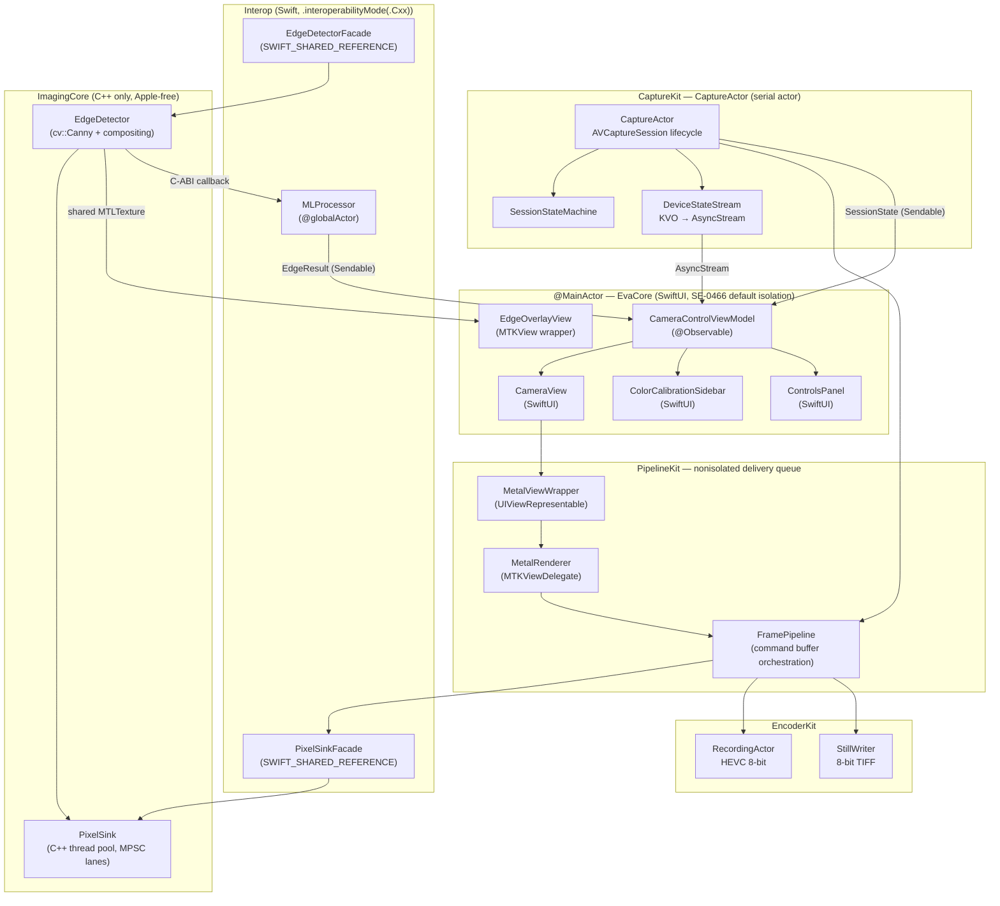
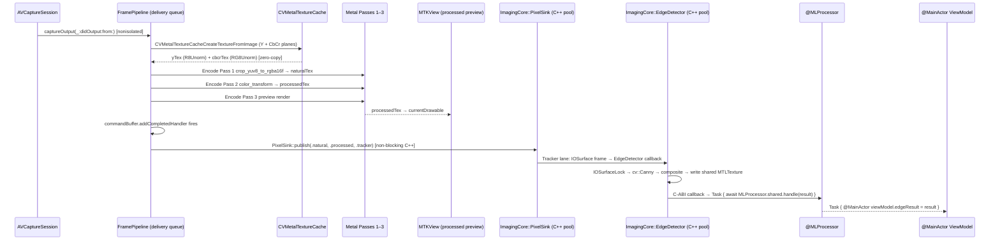
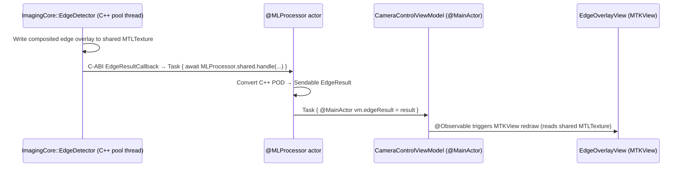

# 01 — Architecture

## Overview

The iOS design uses the **Sandwich pattern** — a three-layer architecture that cleanly separates
declarative UI (SwiftUI), imperative GPU rendering (MTKView), and camera/pipeline logic (CaptureActor + FramePipeline).
Data and configuration flow down; processed frames and results flow up. No layer reaches past its
adjacent neighbor.

---

## Layer Diagram



---

## Layer Responsibilities

### Layer 1 — SwiftUI + ViewModel (`@MainActor`)

**Components:** `CameraView`, `CameraControlViewModel`, `ColorCalibrationSidebar`, `ControlsPanel`, `EdgeOverlayView`

**Responsibilities:**
- Display session state (opening, streaming, recovering, paused, error, closed)
- Render split-screen preview (left: natural stream, right: GPU-processed) via `MTKView` wrappers
- Expose camera controls (ISO, exposure, focus, zoom, white balance, GPU color params)
- Display `FrameResult` readbacks at 3 Hz (ISO, exposure, focus distance, WB gains)
- Render edge detection results as a SwiftUI overlay
- Show recording elapsed timer and capture banner
- NEVER touches `CVPixelBuffer`, `MTLTexture`, or any pixel data

**Isolation:** All types and methods are `@MainActor`. `CameraViewModel` is marked `@Observable`.

**Communication contract:**
- Receives only `Sendable` value types from lower layers: `SessionState`, `FrameResult`, `EdgeDetectionResult`, `CameraError`, `RecordingState`
- Sends `CameraSettings` and `ProcessingParameters` (value types, `Sendable`) down to `CaptureActor` and `FramePipeline`

---

### Layer 2 — Metal Bridge (`nonisolated`)

**Components:** `MetalViewWrapper` (`UIViewRepresentable`), `MetalRenderer` (`MTKViewDelegate`), `NaturalMetalViewWrapper`

**Responsibilities:**
- Bridge SwiftUI's declarative world to Metal's imperative rendering
- Wrap `MTKView` in `UIViewRepresentable` for embedding in SwiftUI
- Implement `MTKViewDelegate.draw(_:)` — called by the system on its own schedule
- Relay configuration changes (viewport size) from SwiftUI to Metal

**Isolation:** `nonisolated` — `MTKViewDelegate.draw(_:)` is called by the system on an arbitrary schedule and cannot be actor-isolated without deadlocking. All pixel data stays in `MetalRenderer` and never escapes to SwiftUI.

**Communication contract:**
- Receives `MTLTexture` references from `FramePipeline` via an atomic texture slot protected by `OSAllocatedUnfairLock<MTLTexture?>` (iOS 16+). The lock is held for microseconds per swap — contention-free in practice (~30 Hz producer, on-demand consumer).
- `FramePipeline` stores the newly-rendered texture via `textureSlot.withLock { $0 = newTexture }` after Pass 3 is encoded. Metal command queue ordering guarantees GPU writes are visible to subsequent GPU reads.
- `MetalRenderer.draw(_:)` reads via `textureSlot.withLock { $0 }` and blits the result to the current drawable. A `nil` slot results in no-op.
- Triggers `MTKView.setNeedsDisplay()` from `FramePipeline` (via `Task { @MainActor in ... }`) so MTKView renders on-demand, not on its own 60 Hz timer.
- **`MTKView` configuration (required):** `isPaused = true`, `enableSetNeedsDisplay = true`, `preferredFramesPerSecond = 30`, `framebufferOnly = false`. This puts the view in on-demand redraw mode — `draw(_:)` fires only when `setNeedsDisplay()` is called, not on a 60Hz internal timer.
- Never calls back into SwiftUI directly; relies on `AsyncStream` + `CameraViewModel` for state

---

### Layer 3 — Capture + Pipeline (CaptureKit + PipelineKit)

**CaptureActor (CaptureKit — serial actor):** Owns the `AVCaptureSession` lifecycle,
discovers the back-facing main lens, applies `AVCaptureDevice` settings (ISO, exposure,
focus, white balance), owns `SessionStateMachine`, and exposes `DeviceStateStream`
(KVO → `AsyncStream<CameraState.Snapshot>`). CaptureKit has **no Metal, no C++**.

**FramePipeline (PipelineKit — nonisolated, delivery queue):** Runs the 6-pass Metal
command graph (see `design/03-metal-pipeline.md`) on the camera delivery queue
(`.userInteractive`). Owns `CVMetalTextureCache`, `TexturePoolManager`, `MetalRenderer`,
`StallWatchdog`, and `ThermalMonitor`. After GPU completion, calls `PixelSinkFacade.publish`
— a non-blocking C++ call that dispatches IOSurfaces to `ImagingCore::PixelSink`.
PipelineKit has **no AVFoundation, no C++**.

**EncoderKit (RecordingActor + StillWriter):** `RecordingActor` (serial actor) manages
`AVAssetWriter` + HEVC 8-bit encoding. `StillWriter` handles 8-bit TIFF output.
Both receive gated commands from `FramePipeline` (Passes 5 and 6 respectively).

**Communication contract:**
- `CaptureActor` sends `Sendable` state via `AsyncStream` to `@MainActor`
- `DeviceStateStream` sends `AsyncStream<CameraState.Snapshot>` to `CameraControlViewModel`
- `FramePipeline` → `PixelSinkFacade.publish`: synchronous C++ call, no actor hop
- `FramePipeline` → `RecordingActor`: actor method calls for gated recording pass

---

### Layer 4 — C++ Consumers (ImagingCore, PixelSink thread pool)

**Components:** `PixelSink` (C++ thread pool, MPSC lane per stream, SWIFT_SHARED_REFERENCE),
`EdgeDetector` (subscribes to `StreamId::Tracker`, 640×480 RGBA16F, SWIFT_SHARED_REFERENCE)

**Responsibilities:**
- `PixelSink` receives IOSurface-backed Frame structs from `FramePipeline` via `publish()` —
  non-blocking; each per-stream lane has a 1-slot mailbox (newest overwrites pending)
- `EdgeDetector` subscribes to `StreamId::Tracker`; for each frame:
  locks the IOSurface, aliases as `cv::Mat CV_16FC4` (zero-copy), applies BT.709 grayscale
  (R,G,B,A channel order), runs `cv::Canny`, composites edges onto the tracker frame in C++,
  writes to a shared `MTLTexture`, invokes a C-ABI result callback
- Never block the Metal render path — C++ dispatch is non-blocking from the GPU completion handler
- **No Apple headers** in `ImagingCore` public headers. `ImagingCore` is independently
  testable via `swift test` on macOS without Metal, AVFoundation, or a camera.

**Isolation:** PixelSink owns a C++ thread pool (`std::min(4, hw_concurrency)` threads).
Each stream's MPSC lane dispatches independently. No Swift actor involvement on the frame path.

**Communication contract:**
- `PixelSinkFacade` and `EdgeDetectorFacade` (in `Interop`) wrap both as SWIFT_SHARED_REFERENCE
  objects — ARC-managed in Swift
- EdgeDetector result → `MLProcessor` via C-ABI callback → `Task { await MLProcessor.shared.handle(...) }`
- EdgeDetector → `EvaCore`: shared `MTLTexture` (`.shared` storage mode) read by `EdgeOverlayView` (MTKView)
- OpenCV headers are **banned from all public headers** under `Sources/ImagingCore/include/`
  and from all Swift code. Legal only inside `Sources/ImagingCore/src/*.cpp`.

---

## Frame Delivery Data Flow



---

## Results Return Path



---

## Module Layout

The project is a **SwiftPM package** (`Package.swift` at the root). `App/` is a thin
shell containing only `@main`, `Info.plist`, and assets. All production code lives
in library targets under `Sources/<TargetName>/`. This forces modularity at the
build-system level and enables the `ImagingCore` C++ target to be tested
independently via `swift test` on the macOS host — no iOS device, no camera, no
Metal, no AVFoundation required for the C++ unit tests.

```
CamPlugin/
├── Package.swift                           # SwiftPM root: all targets declared here
├── App/                                    # Thin shell — EvaApp target
│   ├── EvaApp.swift                        # @main; WindowGroup + Window("Inspector")
│   ├── Info.plist
│   └── Assets.xcassets
│
├── Sources/
│   ├── EvaCore/                            # Swift — SwiftUI, ViewModels, navigation
│   │   │                                   # SE-0466: default @MainActor isolation
│   │   ├── CameraControlViewModel.swift    # @Observable; @MainActor
│   │   ├── CameraView.swift                # Root SwiftUI view (split-screen)
│   │   ├── ColorCalibrationSidebar.swift   # GPU color-transform param sliders
│   │   ├── ControlsPanel.swift             # ISO/exposure/focus/zoom bar
│   │   ├── EdgeOverlayView.swift           # MTKView wrapping shared MTLTexture from EdgeDetector
│   │   ├── RecordingIndicator.swift        # Timer + stop button
│   │   ├── CaptureBanner.swift             # Transient capture confirmation
│   │   └── Inspector/                      # iPadOS 26 secondary window
│   │       ├── InspectorView.swift
│   │       ├── CaptureHistoryList.swift
│   │       └── HistogramView.swift
│   │
│   ├── CaptureKit/                         # Swift — AVFoundation ONLY; no Metal, no C++
│   │   ├── CaptureActor.swift              # Serial actor; AVCaptureSession lifecycle
│   │   ├── SessionStateMachine.swift       # State enum + transition logic
│   │   ├── DeviceStateStream.swift         # KVO → AsyncStream<CameraState.Snapshot>
│   │   ├── CameraDeviceDiscovery.swift     # AVCaptureDevice selection (back-main only)
│   │   ├── CameraSettings+Apply.swift      # AVCaptureDevice configuration extension
│   │   └── SettingsPersistence.swift       # UserDefaults wrapper; Codable settings
│   │
│   ├── PipelineKit/                        # Swift + Metal — no AVFoundation, no C++
│   │   ├── FramePipeline.swift             # Command buffer orchestration (delivery queue)
│   │   ├── MetalRenderer.swift             # MTKViewDelegate; nonisolated
│   │   ├── MetalViewWrapper.swift          # UIViewRepresentable → MTKView
│   │   ├── NaturalMetalViewWrapper.swift   # UIViewRepresentable → MTKView (natural)
│   │   ├── TexturePoolManager.swift        # MTLTexture pool lifecycle
│   │   ├── StallWatchdog.swift             # GPU (3s) + capture-result (5s) watchdogs
│   │   ├── ThermalMonitor.swift            # ProcessInfo.thermalState → banner-only v1
│   │   ├── Shaders.metal                   # Passes 1–5 compute kernels
│   │   └── ColorTransformUniforms.swift    # Uniform buffer layout (Swift mirror)
│   │
│   ├── EncoderKit/                         # Swift — HEVC recording + still capture
│   │   ├── RecordingActor.swift            # Serial actor; AVAssetWriter + HEVC 8-bit
│   │   ├── StillWriter.swift               # 8-bit TIFF output via Pass 6 blit
│   │   ├── EXIFWriter.swift
│   │   └── PhotoLibraryWriter.swift
│   │
│   ├── ImagingCore/                        # ── C++ ONLY; Apple-free ──
│   │   ├── include/imagingcore/            # Public headers (no opencv2, no Apple)
│   │   │   ├── PixelSink.hpp               # SWIFT_SHARED_REFERENCE; Frame struct; StreamId
│   │   │   └── EdgeDetector.hpp            # SWIFT_SHARED_REFERENCE; subscribes to Tracker stream
│   │   ├── src/                            # <opencv2/*> legal ONLY here
│   │   │   ├── PixelSink.cpp               # C++ thread pool + MPSC lanes
│   │   │   └── EdgeDetector.cpp            # cv::Canny + composite; all cv:: in try/catch
│   │   └── module.modulemap                # Clang module for direct Swift import
│   │
│   ├── Interop/                            # Swift — only module with .interoperabilityMode(.Cxx)
│   │   ├── PixelSinkFacade.swift           # SWIFT_SHARED_REFERENCE wrapper for PixelSink
│   │   ├── EdgeDetectorFacade.swift        # SWIFT_SHARED_REFERENCE wrapper for EdgeDetector
│   │   ├── EdgeResult.swift                # Sendable Swift struct (from C++ POD)
│   │   └── MLProcessor.swift              # @globalActor for ML/CV result routing
│   │
│   └── TestingSupport/                     # Swift — synthetic frame provider for CI
│       └── SyntheticFrameProvider.swift    # AVAssetReader replay
│
├── Tests/
│   ├── EvaCoreTests/                       # Swift Testing
│   ├── CaptureKitTests/                    # Swift Testing; uses TestingSupport
│   ├── PipelineKitTests/                   # Swift Testing; golden-frame Metal compare
│   ├── ImagingCoreTests/                   # C++ only; runs via `swift test` on macOS
│   │   ├── PixelSinkTests.cpp
│   │   └── EdgeDetectorTests.cpp
│   └── InteropTests/                       # Swift Testing
│
└── Frameworks/
    └── opencv2.xcframework                 # Wrapped as SwiftPM binaryTarget in Package.swift
```

**Load-bearing invariants of this layout:**

- **`ImagingCore` is Apple-free.** No `#import <Foundation/*>`, no `CoreVideo`, no `CVPixelBuffer`, no `IOSurface.h` in public headers. This is enforced by code review — keeping public headers Apple-free makes `ImagingCore` independently testable (`ImagingCoreTests` runs via `swift test` on macOS without a camera session).
- **OpenCV is a private implementation detail of `ImagingCore`.** `<opencv2/opencv.hpp>` is legal in `Sources/ImagingCore/src/*.cpp` and nowhere else — not in any public header, not in any Swift file, not in `Interop`.
- **`Interop` is the only module with `.interoperabilityMode(.Cxx)`.** It wraps `PixelSink` and `EdgeDetector` as SWIFT_SHARED_REFERENCE objects — ARC-managed in Swift. No Objective-C++ (`.mm`) files anywhere in the project.
- **Frame dispatch is entirely C++ after the GPU completion handler.** `PixelSink::publish` is a non-blocking C++ call; no Swift actor hop is involved on the frame path.
- **The clean module boundary makes `ImagingCoreTests` run on macOS.** Tests create IOSurface fixture buffers, publish via `PixelSink`, and assert `EdgeDetector` contour output — no Metal, no AVFoundation, no Xcode, no iOS device required.

---

## Session Model

A single `CaptureActor` instance is created when `open()` is called and destroyed on `close()`. Only one session is active at a time. The back-facing main lens is the only supported camera; calling `open()` while a session is active is rejected with `INVALID_STATE`. The opaque integer handle is a session identifier vended at open time and validated on every subsequent call.

---

## Key Architectural Invariants (iOS mapping)

| Domain invariant | iOS mechanism |
|---|---|
| Preview shows GPU-processed output, never sensor output | `MTKView` displays Metal-processed texture; `AVCaptureVideoPreviewLayer` is NOT used in production |
| Single memcpy per frame on consumer path | IOSurface-backed frame structs published via PixelSink; consumers lock IOSurface directly — no CVPixelBuffer copy |
| Null field means "do not change" | `CameraSettings` uses `Optional` fields; `nil` is preserved through merge logic in `CaptureActor` |
| ISO + exposure are coupled | Coupling enforced inside `CaptureActor.applySettings(_:)` before touching `AVCaptureDevice` |
| Recording encodes GPU output directly | Pass 5 (`rgba16f_to_yuv8`) writes to IOSurface-backed adaptor pool; `AVAssetWriter` maps the same IOSurface — no CPU copy |
| No CPU-side image processing on preview path | OpenCV edge detection (NEW iOS-only capability) runs on PixelSink pool threads; GPU pipeline is unaffected |
