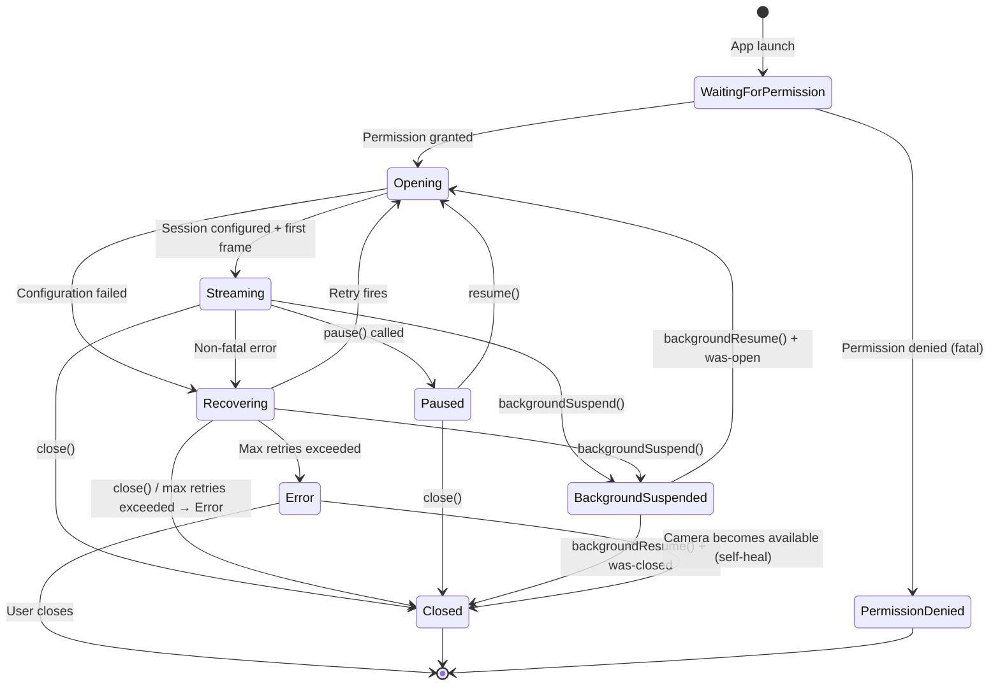

# 02 — Concurrency

Using `swift-engineering:modern-swift` to inform actor isolation and Sendable strategy.

---

## Actor Topology

| Component | Isolation | Mechanism | Why |
|---|---|---|---|
| `CameraControlViewModel` | `@MainActor` | SE-0466 default + `@Observable` | Drives SwiftUI; all UI mutations must be on main thread |
| SwiftUI Views (EvaCore) | `@MainActor` (SE-0466 default) | Module-level default isolation | SwiftUI renders on main thread |
| `CaptureActor` | `actor` (custom, CaptureKit) | Swift actor keyword | Serializes all AVCaptureSession state mutations; satisfies Invariant 1 |
| `SessionStateMachine` | Owned by `CaptureActor` | Actor-isolated property | State accessed only through actor; no separate lock needed |
| `FramePipeline` | `nonisolated` | Camera delivery queue (`.userInteractive`) | AVFoundation requires serial queue; frame path must not hop actor boundaries at 30 Hz |
| `MetalRenderer.draw(_:)` | `nonisolated` | `MTKViewDelegate` + `OSAllocatedUnfairLock` on texture slot | `draw(_:)` is called on Metal's render thread; cannot be actor-isolated. `MTKView` configured `isPaused = true` + `enableSetNeedsDisplay = true` — fires on-demand only. |
| `PixelSink` (ImagingCore) | C++ thread pool | `std::min(4, hw_concurrency)` threads; per-stream MPSC lane | Non-blocking dispatch; never touches Swift actors on the frame path |
| `EdgeDetector` (ImagingCore) | C++ pool thread (via PixelSink) | Subscribed to Tracker lane | Runs Canny + compositing on pool thread; result via C-ABI callback |
| `MLProcessor` | `@globalActor` | Custom global actor | Routes C-ABI EdgeDetector results to `@MainActor` without blocking the camera path |
| `RecordingActor` | `actor` (EncoderKit) | Swift actor keyword | Recording state machine isolated from capture state |
| `StillWriter` | `actor` (EncoderKit) | Swift actor keyword | In-flight guard for atomic still capture |

---

## Domain Invariant Mapping (all 11 invariants)

### Invariant 1 — Camera State Exclusively Serialized

**Domain requirement:** All camera state mutations (session state, retry counter, error counter, background-suspended flag, watchdog timestamps) must be serialized. The serialization context must not block the UI.

**iOS enforcement:** `CaptureActor` is a Swift `actor`. All methods are `async`; the actor serializes execution automatically. Callers from `@MainActor` call actor methods with `await`; the main thread is never blocked. No locks required.

```swift
actor CaptureActor {
    private var sessionState: SessionState = .closed
    private var retryCount: Int = 0
    private var consecutiveErrorCount: Int = 0
    private var isBackgroundSuspended: Bool = false
    // All mutations happen inside actor methods — compiler enforced
}
```

---

### Invariant 2 — GPU Operations on Dedicated Serialized Context

**Domain requirement:** All GPU rendering operations for a session execute on a single dedicated serialized context. Concurrent GPU operations are forbidden.

**iOS enforcement:** Metal command buffers are submitted to a single `MTLCommandQueue` (one per session). `MTLCommandQueue` is inherently serialized — commands execute in submission order. The Metal capture callback runs on the AVFoundation serial queue and submits to this queue. No concurrent GPU commands are possible because only one thread submits commands.

Additionally: all GPU resource initialization/teardown runs inside `CaptureActor` methods (which coordinate with `FramePipeline`), already serialized by the actor.

```swift
// FramePipeline — nonisolated, delivery queue
final class FramePipeline {
    private let commandQueue: MTLCommandQueue  // Single queue; serial by design

    func processFrame(_ sampleBuffer: CMSampleBuffer) {
        let commandBuffer = commandQueue.makeCommandBuffer()!
        // Encode all 6 passes into commandBuffer
        commandBuffer.commit()
    }
}
```

---

### Invariant 3 — UI Callbacks on Main Execution Context

**Domain requirement:** All callbacks (`onStateChanged`, `onError`, `onFrameResult`, `onRecordingStateChanged`) must arrive on the main execution context.

**iOS enforcement:** `CameraControlViewModel` is `@MainActor` (SE-0466 default). Results flow via `AsyncStream<T>` where the consumer runs a `.task { for await value in stream { ... } }` modifier on the SwiftUI view — `.task` runs on `@MainActor` automatically. `CaptureActor` uses `await MainActor.run { }` before delivering state changes.

```swift
// EvaCore — SE-0466 default @MainActor isolation
@Observable
final class CameraControlViewModel {
    var sessionState: SessionState = .closed
    var frameResult: FrameResult?

    func observeCapture(_ actor: CaptureActor) {
        Task { @MainActor in
            for await state in await actor.stateStream {
                self.sessionState = state  // Guaranteed @MainActor
            }
        }
    }
}
```

---

### Invariant 4 — Native Pipeline Pointer Protected Against Use-After-Free

**Domain requirement:** The C++ pipeline pointer must be guarded; teardown must zero the pointer under the guard before calling the destructor.

**iOS enforcement:** The C++ pipeline object is wrapped in an `actor`-isolated optional. Because actor methods are serialized, there is no concurrent access to the pointer — read and zeroing are both actor-isolated operations. No explicit mutex is needed.

```swift
actor CaptureActor {
    private var pixelSink: PixelSinkFacade?  // Nil after teardown

    func teardown() async {
        let sink = pixelSink   // Read under actor isolation
        pixelSink = nil        // Zero under actor isolation (same await-free section)
        sink?.stop()           // C++ destructor called after pointer zeroed
    }

    func requestStill() async throws -> URL {
        guard pixelSink != nil else { throw CameraError(.invalidState) }
        return try await stillWriter.requestStill(from: framePipeline)
    }
}
```

---

### Invariant 5 — C++ Consumer Dispatch Non-Blocking

**Domain requirement:** Frame dispatch to C++ consumers must not block the GPU rendering context.

**iOS enforcement:** `PixelSink::publish()` is a non-blocking C++ call. Each per-stream MPSC lane uses a 1-slot mailbox — if the consumer is busy, the newest frame atomically overwrites the pending slot. The lane's `std::mutex` is held only for the duration of the slot-overwrite (microseconds). `PixelSink` manages all locking internally; Swift never acquires any PixelSink mutex. There is no Swift actor involved on the frame dispatch path.

---

### Invariant 6 — GPU Shader Uniforms Protected Against Concurrent Access

**Domain requirement:** GPU uniform values (brightness, contrast, saturation, black balance, gamma) are written from one context and read from the GPU render path — mutual exclusion required.

**iOS enforcement:** `ProcessingParameters` is a `Sendable` value type (struct). `CaptureActor` stores it and forwards to `FramePipeline` at encode time. `FramePipeline` reads the uniform struct before encoding the command buffer on the delivery queue. Updates from `@MainActor` go through `CaptureActor` (async call), which forwards to `FramePipeline`'s atomic uniform slot. No separate mutex needed — the actor serializes writes; the delivery queue reads a copied value.

```swift
// FramePipeline — delivery queue
final class FramePipeline {
    private var currentUniforms: ColorUniforms = .default  // Updated atomically via OSAllocatedUnfairLock

    func updateUniforms(_ params: ProcessingParameters) {
        uniformsLock.withLock { currentUniforms = ColorUniforms(from: params) }
    }

    func processFrame(_ sampleBuffer: CMSampleBuffer) {
        let uniforms = uniformsLock.withLock { currentUniforms }  // Read before encode
        // Encode uniforms into Metal buffer...
    }
}
```

---

### Invariant 7 — Capture In-Flight Guard Must Be Atomic

**Domain requirement:** The "capture in flight" flag must be a compare-and-set — two concurrent `captureNaturalPicture()` calls must result in exactly one proceeding.

**iOS enforcement:** `StillWriter` is a Swift `actor` in `EncoderKit`. Its `captureInFlight` flag is an actor-isolated boolean. Because actor methods are serialized, the check-and-set is atomic by construction — only one `requestStill()` body can run at a time.

```swift
actor StillWriter {
    private var captureInFlight: Bool = false

    func requestStill(from pipeline: FramePipeline) async throws -> URL {
        guard !captureInFlight else { throw CameraError(.invalidState) }
        captureInFlight = true
        defer { captureInFlight = false }
        // Sets the gated stillRequested flag in FramePipeline; waits for Pass 6 completion
        return try await pipeline.captureStill()
    }
}
```

---

### Invariant 8 — Fast-Path Capture Check Must Be Lock-Free

**Domain requirement:** The "capture requested" flag in the C++ frame delivery path must be readable without locking — it executes on every frame's critical path.

**iOS enforcement:** In `FramePipeline`, the `stillRequested` flag is an `OSAllocatedUnfairLock<Bool>` guarded atomic. The check on every frame is a brief lock read (lock-free-equivalent contention profile at 30 Hz). Setting the flag from `StillWriter` uses the same lock, ensuring visibility. The `PixelSink` 1-slot mailbox uses `std::atomic` internally for its hasFrame flag.

---

### Invariant 9 — Recovery Retry Must Not Run Concurrently with Close

**Domain requirement:** If `close()` or `backgroundSuspend()` is called while a recovery retry is pending, the retry must be cancelled and must exit without action if it fires after cancellation.

**iOS enforcement:** Recovery retries are `Task` objects stored in `CaptureActor`. On `close()` or `backgroundSuspend()`, the stored task is cancelled via `retryTask?.cancel()`. The retry body checks `Task.isCancelled` and `sessionState` at the start — both checks are actor-isolated and thus cannot race with the cancellation.

```swift
actor CaptureActor {
    private var retryTask: Task<Void, Never>?

    func handleNonFatalError(_ error: CameraError) async {
        retryTask?.cancel()
        retryTask = Task {
            let delay = backoffDelay(for: retryCount)
            try? await Task.sleep(nanoseconds: delay)
            guard !Task.isCancelled else { return }
            guard sessionState == .recovering else { return }  // Actor-isolated check
            await reopen()
        }
    }

    func close() async {
        retryTask?.cancel()
        retryTask = nil
        await teardown()
    }
}
```

---

### Invariant 10 — Consumer Dispatch Is Non-Blocking

**Domain requirement:** Frame delivery to C++ consumers must not block the GPU rendering context. Drop-on-busy semantics: overwrite the 1-slot mailbox and return immediately.

**iOS enforcement:** `PixelSink::publish()` is a non-blocking C++ call. Each per-stream MPSC lane atomically updates a 1-slot mailbox — if the consumer's previous frame hasn't been dispatched yet, it is overwritten. The publish call returns immediately without waiting for consumer thread availability. No Swift actor or `AsyncStream` is involved.

```cpp
// PixelSink::publish — called from GPU completion handler (C++ side)
void PixelSink::publish(StreamId stream, const Frame& frame) noexcept {
    auto& lane = lanes_[static_cast<uint8_t>(stream)];
    {
        std::unique_lock lock(lane.mutex);
        lane.pending = frame;         // Overwrite — newest wins, previous dropped
        lane.hasFrame = true;
    }
    lane.cv.notify_one();             // Wake pool thread
}
```

---

### Invariant 11 — Stall Watchdog Timestamp Visible Across Contexts

**Domain requirement:** The stall timestamp written by the GPU context must be visible to the watchdog context without requiring a lock.

**iOS enforcement:** `lastFrameTimestamp` is stored as an `OSAllocatedUnfairLock<Date?>` in `FramePipeline` (written on the delivery queue after each GPU completion). `StallWatchdog` reads it on its own timer task via the same lock. The lock ensures visibility across delivery-queue and watchdog-task contexts.

For the GPU-level stall (3s), the watchdog fires via a `Task` that calls `await captureActor.handleGPUStall()` — crossing the actor boundary provides the necessary memory ordering for any state transitions.

---

## Sendable Strategy

### Rule 1: Pixel Buffers Never Cross Swift Actor Boundaries

`CVPixelBuffer` and `CMSampleBuffer` are NOT `Sendable`. They live inside
`FramePipeline` (delivery queue) and are consumed by the Metal command pipeline
on that same queue. Consumers receive frames via `PixelSink::publish()` — an
IOSurface-backed `Frame` struct, not a `CVPixelBuffer`. The IOSurface handoff
is a C++ value type and does not cross any Swift actor boundary.

When `CaptureActor` needs to communicate a buffer reference (e.g., for configuration
at session start), it uses `sending` parameter annotation (SE-0430):

```swift
func configurePipeline(buffer: sending CVPixelBuffer) async {
    // Ownership transferred; caller must not access it again
}
```

### Rule 2: Only Sendable Results Cross Actor Boundaries

All types that flow from `CaptureActor`, `FramePipeline`, or `@MLProcessor` to `@MainActor` are value types conforming to `Sendable`:

```swift
struct FrameResult: Sendable {
    let iso: Int?
    let exposureTimeNs: Int?
    let focusDistanceDiopters: Double?
    let wbGainR: Double?
    let wbGainG: Double?
    let wbGainB: Double?
}

struct EdgeResult: Sendable {
    let status: imagingcore.EdgeStatus
    let contours: [EdgeContour]     // Array of Sendable value structs
    let framePTS: Int64
    let processingTimeMs: Double
}

enum SessionState: String, Sendable {
    case opening, streaming, recovering, paused, error, closed
}
```

### Rule 3: No `@unchecked Sendable`

The compiler warning about buffer types is correct — the buffers are NOT safely shareable. The design never silences this with `@unchecked Sendable`. Instead, it transfers ownership via `sending` or keeps buffers single-context.

---

## Back-Pressure: PixelSink 1-Slot MPSC Mailbox

```
AVFoundation capture callback (delivery queue)
    → FramePipeline.processFrame (nonisolated, delivery queue)
        → MetalRenderer.encodePreviewPass (synchronous)
        → commandBuffer.addCompletedHandler fires
            → PixelSink::publish(.natural / .processed / .tracker)  [non-blocking C++]
                → Per-stream MPSC lane (1-slot mailbox, newest overwrites)
                    → PixelSink pool thread → EdgeDetector callback
```

PixelSink 1-slot mailbox semantics:
- If the consumer (EdgeDetector) is busy, the previous frame is atomically overwritten
- Consumer always processes the most recent frame
- Memory stays flat — no unbounded queue growth
- Preview and GPU path are never blocked by slow consumers
- No Swift actor involved on the frame dispatch path

---

## State Machine

### States



### State Enum

```swift
enum SessionState: String, Sendable, CaseIterable {
    case waitingForPermission = "waitingForPermission"
    case opening              = "opening"
    case streaming            = "streaming"
    case recovering           = "recovering"
    case paused               = "paused"
    case backgroundSuspended  = "backgroundSuspended"  // Internal; not emitted as user-visible state
    case error                = "error"
    case closed               = "closed"
    case permissionDenied     = "permissionDenied"     // iOS-specific fatal state
}
```

**Note:** `backgroundSuspended` is an internal state — the domain spec says background suspension does not emit a user-visible state change. `permissionDenied` is iOS-specific (maps to the domain's `PERMISSION_DENIED` fatal error).

### Transition Guard Table

| From | Event | Allowed transitions |
|---|---|---|
| `.waitingForPermission` | Permission granted | → `.opening` |
| `.waitingForPermission` | Permission denied | → `.permissionDenied` |
| `.opening` | Session configured | → `.streaming` |
| `.opening` | Error | → `.recovering` |
| `.streaming` | Non-fatal error | → `.recovering` |
| `.streaming` | `pause()` | → `.paused` |
| `.streaming` | `backgroundSuspend()` | → `.backgroundSuspended` |
| `.streaming` | `close()` | → `.closed` |
| `.recovering` | Retry success | → `.opening` |
| `.recovering` | Max retries | → `.error` |
| `.recovering` | `close()` | → `.closed` |
| `.recovering` | `backgroundSuspend()` | → `.backgroundSuspended` |
| `.paused` | `resume()` | → `.opening` |
| `.paused` | `close()` | → `.closed` |
| `.backgroundSuspended` | `backgroundResume()` | → `.opening` or `.closed` |
| `.error` | Camera available (self-heal) | → `.opening` |

Any transition not listed above is a protocol violation and is logged as a fault.

---

## AVCaptureSession Capture Queue Handoff

`AVCaptureVideoDataOutput` requires a serial `DispatchQueue`. The capture callback fires
on this queue, which is also the delivery queue for `FramePipeline`. No actor hop occurs
on the frame path — `FramePipeline` is `nonisolated` and runs inline on this queue:

```swift
// CaptureActor (actor, CaptureKit)
func configureCaptureOutput(_ output: AVCaptureVideoDataOutput,
                             pipeline: FramePipeline) {
    let deliveryQueue = DispatchQueue(label: "com.camplugin.capture", qos: .userInteractive)
    output.setSampleBufferDelegate(pipeline, queue: deliveryQueue)
    // FramePipeline acts as the AVCaptureVideoDataOutputSampleBufferDelegate
}

// FramePipeline (nonisolated, PipelineKit)
// Conforms to AVCaptureVideoDataOutputSampleBufferDelegate directly
extension FramePipeline: AVCaptureVideoDataOutputSampleBufferDelegate {
    // Called on deliveryQueue (nonisolated — cannot be actor-isolated)
    func captureOutput(_ output: AVCaptureOutput,
                       didOutput sampleBuffer: CMSampleBuffer,
                       from connection: AVCaptureConnection) {
        processFrame(sampleBuffer)  // Inline on delivery queue — no Task, no await
    }
}
```

**Key:** the frame path is entirely synchronous on the delivery queue. No `Task {}` wrapping,
no actor hop, no `await`. This is what keeps the 30 Hz frame clock off the Swift actor
scheduler.

`CMSampleBuffer` and `CVPixelBuffer` never leave the delivery queue on the frame path.
When `CaptureActor` needs to coordinate with `FramePipeline` (e.g., to start/stop recording),
it uses actor method calls that do NOT run on the delivery queue — they schedule work
through `CaptureActor`'s own serialization context.

---

## iOS-Specific Concurrency States

### Permission State (U-01 resolution)

iOS camera permission is checked via `AVCaptureDevice.authorizationStatus(for: .video)`. On first launch, the system prompts the user. The state machine adds `waitingForPermission` as a pre-`opening` state. If permission is `.denied` or `.restricted`, the engine transitions to `.permissionDenied` (fatal) without attempting camera open.

Permission revocation mid-session: `AVCaptureSession` posts `AVCaptureSessionRuntimeErrorNotification` when the system revokes camera access. This is caught and handled as a `PERMISSION_DENIED` fatal error.

### Thermal State Integration (U-05 resolution — v1: banner-only)

**v1 policy:** Display a user-visible warning banner only. No pipeline degradation, no
frame rate reduction. Full pipeline degradation (frame rate throttle at `.serious`,
teardown at `.critical`) is deferred to a later phase. The banner is sufficient for
the initial release on a device with known thermal headroom.

```swift
// ThermalMonitor.swift (PipelineKit)
final class ThermalMonitor {
    private let bannerCallback: @MainActor (ProcessInfo.ThermalState) -> Void

    func start() {
        NotificationCenter.default.addObserver(
            forName: ProcessInfo.thermalStateDidChangeNotification,
            object: nil, queue: .main
        ) { [weak self] _ in
            let state = ProcessInfo.processInfo.thermalState
            Task { @MainActor in self?.bannerCallback(state) }
        }
    }
}

// CameraControlViewModel (EvaCore — @MainActor via SE-0466)
func handleThermalChange(_ state: ProcessInfo.ThermalState) {
    switch state {
    case .nominal, .fair:
        thermalWarningVisible = false
    case .serious, .critical:
        thermalWarningVisible = true   // Show banner; no pipeline change in v1
    @unknown default:
        break
    }
}
```

### App Lifecycle (U-07 resolution)

iOS "fully invisible" maps to `scenePhase == .background` in SwiftUI (not `.inactive`). The `.inactive` phase occurs during partial occlusion (Control Center overlay, incoming call banner) and must NOT trigger camera release. Only `.background` maps to `backgroundSuspend()`.

```swift
@main
struct CamPluginApp: App {
    @Environment(\.scenePhase) private var scenePhase
    @State private var captureActor = CaptureActor()

    var body: some Scene {
        WindowGroup {
            CameraView()
        }
        .onChange(of: scenePhase) { _, newPhase in
            Task {
                switch newPhase {
                case .background:
                    await captureActor.backgroundSuspend()
                case .active:
                    await captureActor.backgroundResume()
                default:
                    break  // .inactive = partial occlusion; do NOT release camera
                }
            }
        }
    }
}
```

#### `backgroundSuspend()` must guard the recording drain with `beginBackgroundTask`

When the app transitions to `.background`, iOS gives the process a short window to finish
cleanup before suspending it. For a camera app that may be actively recording, the drain
sequence (stop the writer, finalize the MP4 atom/moov, flush the pixel buffer pool) can take
several seconds. If iOS suspends the process mid-drain, the MP4 file is permanently corrupted —
the moov atom is never written, and the file becomes unplayable.

`backgroundSuspend()` must request a background task from `UIApplication` **before** starting
the recording drain, and must end the background task only after the drain completes. If the
drain exceeds the OS-granted window (typically 30 seconds), the expiration handler ends the
task gracefully by cancelling the writer.

```swift
func backgroundSuspend() async {
    // 1. If recording, request background time for the drain.
    //    beginBackgroundTask MUST be called on the main actor (it touches UIApplication).
    var bgTaskID: UIBackgroundTaskIdentifier = .invalid
    let wasRecording = (recordingState == .recording)

    if wasRecording {
        bgTaskID = await MainActor.run {
            UIApplication.shared.beginBackgroundTask(withName: "CameraRecordingDrain") {
                // Expiration handler — iOS is about to suspend us.
                Task { [weak self] in await self?.cancelRecordingOnExpiration() }
            }
        }
    }

    // 2. Stop the watchdog tasks first — they cannot observe teardown safely.
    gpuStallWatchdogTask?.cancel()
    captureResultWatchdogTask?.cancel()

    // 3. Drain the recorder synchronously (if it was active).
    //    This is the step that can take seconds and must not be interrupted.
    if wasRecording {
        await recordingActor.stop()  // internally calls assetWriter.finishWriting
    }

    // 4. Tear down the capture session and release resources.
    session.stopRunning()
    releaseMetalResources()

    // 5. Set state and release the background task.
    isBackgroundSuspended = true
    sessionState = .backgroundSuspended

    if bgTaskID != .invalid {
        await MainActor.run { UIApplication.shared.endBackgroundTask(bgTaskID) }
    }
}

private func cancelRecordingOnExpiration() async {
    // Called from the background task expiration handler.
    // We have seconds, not minutes — cancel the writer rather than finalize.
    await recordingActor.cancelWriting()
}
```

**Rule:** any teardown step that interacts with the filesystem or encoder during a background
transition must be wrapped in `beginBackgroundTask` / `endBackgroundTask`. The expiration
handler must be idempotent and must terminate the operation cleanly within its own short
window (the expiration handler itself has only a few seconds before forced termination).

---

## Swift 6.2 Approachable Concurrency (SE-0466)

`EvaCore` opts into **default `@MainActor` isolation** at the module level
via the Swift 6.2 approachable concurrency feature (SE-0466). In
`Package.swift`:

```swift
.target(
    name: "EvaCore",
    dependencies: ["CaptureKit", "PipelineKit", "Interop"],
    path: "Sources/EvaCore",
    swiftSettings: [
        .defaultIsolation(MainActor.self),    // SE-0466
    ]
)
```

Effect: every view, view model, and helper in `EvaCore` is `@MainActor` by
default. Swift files no longer need `@MainActor` on every type or method —
the compiler applies it transitively. SwiftUI `View` conformance already
requires `@MainActor`, so this aligns the rest of the view layer with SwiftUI
and removes a large amount of attribute boilerplate.

**`CaptureKit`, `PipelineKit`, `EncoderKit`, `Interop` do NOT opt in.** These modules
keep **explicit** isolation — actors, `nonisolated` delivery-queue functions, and
explicit `@MainActor` hops where needed. The reason is that these modules
have hot paths that must not be serialized through `MainActor`:

- `CaptureActor` runs off-main and serializes AVCaptureSession state.
- `FramePipeline` is `nonisolated` — it runs on the delivery queue at 30 Hz.
- `MetalRenderer.draw(_:)` is `nonisolated` because `MTKViewDelegate` is
  called on Metal's internal render thread.
- `PixelSink` and `EdgeDetector` run on C++ pool threads — no Swift isolation.

Marking these modules default-MainActor would either deadlock the render
path or serialize every frame through the UI thread. The design explicitly
splits modules into "UI-first" (default MainActor, EvaCore only) and "off-main engine"
(explicit isolation) categories.

---

## Exception Discipline at the C++ Boundary

**Rule:** Every public method on the `ImagingCore` facade is `noexcept`.
An uncaught C++ exception crossing into Swift aborts the process — Swift 6's
tentative `throws` importer for C++ is not yet production-ready for
template-heavy exception hierarchies like `cv::Exception`. Catching at the
facade is deterministic and does not depend on compiler-version-specific
interop behavior.

Every public method follows this pattern:

```cpp
// EdgeDetector.cpp — every cv:: call wrapped in try/catch
void EdgeDetector::onTrackerFrame(const Frame& frame) noexcept {
    try {
        // IOSurfaceLock → cv::transform → cv::Canny → composite → IOSurfaceUnlock
        // ...
        invokeCallback(EdgeStatus::Ok, /* contours */, frame.presentationTimeNs);
    }
    catch (const cv::Exception& e) {
        invokeCallback(EdgeStatus::Error, {}, frame.presentationTimeNs);
    }
    catch (const std::exception& e) {
        invokeCallback(EdgeStatus::Error, {}, frame.presentationTimeNs);
    }
    catch (...) {
        invokeCallback(EdgeStatus::Error, {}, frame.presentationTimeNs);
    }
}
```

The `noexcept` specifier asserts the contract at the type system level: if
an exception does escape despite the try/catch, `std::terminate` fires
*before* Swift sees anything, so the crash is attributable to the C++ side
(not a confusing Swift runtime abort). This is the worse of two bad
outcomes, but it is the correct one for debugging.

**Enforcement:**

1. **Code review checklist** — every new method on the facade must be
   `noexcept` and must have the three-clause try/catch.
2. **`ImagingCoreTests` poison test** — one specific test feeds a malformed
   image (e.g., zero width, invalid stride) into every public method and
   asserts the return is an `ErrorCode`, not a crash. This runs on every CI
   build via `swift test`.
3. **`Interop` never catches** — the Swift side assumes the facade
   honors the contract. If `Interop` sees an `ErrorCode` other than
   `Ok`, it logs, drops the frame, and continues; if the facade does crash,
   `Interop` has no defensive try/catch to mask it.

Swift's return-side convention:

```swift
// EdgeDetectorFacade C-ABI callback (Interop)
private func edgeResultCallback(_ result: UnsafePointer<imagingcore.EdgeResult>?,
                                 context: UnsafeMutableRawPointer?) {
    guard let result, result.pointee.status == .Ok else {
        // Log and drop — no throw, no assertion.
        os_log(.error, log: imagingLog, "EdgeDetector returned error status")
        return
    }
    let swiftResult = EdgeResult(from: result.pointee)
    Task { await MLProcessor.shared.handle(swiftResult) }
}
```

This is deliberately narrow: only `.Ok` proceeds to the result-routing path.
Every other outcome is "drop the frame, keep streaming". This preserves the
drop-on-busy invariant even in the presence of C++ failures.
