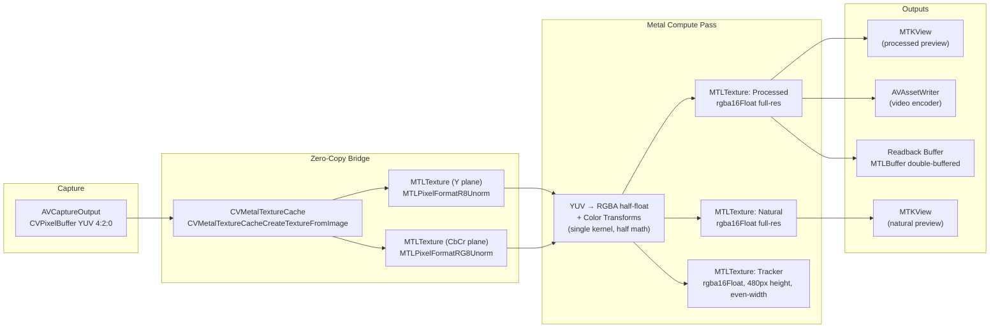

# 03 — Metal Pipeline

Using `swift-engineering:ios-26-platform` and `swift-engineering:swift-diagnostics` to inform this design.

---

## VTFrameProcessor Evaluation

**Evaluation date:** 2026-04-13. **Re-checked:** 2026-04-16 against the WWDC25
Video Toolbox sessions and current `VTFrameProcessor` documentation, now that
iOS 26 is the confirmed minimum deployment target.
**Verdict (confirmed after re-check): do not use. Proceed with custom Metal compute shaders.**

`VTFrameProcessor` (VideoToolbox, WWDC 2025) is an iOS 26+ API designed to apply
configurable effects to video frames with an `AsyncSequence`-based output model
and Metal command buffer integration.

**Findings (unchanged after re-check):**

- `VTFrameProcessor` exposes **system-defined effects** — motion deblur,
  super-resolution, noise reduction, frame interpolation. It does not expose
  an "arbitrary custom Metal compute kernel" mode.
- The per-channel color pipeline required by `domain/03-camera-control.md`
  (black balance → brightness → contrast → saturation → gamma with specific
  Rec.709 luma coefficients for saturation) is not achievable through
  `VTFrameProcessor`'s effect enumeration.
- `VTFrameProcessor` does not expose `CVPixelBuffer` → `MTLTexture` zero-copy
  semantics equivalent to `CVMetalTextureCache` for our specific pipeline. The
  `AsyncSequence` output model introduces an indirection layer between camera
  capture and GPU readback that would complicate the frame-synchronized
  double-buffer design.
- `VTFrameProcessor` is the right tool for apps that want *Apple-authored*
  effects; it is the wrong tool for apps that own their shader pipeline.

**Decision (final):** Custom Metal compute shaders with `CVMetalTextureCache`
zero-copy. Logged in `design/06-decisions-log.md` entry D-02.

---

## Pipeline Architecture



---

## 6-Pass Metal Command Graph

Each `CMSampleBuffer` from `AVCaptureVideoDataOutput` drives a single `MTLCommandBuffer`
containing up to six passes. Passes 4–6 are **gated** — they only execute when the
corresponding consumer is active.

```
Input: CMSampleBuffer (8-bit YUV Lossless_420, ~4160×3120)
  → CVMetalTextureCache: yTex (R8Unorm), cbcrTex (RG8Unorm)  [zero-copy]

Pass 1 (compute): crop_yuv8_to_rgba16f
  reads yTex + cbcrTex at user-defined crop region
  BT.709 YUV→RGB matrix
  writes naturalTex (cropW × cropH, RGBA16F)

Pass 2 (compute): color_transform
  reads naturalTex + ColorParamsUniform
  5-stage: black balance → brightness → contrast → saturation → gamma
  writes processedTex (cropW × cropH, RGBA16F)

Pass 3 (render): preview
  processedTex → processedPreviewDrawable (MTKView)
  naturalTex   → naturalPreviewDrawable   (MTKView, PiP)

Pass 4 (compute): lanczos_downscale  [gated: tracker consumer subscribed]
  MPSImageLanczosScale: processedTex → trackerTex (640×480, RGBA16F)

Pass 5 (compute): rgba16f_to_yuv8   [gated: recording active]
  reads processedTex, writes 8-bit YUV adaptor buffer for HEVC 8-bit encoder

Pass 6 (blit): still readback       [gated: stillRequested flag]
  blits processedTex → CPU-readable CVPixelBuffer for 8-bit TIFF output

[commandBuffer commit + present + addCompletedHandler]

On GPU completion → publish IOSurfaces to ImagingCore::PixelSink:
  • .natural   ← naturalTex.iosurface
  • .processed ← processedTex.iosurface
  • .tracker   ← trackerTex.iosurface   (only if Pass 4 executed)
```

**Gate semantics:** If no recorder is active, Pass 5 does not execute. If no consumer
is subscribed to the tracker stream, Pass 4 does not execute. If no still is requested,
Pass 6 does not execute. All gates are checked before encoding the command buffer —
no GPU work is submitted for inactive paths.

---

## Texture Specification

| Stage | MTLPixelFormat / CVPixelFormat | Dimensions | Usage flags | Storage mode |
|---|---|---|---|---|
| Capture `CVPixelBuffer` | `kCVPixelFormatType_Lossless_420YpCbCr8BiPlanarFullRange` | sensor W × sensor H (~4160×3120) | — (CVBuffer) | IOSurface-backed |
| Y plane texture (zero-copy wrap) | `R8Unorm` | sensor W × sensor H | `.shaderRead` | `.shared` (IOSurface) |
| CbCr plane texture (zero-copy wrap) | `RG8Unorm` | sensor W/2 × sensor H/2 | `.shaderRead` | `.shared` (IOSurface) |
| naturalTex (Pass 1 output) | `rgba16Float` | cropW × cropH | `.shaderRead`, `.shaderWrite` | `.private` (GPU-only) |
| processedTex (Pass 2 output) | `rgba16Float` | cropW × cropH | `.shaderRead`, `.shaderWrite`, `.renderTarget` | `.private` |
| trackerTex (Pass 4 output) | `rgba16Float` | `trackerWidth` × 480 | `.shaderWrite` | `.shared` |
| Encoder adaptor pool buffer | `kCVPixelFormatType_Lossless_420YpCbCr8BiPlanarFullRange` | cropW × cropH | IOSurface-backed | `.shared` |
| MTKView drawable | `bgra10_xr` (wide-gamut) | view bounds | system-managed | system-managed |

**Channel order table (authoritative — incorrect channel order causes silent wrong results):**

| Stage | Format | Channel order | Used by |
|---|---|---|---|
| Capture input | 8-bit YUV biplanar | Y plane + CbCr plane (not interleaved RGBA) | CVMetalTextureCache wrap |
| Working textures (naturalTex, processedTex, trackerTex) | RGBA16F | R, G, B, A | Metal passes 2–4, PixelSink IOSurface fanout |
| Encoder adaptor pool (Pass 5) | 8-bit YUV biplanar | Y plane + CbCr plane | `rgba16f_to_yuv8` compute kernel |
| PixelSink streams (C++ consumers) | RGBA16F | R, G, B, A | EdgeDetector uses BT.709 weights `(0.2126, 0.7152, 0.0722, 0.0)` |

BGRA never appears in any stream that C++ consumers touch.

**Working format justification (RGBA16F throughout GPU passes):**

- The 5-stage color transform (black balance → brightness → contrast → saturation → gamma) compounds quantization error at 8-bit. Half-float has ~11 bits of mantissa precision and preserves stages cleanly with effectively zero inter-stage loss.
- `half` math runs at **full rate** on Apple Silicon GPUs.
- Capture uses 8-bit YUV lossless (what the device supports). Pass 1 performs the YUV→RGBA16F conversion; all subsequent passes operate in half-float.

**Capture pipeline configuration:**

```swift
let videoDataOutput = AVCaptureVideoDataOutput()
videoDataOutput.videoSettings = [
    kCVPixelBufferPixelFormatTypeKey as String:
        kCVPixelFormatType_Lossless_420YpCbCr8BiPlanarFullRange,
    kCVPixelBufferMetalCompatibilityKey as String: true,
    kCVPixelBufferIOSurfacePropertiesKey as String: [:],
]
```

The `kCVPixelBufferMetalCompatibilityKey` + `kCVPixelBufferIOSurfacePropertiesKey` pair is load-bearing — without them, `CVMetalTextureCacheCreateTextureFromImage` fails or returns an incompatible texture.

**Why not `kCVPixelFormatType_64RGBAHalf`:** iPad A16 does NOT support half-float RGBA as an `AVCaptureVideoDataOutput` capture format. Half-float RGBA is a Metal/CoreImage working format, not a capture output format. Attempting to configure it throws a runtime exception. See D-18.

---

## Tracker Dimension Formula

Per domain/12-unresolved.md §U-15 (RESOLVED), the tracker height is fixed at 480px and the width formula is:

```swift
// trackerHeight is a compile-time constant: 480
static let trackerHeight: Int = 480

static func trackerWidth(streamWidth: Int, streamHeight: Int) -> Int {
    ((streamWidth * trackerHeight / streamHeight) + 1) & ~1  // even-rounded
}
```

This formula is preserved exactly from the domain spec.

---

## Color Space and Precision

**Decision: half-float (`rgba16Float`) throughout the GPU pipeline.** Supersedes
the previous SDR-only / `BGRA8Unorm` recommendation. See D-18.

**Justification:**
- **Precision, not HDR.** The motivation is NOT HDR capture — the domain color pipeline is still SDR-range (brightness `[-1,1]`, contrast `[0,2]`, gamma correction). The motivation is that 5 sequential color transforms compound quantization error at 8-bit and produce visible banding. Half-float has ~11 bits of mantissa precision and preserves the stages cleanly.
- **Wide-gamut headroom.** Half-float can represent values > 1.0 and < 0.0, which gives correct behavior in edge-case color transforms without clamping. Display P3 is the target color space on iPad Pro.
- **No perf cost.** Apple Silicon GPUs run `half` math at full rate. `half4` reads and writes in Metal compute kernels are no slower than `uchar4`.
- **PixelSink stream contract:** All three streams (natural, processed, tracker) use RGBA16F with R,G,B,A channel order via IOSurface handoff. C++ consumers (EdgeDetector) use BT.709 weights in RGBA order: `(0.2126, 0.7152, 0.0722, 0.0)`. The domain spec wording `"All delivered frames use RGBA8888"` is superseded by D-18.
- **Still capture** produces 8-bit TIFF (device does not support 16-bit TIFF). Pass 6 blits `processedTex` to a CPU-readable CVPixelBuffer; `StillWriter` in `EncoderKit` converts to 8-bit TIFF. This is a local conversion, not a pipeline-wide constraint.

**HDR capture (future):** Half-float is already the correct format for HDR preview if `AVCaptureSession` is configured for HDR10/Dolby Vision. The pipeline does not need restructuring — only the input `activeColorSpace` needs to change. This is a forward-compatible architecture.

---

## Metal Compute Shader Design

The GPU work is split across two compute kernels matching the 6-pass command graph:

**Pass 1 — `crop_yuv8_to_rgba16f`:** Reads the Y plane (R8Unorm) and CbCr plane (RG8Unorm)
at a user-defined crop region, applies the BT.709 YUV→RGB matrix, and writes RGBA16F to
`naturalTex`. Crop origin and size come from a crop uniform buffer.

**Pass 2 — `color_transform`:** Reads `naturalTex` and applies the 5-stage color transform:
1. Black balance (per-channel offset, rescale to [0,1] in `half4`)
2. Brightness (piecewise: `x > 0` → `pow(x, 1 - brightness)` ; `x < 0` → `x * (1 + brightness)`)
3. Contrast (piecewise sigmoid around 0.5 midpoint)
4. Saturation (Rec.709 luma weights: 0.2126R, 0.7152G, 0.0722B)
5. Gamma (`output = pow(input, 1.0 / gamma)`, gamma clamped to `max(0.001h, gamma)`)

Writes to `processedTex` (RGBA16F).

**Pass 4 — `lanczos_downscale` (gated):** `MPSImageLanczosScale` downscales `processedTex`
to `trackerTex` (640×480 RGBA16F). Lanczos is used — not bilinear — because `MTLBlitCommandEncoder`
cannot apply filtering and the tracker stream feeds Canny edge detection where downscale
quality affects gradient accuracy.

**Kernel signatures (half throughout — Apple Silicon full-rate):**

```metal
#include <metal_stdlib>
using namespace metal;

// Pass 1: YUV biplanar → RGBA16F with crop
kernel void crop_yuv8_to_rgba16f(
    texture2d<float, access::read>   yTex        [[texture(0)]],
    texture2d<float, access::read>   cbcrTex     [[texture(1)]],
    texture2d<half,  access::write>  outNatural  [[texture(2)]],
    constant CropUniforms &crop                  [[buffer(0)]],
    uint2 gid                                    [[thread_position_in_grid]]
);

// Pass 2: Color transform chain
kernel void color_transform(
    texture2d<half, access::read>    inNatural   [[texture(0)]],
    texture2d<half, access::write>   outProcessed [[texture(1)]],
    constant ColorUniforms &uniforms             [[buffer(0)]],
    uint2 gid                                    [[thread_position_in_grid]]
);
```

**Uniform buffer layouts:**

```swift
struct CropUniforms {
    var originX: UInt32
    var originY: UInt32
    var cropWidth: UInt32
    var cropHeight: UInt32
}

struct ColorUniforms {
    var brightness: Float
    var contrast: Float
    var saturation: Float
    var blackR: Float
    var blackG: Float
    var blackB: Float
    var gamma: Float
}
```

Uniforms are updated by `FramePipeline` before encoding. The command buffer reads
the uniform buffer at encode time, satisfying Invariant 6.

---

## Zero-Copy Path Detail

```swift
// Inside FramePipeline — runs on the camera delivery queue (nonisolated, .userInteractive)

func processFrame(_ sampleBuffer: CMSampleBuffer) {
    guard let pixelBuffer = CMSampleBufferGetImageBuffer(sampleBuffer) else { return }

    let sensorW = CVPixelBufferGetWidth(pixelBuffer)
    let sensorH = CVPixelBufferGetHeight(pixelBuffer)

    // Step 1: Zero-copy wrap CVPixelBuffer → Y plane + CbCr plane MTLTextures.
    // The buffer is kCVPixelFormatType_Lossless_420YpCbCr8BiPlanarFullRange,
    // IOSurface-backed. CVMetalTextureCache wraps each plane with no copy.
    var yMeta: CVMetalTexture?
    var cbcrMeta: CVMetalTexture?

    let ys = CVMetalTextureCacheCreateTextureFromImage(
        kCFAllocatorDefault, textureCache, pixelBuffer, nil,
        .r8Unorm, sensorW, sensorH, 0, &yMeta)
    let cs = CVMetalTextureCacheCreateTextureFromImage(
        kCFAllocatorDefault, textureCache, pixelBuffer, nil,
        .rg8Unorm, sensorW / 2, sensorH / 2, 1, &cbcrMeta)

    guard ys == kCVReturnSuccess, cs == kCVReturnSuccess,
          let yTex = yMeta.flatMap(CVMetalTextureGetTexture),
          let cbcrTex = cbcrMeta.flatMap(CVMetalTextureGetTexture) else {
        metalWrapFailureCount += 1
        return
    }

    let commandBuffer = commandQueue.makeCommandBuffer()!

    // Pass 1: crop_yuv8_to_rgba16f
    let pass1 = commandBuffer.makeComputeCommandEncoder()!
    pass1.setComputePipelineState(cropYUVPipeline)
    pass1.setTexture(yTex, index: 0)
    pass1.setTexture(cbcrTex, index: 1)
    pass1.setTexture(naturalTexture, index: 2)
    pass1.setBytes(&currentCrop, length: MemoryLayout<CropUniforms>.size, index: 0)
    let tg = MTLSize(width: 16, height: 16, depth: 1)
    pass1.dispatchThreadgroups(
        MTLSize(width: (cropW + 15) / 16, height: (cropH + 15) / 16, depth: 1),
        threadsPerThreadgroup: tg)
    pass1.endEncoding()

    // Pass 2: color_transform
    let pass2 = commandBuffer.makeComputeCommandEncoder()!
    pass2.setComputePipelineState(colorTransformPipeline)
    pass2.setTexture(naturalTexture, index: 0)
    pass2.setTexture(processedTexture, index: 1)
    pass2.setBytes(&currentUniforms, length: MemoryLayout<ColorUniforms>.size, index: 0)
    pass2.dispatchThreadgroups(
        MTLSize(width: (cropW + 15) / 16, height: (cropH + 15) / 16, depth: 1),
        threadsPerThreadgroup: tg)
    pass2.endEncoding()

    // Pass 3: render to MTKView drawables (MetalRenderer)
    metalRenderer.encodePreviewPass(commandBuffer: commandBuffer,
                                    processedTex: processedTexture,
                                    naturalTex: naturalTexture)

    // Passes 4–6 encoded by gated helpers (recording, tracker, still)
    encodeGatedPasses(commandBuffer: commandBuffer)

    let frameSessionState = sessionState
    commandBuffer.addCompletedHandler { [weak self] cb in
        guard cb.status != .error else {
            if let err = cb.error {
                Task { await self?.captureActor.handleMetalError(err) }
            }
            return
        }
        // Publish IOSurfaces to PixelSink (non-blocking C++ dispatch)
        self?.pixelSink.publish(.natural,    iosurface: self?.naturalTexture.iosurface)
        self?.pixelSink.publish(.processed,  iosurface: self?.processedTexture.iosurface)
        if self?.trackerActive == true {
            self?.pixelSink.publish(.tracker, iosurface: self?.trackerTexture.iosurface)
        }
    }
    commandBuffer.commit()
}
```

---

## Display Path: MTKView vs AVCaptureVideoPreviewLayer

**Production:** `MTKView` displays Metal-processed output. `AVCaptureVideoPreviewLayer` is NOT used (it shows the sensor's native unprocessed output, bypassing the GPU color pipeline).

**Phase 1a temporary:** `AVCaptureVideoPreviewLayer` is used as a placeholder preview only during Phase 1a, before the Metal pipeline is built. It is removed in Phase 2.

**Natural stream display:** A separate `MTKView` instance (wrapped in `NaturalMetalViewWrapper`) displays the natural output texture. The two `MTKView` instances are placed side-by-side in the SwiftUI `HStack` for the split-screen layout.

---

## GPU-to-Encoder Path (U-03 resolution) — True Zero-Copy

**Domain requirement:** `domain/08-capture-and-recording.md` §Video Encoding requires that the encoder receive GPU-processed frames directly from the GPU render pipeline **without CPU-side frame conversion**. This is a hard invariant, not an optimization target.

**iOS mechanism:** The zero-copy path relies on `IOSurface`-backed `CVPixelBuffer`s shared between Metal and VideoToolbox via `AVAssetWriterInputPixelBufferAdaptor`. The key insight is that every `CVPixelBuffer` allocated from a pool created with `kCVPixelBufferIOSurfacePropertiesKey` is backed by an `IOSurface`, which both Metal and VideoToolbox can map into their respective address spaces without copying. When Metal writes to a texture wrapping that `IOSurface` and VideoToolbox reads the same `IOSurface` for encoding, the pixel data never leaves GPU/shared memory.

### `RecordingActor` Pool Setup (one-time, on recording start)

The recording pipeline uses an **8-bit YUV biplanar pool** for the HEVC encoder.
HEVC 8-bit on A16 takes 8-bit YUV biplanar input natively — this is the same format as
capture, so there is no colorspace round-trip. Pass 5 (`rgba16f_to_yuv8`) performs the
half-float → 8-bit YUV conversion on the GPU so the CPU never touches pixel data.

```swift
let pixelBufferAttrs: [String: Any] = [
    kCVPixelBufferPixelFormatTypeKey as String:
        kCVPixelFormatType_Lossless_420YpCbCr8BiPlanarFullRange,
    kCVPixelBufferWidthKey as String: cropWidth,
    kCVPixelBufferHeightKey as String: cropHeight,
    kCVPixelBufferMetalCompatibilityKey as String: true,
    kCVPixelBufferIOSurfacePropertiesKey as String: [:]     // REQUIRED — IOSurface backing
]

let adaptor = AVAssetWriterInputPixelBufferAdaptor(
    assetWriterInput: videoInput,
    sourcePixelBufferAttributes: pixelBufferAttrs
)
// adaptor.pixelBufferPool is lazily created after assetWriter.startWriting()
```

The `kCVPixelBufferMetalCompatibilityKey: true` and `kCVPixelBufferIOSurfacePropertiesKey: [:]` entries are **load-bearing** — without them, the pool allocates plain CPU-backed `CVPixelBuffer`s and `CVMetalTextureCache` wrapping fails.

**Pass 5 note:** The `rgba16f_to_yuv8` kernel reads `processedTex` (RGBA16F) and writes
to the encoder pool buffer's Y and CbCr planes via two `texture2d<float, access::write>`
bindings. This is GPU-local (no CPU copy) and preserves the zero-copy invariant. The kernel
is recording-gated — it does not execute when no recording is active.

### Per-Frame Zero-Copy Write (inside Metal command buffer)

```swift
// Inside RecordingActor.encodeRecordingPass(commandBuffer:processedTex:presentationTime:)

// Step 1: Dequeue a CVPixelBuffer from the adaptor pool (8-bit YUV biplanar)
var cvPixelBuffer: CVPixelBuffer?
let poolResult = CVPixelBufferPoolCreatePixelBuffer(nil, adaptor.pixelBufferPool!, &cvPixelBuffer)
guard poolResult == kCVReturnSuccess, let pb = cvPixelBuffer else {
    // Pool exhausted — drop this recording frame; preview continues at full rate
    recordingDropCount += 1
    return
}

// Step 2: Wrap the encoder pixel buffer as Metal textures (Y + CbCr planes).
var yMeta: CVMetalTexture?
var cbcrMeta: CVMetalTexture?
CVMetalTextureCacheCreateTextureFromImage(
    nil, recorderTextureCache, pb, nil, .r8Unorm, cropW, cropH, 0, &yMeta)
CVMetalTextureCacheCreateTextureFromImage(
    nil, recorderTextureCache, pb, nil, .rg8Unorm, cropW / 2, cropH / 2, 1, &cbcrMeta)
guard let yTex = yMeta.flatMap(CVMetalTextureGetTexture),
      let cbcrTex = cbcrMeta.flatMap(CVMetalTextureGetTexture) else { return }

// Step 3: Pass 5 — rgba16f_to_yuv8 compute kernel (GPU-local, no CPU copy)
let pass5 = commandBuffer.makeComputeCommandEncoder()!
pass5.setComputePipelineState(rgba16fToYUV8Pipeline)
pass5.setTexture(processedTex, index: 0)   // rgba16Float in
pass5.setTexture(yTex, index: 1)           // R8Unorm Y plane out
pass5.setTexture(cbcrTex, index: 2)        // RG8Unorm CbCr plane out
let tg = MTLSize(width: 16, height: 16, depth: 1)
pass5.dispatchThreadgroups(
    MTLSize(width: (cropW + 15) / 16, height: (cropH + 15) / 16, depth: 1),
    threadsPerThreadgroup: tg)
pass5.endEncoding()

// Step 4: Append to adaptor after GPU writes are visible
commandBuffer.addCompletedHandler { [weak self, pb] _ in
    guard let self else { return }
    Task { await self.appendRecordedFrame(pb, at: presentationTime) }
}
```

The `appendRecordedFrame` actor method calls `adaptor.append(pb, withPresentationTime: presentationTime)` — this does **not** copy the buffer; `AVAssetWriter` reads the same `IOSurface` that Metal wrote.

### Per-Frame Flow Summary

```
[Camera sensor → AVCaptureVideoDataOutput]
      ↓  (kCVPixelFormatType_Lossless_420YpCbCr8BiPlanarFullRange, IOSurface-backed)
[Input CVPixelBuffer]
      ↓  (CVMetalTextureCache wrap — zero-copy, Y plane R8Unorm + CbCr plane RG8Unorm)
[yTex + cbcrTex MTLTextures]
      ↓  (Pass 1: crop_yuv8_to_rgba16f — BT.709 matrix, crop to working resolution)
[naturalTex — RGBA16F]
      ↓  (Pass 2: color_transform — 5-stage color pipeline)
[processedTex — RGBA16F]
      ↓  (Pass 5: rgba16f_to_yuv8 — GPU-local format conversion, no CPU copy)
[Encoder 8-bit YUV CVPixelBuffer (IOSurface-backed)]
      ↓  (adaptor.append — VideoToolbox maps the same IOSurface)
[HEVC 8-bit encoded frame]
```

**The CPU never touches pixel data on the recording path.** `MTLTexture.getBytes` is **forbidden** on this path.

### Recorder Texture Cache (separate from capture texture cache)

`RecordingActor` owns its own `CVMetalTextureCache` distinct from `FramePipeline`'s input texture cache. This separation is intentional: the input cache is invalidated on session teardown; the recorder cache is invalidated on recording stop. Mixing them would couple their lifecycles incorrectly.

### Why Not `AVCaptureMovieFileOutput`?

`AVCaptureMovieFileOutput` writes the camera's native capture directly, bypassing the Metal compute pipeline. It cannot encode GPU-processed frames. It is therefore excluded from the design — the whole point of the Metal pipeline is that the recording must contain the processed output, not the sensor output.

### Pool Exhaustion

`AVAssetWriterInputPixelBufferAdaptor.pixelBufferPool` has an implicit maximum buffer count (typically ~3, controlled by the underlying pool). If the encoder backs up (thermal throttling, disk I/O stall), `CVPixelBufferPoolCreatePixelBuffer` returns `kCVReturnWouldBlock`. On this path the design drops the recording frame (not the preview frame) and logs a `RECORDER_POOL_EXHAUSTED` counter — the preview pipeline continues at full rate. This preserves the "recording dropout rate < 1%" budget in `domain/07-performance-budgets.md` while avoiding a stall.

---

## Profiling Strategy

### `os_signpost` Intervals

```swift
// Recommended signpost instrumentation
let cameraLog = OSLog(subsystem: "com.camplugin.camera", category: .pointsOfInterest)

// Interval 1: Capture callback received
os_signpost(.begin, log: cameraLog, name: "CaptureCallback")
// ... processFrame start
os_signpost(.end, log: cameraLog, name: "CaptureCallback")

// Interval 2: Metal encoding
os_signpost(.begin, log: cameraLog, name: "MetalEncoding")
// ... commandBuffer.commit()
os_signpost(.end, log: cameraLog, name: "MetalEncoding")

// Interval 3: Display commit (MTKView presentDrawable)
os_signpost(.event, log: cameraLog, name: "DisplayCommit")

// Interval 4: Readback complete (commandBuffer completedHandler fires)
os_signpost(.event, log: cameraLog, name: "ReadbackComplete")

// Interval 5: PixelSink IOSurface publish (non-blocking)
os_signpost(.event, log: cameraLog, name: "PixelSinkPublish")
```

### Frame Budget (at 30fps = 33.33ms total)

| Stage | Budget | Acceptable | Degraded | Failing |
|---|---|---|---|---|
| AVFoundation callback delivery | 1ms | < 2ms | 2–5ms | > 5ms |
| `CVMetalTextureCache` wrap | 0.1ms | < 0.5ms | 0.5–1ms | > 1ms |
| Metal compute dispatch + encode | 3ms | < 6ms | 6–10ms | > 10ms |
| GPU execution (measured via `addCompletedHandler` delta) | 5ms | < 8ms | 8–12ms | > 12ms |
| Readback blit (async, overlapping with next frame) | 2ms | < 4ms | 4–8ms | > 8ms |
| `MTKView.presentDrawable` | 0.5ms | < 1ms | 1–3ms | > 3ms |
| PixelSink publish (IOSurface, non-blocking) | 0.1ms | < 0.5ms | — | — |
| **Total pipeline (capture → display)** | **12ms** | **< 16ms** | **16–25ms** | **> 25ms** |

The GPU fence budget of 8ms (from domain spec) is enforced by the `completedHandler` pattern — if the handler hasn't fired within 8ms of command buffer commit, the session logs a stall warning.

### Instruments Templates

- **Metal System Trace** — Verify command buffer submission cadence and GPU utilization
- **Time Profiler** — CPU hotspot analysis in capture callback and Metal encoding
- **Allocations** — Verify no per-frame heap allocations in the hot path (everything pre-allocated)
- **Leaks** — Check for CVMetalTexture or MTLTexture leaks (use CVMetalTextureCacheFlush on memory warnings)

### CVMetalTextureCache Lifecycle

```swift
// Create once at pipeline initialization:
CVMetalTextureCacheCreate(kCFAllocatorDefault, nil, device, nil, &textureCache)

// Flush on memory warning (not recreation):
NotificationCenter.default.addObserver(forName: UIApplication.didReceiveMemoryWarningNotification, ...) {
    CVMetalTextureCacheFlush(textureCache, 0)
}

// DO NOT recreate per-frame — the cache holds internal allocations and recreating is expensive
```

---

## Sensor Orientation (U-10 resolution)

On iOS, `AVCaptureConnection.videoRotationAngle` handles sensor orientation automatically. The app sets the connection's rotation angle to match the UI orientation at session configuration time. Since the app is landscape-only, the rotation is set once at configuration and not changed dynamically.

Unlike the Android source (which applied a manual 90° UV rotation matrix in the vertex shader), this is handled by AVFoundation before the pixel buffer reaches the Metal pipeline — the `CVPixelBuffer` arriving in `captureOutput(_:didOutput:from:)` is already correctly oriented.

```swift
if let connection = captureOutput.connection(with: .video) {
    connection.videoRotationAngle = 0  // Landscape right; verify for target hardware
}
```

**Note:** The exact rotation angle must be verified on target hardware during Phase 1a. Use `AVCaptureDevice.position` and the device's natural orientation to compute the correct value.
