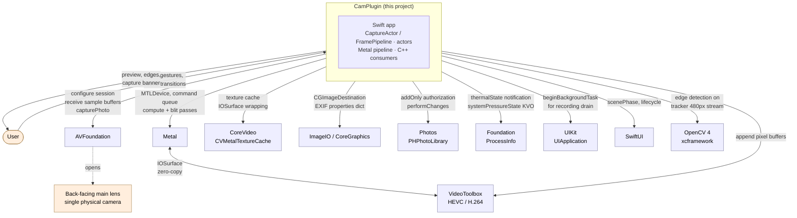
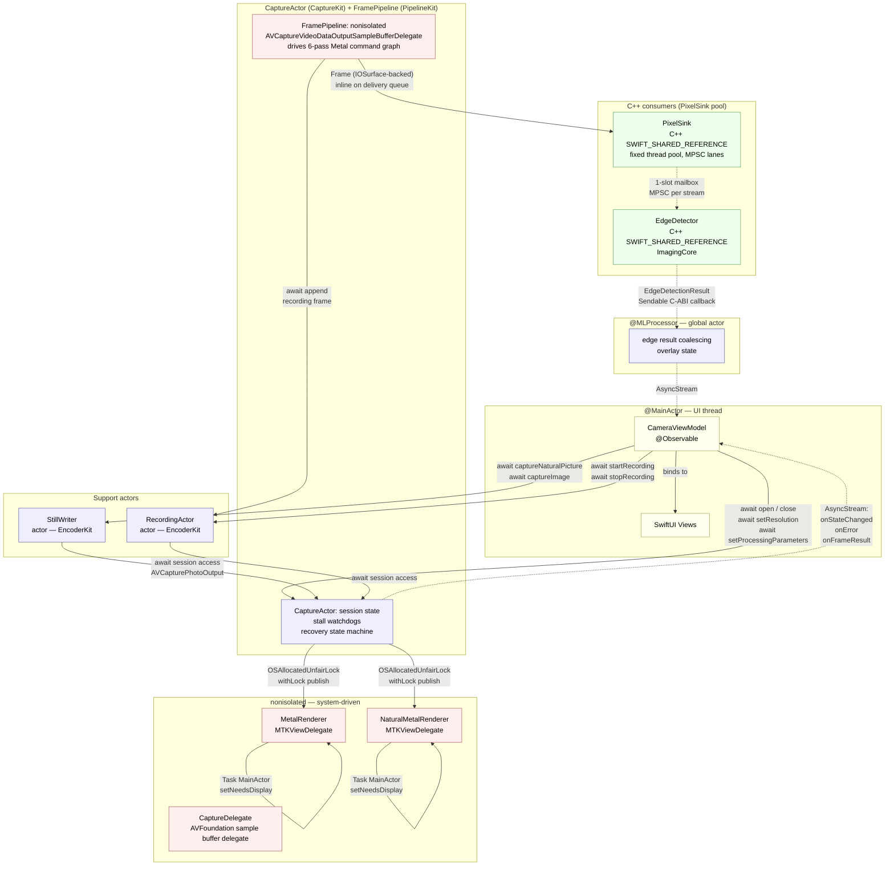
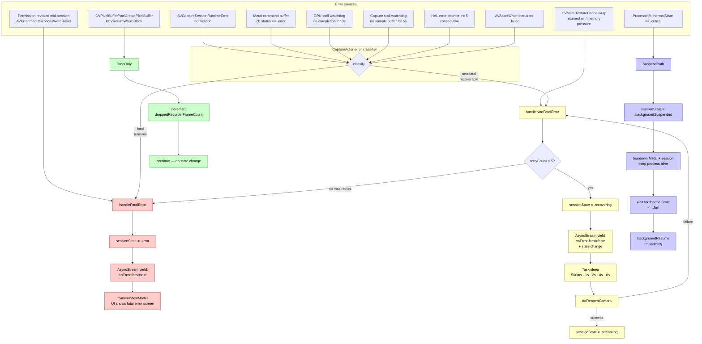
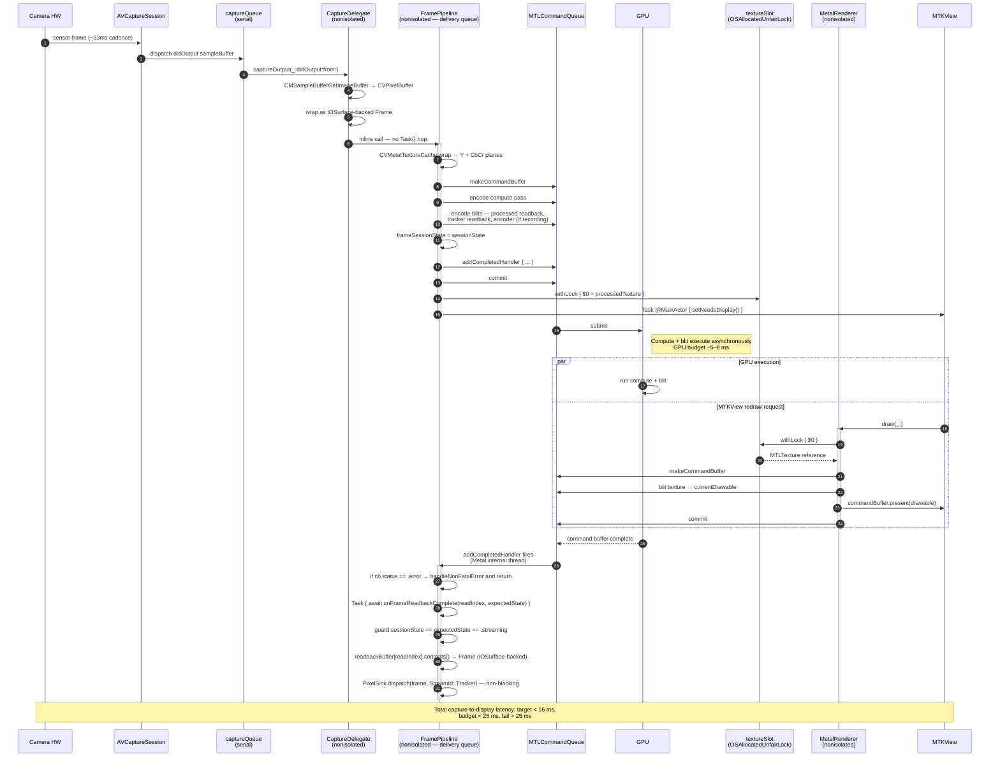
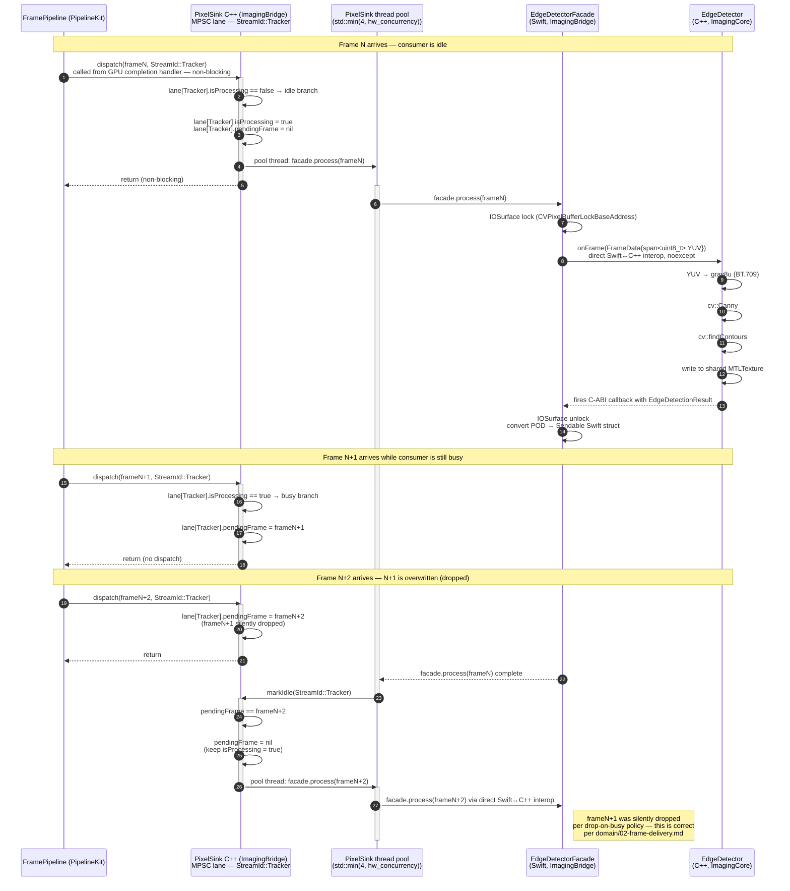
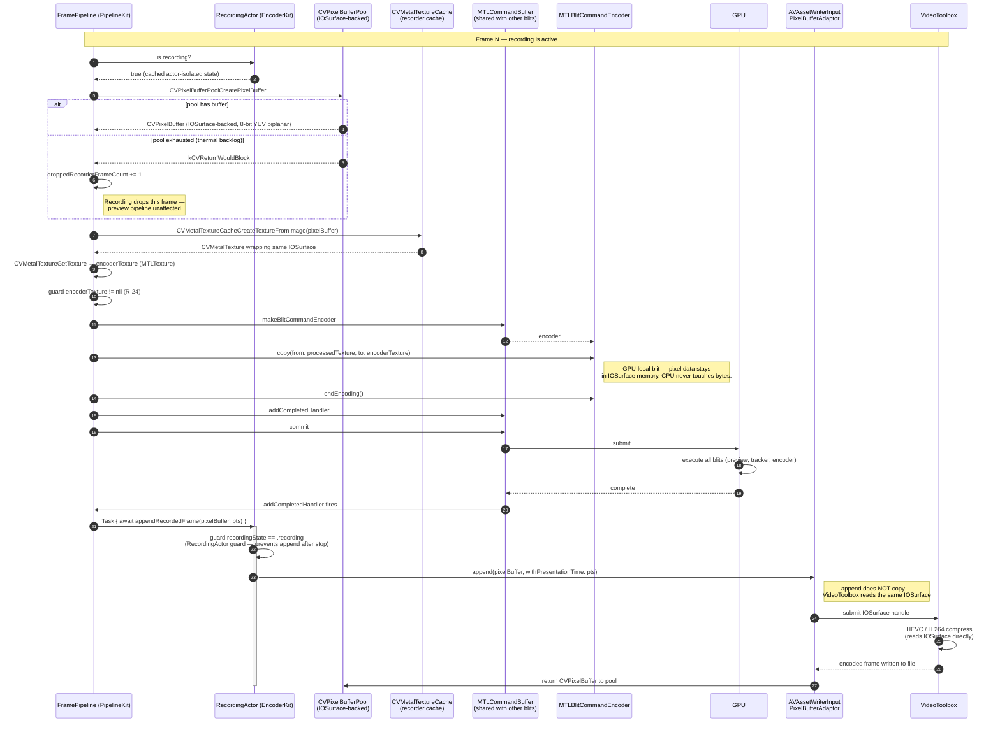
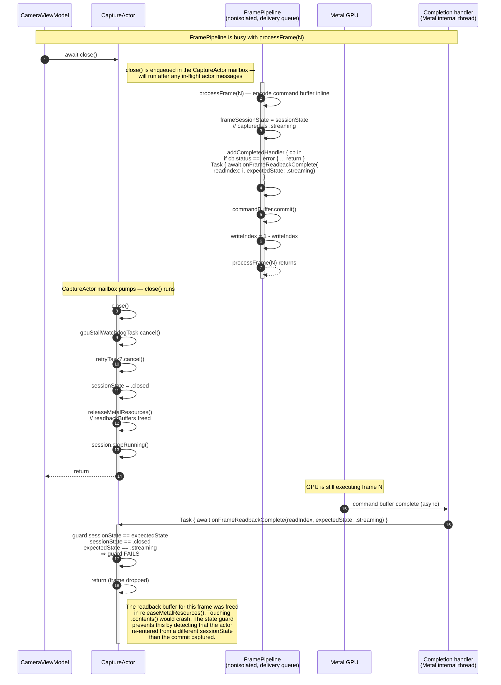
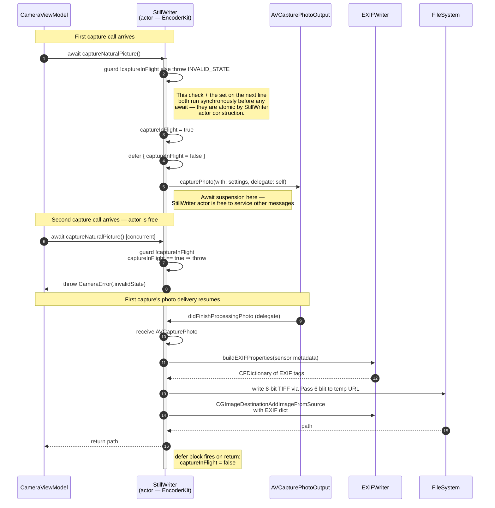

# 09 — Architecture Diagrams

Visual reference for the iOS architecture. Diagrams are authored in **Mermaid** — the source
text in each code block is the canonical form, so both humans (rendered on GitHub / in IDEs /
in Claude Code UI) and LLM agents (reading the raw markdown) see the same structure.

This file is a **reference companion** to `01-architecture.md` through `08-audit-lookups.md`.
Every diagram cross-links to the design file(s) where the component is specified in prose.

**Sidecar files in [`diagrams/`](diagrams/)**:
- `diagrams/NN-name.mmd` — extracted standalone Mermaid source for each diagram (editable, shareable)
- `diagrams/NN-name.png` — pre-rendered PNG at 2× scale with white background (for slide decks,
  issue attachments, and tools that can't render Mermaid)

**To regenerate** after editing any diagram in this file:
```sh
./design/diagrams/render.sh
```
That script calls `design/diagrams/extract.py` (re-extracts all mermaid blocks into `.mmd`
sidecar files) and then runs `mmdc` on each to produce the PNGs. Prerequisites:
```sh
npm install -g @mermaid-js/mermaid-cli
```
If you add or remove a diagram from this file, update `NAMES` in `extract.py` to match the
new block order.

**Mermaid gotchas encountered during initial rendering** (keep in mind when editing):
- **Semicolons** `;` are treated as statement terminators in Mermaid — they cannot appear inside
  sequence-diagram messages, notes, or edge labels. Use `—`, `/`, or `and` instead.
- **The `@` character** in flowchart node labels is lexed as the new typed-shape/edge sigil
  (e.g. `A@{shape: rect}`). Labels containing `@MainActor`, `@Observable`, etc. must be
  wrapped in double quotes: `VM["CameraViewModel<br/>@Observable"]`.
- **`---|label|`** (undirected link with label) is not valid syntax — use a directed link
  `-->|label|` or an unlabeled undirected link `---`.

---

## Contents

**Part 1 — Architecture / flow diagrams**
1. [System context](#1--system-context) — app boundary and iOS service dependencies
2. [Actor topology](#2--actor-topology) — Swift actors and their message channels
3. [Frame data-flow + buffer ownership](#3--frame-data-flow--buffer-ownership) — 4-stream pipeline with per-buffer ownership table
4. [Metal pipeline internals](#4--metal-pipeline-internals) — compute kernel inputs/outputs and post-encode blits
5. [Error propagation](#5--error-propagation) — how errors reach the UI and the recovery paths

**Part 2 — Sequence diagrams**
6. [Hot path: capture → display](#6--hot-path-capture--display) — the 33 ms per-frame budget
7. [Fan-out to C++ consumer](#7--fan-out-to-c-consumer-1-slot-mailbox) — 1-slot mailbox drop-on-busy semantics
8. [GPU-to-encoder zero-copy recording](#8--gpu-to-encoder-zero-copy-recording) — IOSurface never touches the CPU
9. [Actor re-entrancy guard](#9--actor-re-entrancy-guard-f-01) — close() during an in-flight frame
10. [Still capture in-flight guard](#10--still-capture-in-flight-guard) — concurrent capture rejection

---

## How to read the diagrams

- **Solid arrows** (`-->`): synchronous call, actor-to-actor `await`, or command-buffer encoding step
- **Dashed arrows** (`-.->`): asynchronous or conditional flow (AsyncStream delivery, callbacks, optional paths)
- **Colors on `subgraph` boundaries** (where present): isolation domain (actor vs `@MainActor` vs `nonisolated`)
- **In sequence diagrams**: `activate` / `deactivate` on a participant lifeline = that participant is currently processing a message; the bar visualizes holding the actor

Every structural decision shown here has a corresponding prose entry in `06-decisions-log.md`
or a risk entry in `07-ios-specific-risks.md`. When a diagram and prose disagree, the prose wins
and the diagram should be patched.

---

# Part 1 — Architecture / Flow

## 1 — System context

The app's dependency boundary against iOS system frameworks and the single external library (OpenCV).
This is the C4-level-1 view — "what does CamPlugin touch in the outside world?"

Cross-ref: `01-architecture.md §System Overview`, `06-decisions-log.md D-05, D-11`.



**Key takeaways:**
- Single physical camera by product decision (`domain/12-unresolved.md §U-17`).
- Metal ↔ VideoToolbox zero-copy is the *only* arrow that is bidirectional — both read and write the same `IOSurface`-backed pixel buffers.
- OpenCV is the only non-Apple dependency.
- No microphone / `AVAudioSession` boundary (`05-implementation-phases.md §Phase 5` — video-only recording).

---

## 2 — Actor topology

Swift isolation domains and the message channels between them. This is where Invariants 1, 2,
4, 5, 6, 7, and 10 from `domain/04-concurrency-invariants.md` are enforced structurally.

Cross-ref: `02-concurrency.md §Isolation Taxonomy`, `02-concurrency.md §Domain Invariant Mapping`,
`06-decisions-log.md D-01, D-10, D-12`.



**Key takeaways:**
- Solid arrows = synchronous `await` across actors. Dashed = async continuous delivery (`AsyncStream`).
- `MetalRenderer`, `CaptureDelegate`, and `FramePipeline` are **nonisolated** by necessity — they're invoked by
  the system (MTKView timer, AVFoundation serial queue) and cannot be actor-isolated without
  deadlocking. `FramePipeline` runs inline on the delivery queue (no `Task{}`).
- The crossings from the `CaptureActor` **to** the nonisolated renderers use
  `OSAllocatedUnfairLock<MTLTexture?>` for the texture slot — actor isolation alone does not
  protect these reads (F-01 / C-03).
- `PixelSink` is a C++ `SWIFT_SHARED_REFERENCE` class, not a Swift actor — consumer dispatch
  is handled entirely in C++ via per-stream MPSC lanes with 1-slot mailboxes.
- `@MLProcessor` is a custom global actor that keeps edge-detection result handling off the
  camera hot path.

---

## 3 — Frame data-flow + buffer ownership

The structural "where does each frame go" with the 4 parallel output streams. Detailed buffer
ownership lives in the table below the diagram.

Cross-ref: `03-metal-pipeline.md` (entire file), `domain/02-frame-delivery.md` §Parallel Stream Outputs.

### 3a — Data flow

```mermaid
flowchart TB
    HW[Back-main camera sensor]

    subgraph CaptureLayer["AVCaptureSession"]
        direction TB
        AVOut[AVCaptureVideoDataOutput]
        AVPhoto[AVCapturePhotoOutput]
    end

    HW --> AVOut
    HW --> AVPhoto

    AVOut -->|CVPixelBuffer<br/>kCVPixelFormatType_Lossless_420YpCbCr8BiPlanarFullRange<br/>~4000x3000| CD[CaptureDelegate]
    CD -->|Frame (IOSurface-backed)| CE[FramePipeline — inline on delivery queue]

    subgraph EngineWork["FramePipeline (nonisolated) — per frame work"]
        direction TB
        CE --> Wrap[CVMetalTextureCache wrap]
        Wrap -->|rgba16Float| Compute
        Compute[Metal compute kernel<br/>half-float RGBA<br/>5-stage color pipeline]
    end

    Compute -->|rgba16Float<br/>full res| Proc[processedTexture]
    Compute -->|rgba16Float<br/>full res, passthrough| Nat[naturalTexture]
    Compute -->|rgba16Float<br/>480px height| Trk[trackerTexture]
    Compute -.->|bgra8Unorm<br/>downcast for encoder,<br/>only while recording| EncT[encoderTexture<br/>from IOSurface pool]

    Proc -->|OSAllocatedUnfairLock<br/>publish| PSlot[processedTextureSlot]
    Nat -->|OSAllocatedUnfairLock<br/>publish| NSlot[naturalTextureSlot]

    Proc -->|blit| RB[readbackBuffer 0 / 1<br/>double-buffered]
    Trk -->|blit| TRB[trackerReadbackBuffer]

    PSlot --> MR[MetalRenderer.draw]
    NSlot --> NMR[NaturalMetalRenderer.draw]

    MR -->|present| Disp1[MTKView<br/>processed preview]
    NMR -->|present| Disp2[MTKView<br/>natural preview]

    TRB -->|wrap Frame<br/>CPU-visible pixels| CR[PixelSink<br/>dispatch StreamId::Tracker]
    CR -.->|1-slot mailbox<br/>MPSC lane| EDC[EdgeDetector<br/>cv::Canny]

    EncT -.->|GPU-local blit<br/>stays in IOSurface| Pool[CVPixelBufferPool]
    Pool -.->|adaptor.append| AW[AVAssetWriterInput<br/>PixelBufferAdaptor]
    AW -.->|same IOSurface| VT[VideoToolbox encoder]

    classDef display fill:#efe,stroke:#6a6,color:#000
    classDef record fill:#fee,stroke:#a66,color:#000
    classDef consume fill:#eef,stroke:#66a,color:#000
    class Disp1,Disp2,MR,NMR,PSlot,NSlot display
    class EncT,Pool,AW,VT record
    class EDC,CR,TRB,CD,CE consume
```

### 3b — Buffer ownership and lifetime

| Buffer | Type | Allocator | Retain period | Release trigger | Notes |
|---|---|---|---|---|---|
| `inputPixelBuffer` | `CVPixelBuffer` (kCVPixelFormatType_Lossless_420YpCbCr8BiPlanarFullRange, IOSurface-backed) | AVFoundation internal pool | Retained by `CMSampleBuffer`; transferred via IOSurface-backed `Frame` struct | When `FramePipeline` completes inline processing (CFType release) | `@unchecked Sendable` wrapper — safe because `CVPixelBuffer` retain/release is thread-safe CFType semantics. AVFoundation reuses the buffer once all retains drop. |
| `inputTexture` | `MTLTexture` (rgba16Float) | `CVMetalTextureCache` wrap of `inputPixelBuffer` | Per-frame; bound to the command buffer encode | Automatic when the command buffer completes | Zero-copy — same `IOSurface` as the input. Never copied to CPU. |
| `processedTexture` | `MTLTexture` (rgba16Float, full res) | `FramePipeline` at session-start (or resize) | Session | `teardownSession()` — also rebuilt on `setResolution()` | Pre-allocated; reused every frame. Size depends on `AVCaptureDevice.formats` selection. Pass 1 converts from YUV to RGBA16F. |
| `naturalTexture` | `MTLTexture` (rgba16Float, full res) | Same as above, only if `enableNaturalStream == true` | Session | `teardownSession()` | Passthrough — no GPU color transforms applied. |
| `trackerTexture` | `MTLTexture` (rgba16Float, aspect-preserving, 480 px tall, even-width) | Same as above | Session | `teardownSession()` | Fixed 480 px height per `domain/12-unresolved.md §U-15 RESOLVED`. Width formula preserved verbatim. |
| `readbackBuffer[0]`, `readbackBuffer[1]` | `MTLBuffer` with `.storageModeShared` | `FramePipeline` at session-start | Session | `teardownSession()` | Double-buffered — Metal writes to `writeIndex`, CPU reads from `readIndex = 1 - writeIndex` after the previous command buffer's completion handler fires. Serves the `ProcessedFullResolution` consumer role (if any) and `sampleCenterPatch`. |
| `trackerReadbackBuffer` | `MTLBuffer` with `.storageModeShared` | `FramePipeline` at session-start | Session | `teardownSession()` | CPU-accessible; blit target for `trackerTexture` → handed to `EdgeDetector` via `PixelSink` wrapped as IOSurface-backed `Frame`. |
| `encoderPixelBuffer` | `CVPixelBuffer` (IOSurface-backed, 8-bit YUV biplanar) | `adaptor.pixelBufferPool` created by `RecordingActor` on recording start | Per recorded frame | Returned to pool after `AVAssetWriter` completes encoding | Pool configured with `kCVPixelBufferIOSurfacePropertiesKey: [:]` + `kCVPixelBufferMetalCompatibilityKey: true`. `maximumBufferCount ≥ 6` to survive encoder backlog during thermal throttling (F-04 deferred mitigation). HEVC 8-bit via 8-bit YUV biplanar adaptor pool. |
| `encoderTexture` | `MTLTexture` | `CVMetalTextureCache` wrap of `encoderPixelBuffer` | Per recorded frame | Implicit when the wrapped pixel buffer is appended to the adaptor | Recorder owns its **own** `CVMetalTextureCache` distinct from the input cache — mixing lifecycles is a bug. |
| `textureSlot`, `naturalTextureSlot` | `OSAllocatedUnfairLock<MTLTexture?>` | `MetalRenderer` / `NaturalMetalRenderer` init | Renderer lifetime | Renderer `deinit` | Protects publisher (`FramePipeline`, nonisolated delivery queue) vs consumer (`draw(_:)`, nonisolated MTKView thread). Held for microseconds per swap. |
| `frame` (IOSurface-backed `Frame` struct) | Swift struct wrapping an IOSurface-backed `CVPixelBuffer` | `FramePipeline` per frame at dispatch time | Lifetime of `EdgeDetector.onFrame()` C-ABI callback | Implicit when the consumer callback returns; IOSurface lock released | The pixel data is valid **only** while the IOSurface is locked — `EdgeDetector` locks IOSurface, runs cv::Canny, writes to shared `MTLTexture`, then releases. |

**Invariants enforced by this layout:**
- **Single memcpy per frame** (`domain/04-concurrency-invariants.md §Invariant 2`): Only the readback buffer paths perform a GPU→CPU blit; everything on the display and encoder paths stays in GPU/IOSurface memory.
- **No per-consumer copies** (`domain/02-frame-delivery.md §Consumer Dispatch Semantics`): All registered consumers for a given stream share the same `Frame` — the 1-slot MPSC mailbox in `PixelSink` passes a reference, not a copy.
- **GPU→encoder zero-copy** (`domain/08-capture-and-recording.md §Video Encoding`): `MTLTexture.getBytes` is explicitly **forbidden** on the recording path (see `03-metal-pipeline.md §GPU-to-Encoder Path`).

---

## 4 — Metal pipeline internals

Zoom into the compute kernel stage of diagram 3. Shows inputs, uniforms, and all outputs in
a single command buffer encode pass, plus the post-compute blit pass.

Cross-ref: `03-metal-pipeline.md §Compute Kernel`, `03-metal-pipeline.md §Texture Specification`,
`06-decisions-log.md D-18 (capture format: kCVPixelFormatType_Lossless_420YpCbCr8BiPlanarFullRange; working format: RGBA16F throughout GPU passes)`.

```mermaid
flowchart LR
    subgraph Inputs["Kernel inputs (per frame)"]
        direction TB
        IN[inYUV (Y + CbCr planes)<br/>texture2d, read<br/>from kCVPixelFormatType_Lossless_420YpCbCr8BiPlanarFullRange]
        U[ColorUniforms<br/>brightness, contrast, saturation,<br/>gamma, blackBalance<br/>enableNaturalStream flag]
    end

    subgraph Kernel["Metal compute kernel — cam_pipeline.metal (6-pass, half-float working)"]
        direction TB
        K1[1. Pass 1: YUV → RGBA16F conversion<br/>BT.709 matrix, writes rgba16Float]
        K2[2. black balance offset + rescale<br/>half math, full rate]
        K3[3. 5-stage color pipeline<br/>black balance -> brightness -><br/>contrast -> saturation -> gamma]
        K4[4. write processed<br/>write natural passthrough<br/>write tracker downscaled]
        K1 --> K2 --> K3 --> K4
    end

    IN --> Kernel
    U --> Kernel

    Kernel -->|rgba16Float| P[processedTexture]
    Kernel -->|rgba16Float<br/>no color transforms| N[naturalTexture]
    Kernel -->|rgba16Float| T[trackerTexture<br/>480 px tall]

    subgraph BlitPass["Post-compute blit pass (same command buffer)"]
        direction TB
        BE[MTLBlitCommandEncoder]
        BE --> RB1[readbackBuffer<br/>writeIndex]
        BE --> TRB[trackerReadbackBuffer]
        BE -.->|recording only<br/>GPU-local copy| ENCT[encoderTexture<br/>IOSurface-backed]
    end

    P -.-> BE
    T -.-> BE

    subgraph Completion["Command buffer completion"]
        CH[addCompletedHandler<br/>1. check cb.status == .error<br/>2. Task await onFrameReadbackComplete<br/>   with expectedState guard]
    end

    BlitPass --> CH
```

**Key points:**
- Pass 1 converts the YUV capture format to RGBA16F; subsequent passes operate in half-float throughout. The kernel writes **three** outputs in a single dispatch (processed, natural, tracker) — one kernel, three `texture2d<half, access::write>` arguments. The natural stream is simply the pre-color-pipeline RGBA16F written to its own target.
- The blit pass is encoded into the **same** command buffer as the compute pass — they are committed together. This keeps the completion handler semantics coherent.
- The encoder texture blit only executes when `RecordingActor.recordingState == .recording`. When not recording, the encoder texture is not created and the adaptor pool is not allocated.
- The completion handler has two responsibilities (both added during the post-review patch pass): (a) check `cb.status == .error` for silent GPU failures (R-23), (b) re-enter the actor with the captured `expectedState` to guard against re-entrancy during teardown (F-01).

---

## 5 — Error propagation

How errors from each subsystem reach the UI and the recovery state machine. Shows both the
fatal and non-fatal paths and the final emission point.

Cross-ref: `domain/06-error-and-recovery.md`, `02-concurrency.md §Invariant 9 (Recovery Cancellation)`,
`07-ios-specific-risks.md §Domain Edge Case → iOS Handling Mapping`.



**Key points:**
- Every non-fatal error path ultimately transitions through `.recovering` → `Task.sleep` (backoff) → `doReopenCamera`. Five consecutive failures promote to fatal.
- The **recovery cancellation** invariant (`domain/04-concurrency-invariants.md §Invariant 9`) is enforced by storing the retry task in the actor and cancelling it on `close()` or `backgroundSuspend()` — the retry body checks `Task.isCancelled` before acting.
- `E9` (texture cache wrap nil under memory pressure, per R-24) is explicitly non-fatal — the frame is dropped, a counter increments, and the next frame retries. It does not reach the stall watchdog unless it persists for 3 seconds.
- `E10` (encoder pool exhaustion) and `E9` both use the drop-only path: the recording or preview frame is lost but no state change occurs. This is critical for thermal survival — a cascade of drop-on-busy must not trigger recovery.

---

# Part 2 — Sequence Diagrams

## 6 — Hot path: capture → display

The per-frame sequence against the 33 ms budget. Shows the actor hop from the AVFoundation
serial queue, the Metal command buffer lifecycle, the texture slot publish, and the `MTKView`
on-demand redraw.

Cross-ref: `03-metal-pipeline.md §Frame Budget`, `02-concurrency.md §Invariant 4, 6`,
`07-ios-specific-risks.md R-23, R-24`.



**Key points:**
- `FramePipeline` runs inline on the delivery queue — no `Task{}` hop. The capture queue is held for the encode + commit sequence, then released. This eliminates the actor scheduling overhead on the hot path.
- The `par` block shows that **GPU execution and MTKView redraw overlap** — this is correct because the texture slot published the *previous* frame's output. The MTKView read happens on the Metal thread's `draw(_:)` callback; the GPU compute for the *next* frame runs concurrently.
- The completion handler reads the readback buffer and dispatches to the consumer — this is the only CPU touch of processed pixels, and it happens one frame **after** the initial commit (double-buffered).

---

## 7 — Fan-out to C++ consumer (1-slot mailbox)

The drop-on-busy semantics of `PixelSink` MPSC dispatch. Shows three frames arriving while
the consumer is busy with the first, and how `markIdle` re-dispatches the newest pending frame.

Cross-ref: `04-opencv-integration.md §PixelSink`, `domain/02-frame-delivery.md §Consumer
Dispatch Semantics`.



**Key points:**
- `PixelSink.dispatch` is **non-blocking** — it is called from the GPU completion handler and must return immediately. The MPSC lane atomically swaps the pending frame slot without taking a heavyweight lock.
- The **producer (`FramePipeline`) is never blocked** by consumer slowness. The 1-slot mailbox guarantees memory stays flat (`O(1)` per consumer regardless of frame rate).
- The "drop-on-busy" semantics are the key product contract: the consumer is guaranteed to always process the *newest* frame it can, never a stale one. This is the correct behavior for real-time edge detection.

---

## 8 — GPU-to-encoder zero-copy recording

The per-frame sequence that writes a recorded frame to the encoder without ever touching CPU
pixel memory. Verification point for F-03's zero-copy claim.

Cross-ref: `03-metal-pipeline.md §GPU-to-Encoder Path`, `06-decisions-log.md D-03`,
`domain/08-capture-and-recording.md §Video Encoding`.



**Key points:**
- **The CPU never touches recorded pixel data.** Three GPU-side operations handle everything: (1) compute kernel writes `processedTexture`, (2) blit encoder copies to `encoderTexture`, (3) VideoToolbox reads the same `IOSurface`. Every buffer transition stays in GPU/shared memory.
- The **recorder texture cache is separate** from the input texture cache. This is intentional: the input cache is invalidated on session teardown; the recorder cache is invalidated on recording stop. Mixing them couples their lifecycles incorrectly. `RecordingActor` owns its own cache.
- `CVPixelBufferPoolCreatePixelBuffer` can return `kCVReturnWouldBlock` under thermal throttling when the encoder backlog fills the pool. The correct response is to **drop the recording frame only** — the preview pipeline keeps going. This is the documented mitigation for F-04.

---

## 9 — Actor re-entrancy guard (F-01)

The subtlest sequence in the system: `close()` arrives while a frame is mid-flight in the Metal
pipeline. Without the state guard, the completion handler would access freed buffers.

Cross-ref: `03-metal-pipeline.md §onFrameReadbackComplete`, `review/02-adversarial-red-team.md F-01`.



**Why this works:**
- `frameSessionState` is captured **synchronously** before the `commit()` — actor re-entrancy cannot race this assignment because it runs on the actor before any `await`.
- The guard `sessionState == expectedState` detects *any* state change between commit and completion, not just `.closed`. It also catches `backgroundSuspend()`, `setResolution()`, and fatal errors.
- The same pattern protects the `Metal command buffer error` path — if the GPU faults, the completion handler also checks `cb.status == .error` and routes to `handleNonFatalError` instead of the normal readback path.

---

## 10 — Still capture in-flight guard

Shows how `StillWriter.captureNaturalPicture()` enforces `domain/04-concurrency-invariants.md §Invariant 7`
(atomic one-capture-at-a-time) using actor isolation alone — no locks.

Cross-ref: `02-concurrency.md §Invariant 7`, `05-implementation-phases.md §Phase 5 Acceptance Criteria`.



**Why the guard is correct without locks:**
- `guard !captureInFlight` and `captureInFlight = true` both execute **synchronously** before the first `await` in the method. Actor isolation guarantees no other method can interleave between these two lines.
- Once the actor suspends on `await APO.capturePhoto(...)` (via the delegate callback), *other* actor methods can run — but any concurrent `captureNaturalPicture` call will re-enter the guard and find `captureInFlight == true`, correctly rejecting.
- `defer { captureInFlight = false }` runs after the `return` (or any `throw`), ensuring the flag is always cleared regardless of success or failure path.

**This pattern is load-bearing** because it replaces an explicit `NSLock` or atomic flag with purely structural Swift-language semantics. Any change to the ordering (moving the guard after an `await`) would break the invariant — document this in the source as a comment.

---

## Regenerating / editing diagrams

Mermaid source is the canonical form. To edit:
1. Open this file in any Markdown editor with Mermaid preview (VS Code + "Markdown Preview Mermaid Support", or paste into https://mermaid.live).
2. Edit the source inside the ```` ```mermaid ```` fences.
3. Commit — GitHub renders the updated diagram automatically on the next view.

To export a single diagram as PNG / SVG for a slide deck or external doc:
```sh
npm install -g @mermaid-js/mermaid-cli
mmdc -i diagram.mmd -o diagram.png
```

If a diagram and the prose design files disagree, **the prose wins**. Patch the diagram to
match and add a note in `06-decisions-log.md` if the disagreement reveals a real design change.
