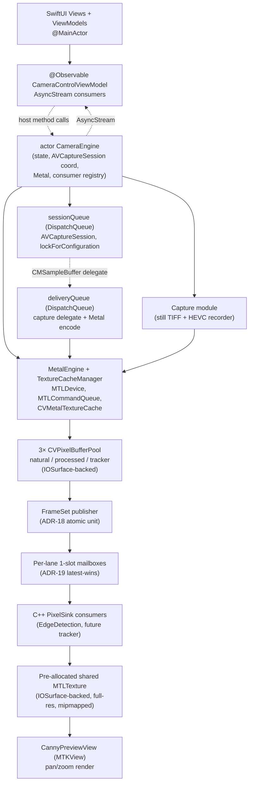

# 01 — iOS Architecture

This document describes the native iOS system architecture that satisfies the behavior
requirements in `domain-revised/` using the platform decisions captured in
`ios-platform-guide/`. The design is iOS-first: the layering, actor topology, and frame
plumbing come from ADR-01, ADR-02, ADR-03, ADR-13, ADR-18, and ADR-19 — not from
translating an Android structure.

## 1. Overall Shape

The app is a single-scene SwiftUI application with exactly one active camera session
(domain §01 Session Model). Per **ADR-01**, the baseline is a two-file core
(`CameraView.swift` + `CameraEngine.swift`) that grows only where the domain genuinely
forces a new boundary. Three domain triggers force growth beyond the two-file baseline:

1. **Three preview `MTKView`s** (split natural/processed + separate canny pane) require
   three `UIViewRepresentable` wrappers; kept inline in the view file per ADR-01.
2. **C++ OpenCV edge-detection consumer** needs a physically separate Cpp target
   (ADR-11, ADR-12, ADR-13) so OpenCV headers never leak into Swift.
3. **Still capture + video recording** have lifetimes orthogonal to the frame clock,
   so they live in their own capture module coordinated through the engine actor
   (ADR-02 "one actor per lifecycle").

Everything else (device control, state machine, permissions, thermal/pressure, consumer
registry) collapses into the engine actor. The "sandwich" layering (Application →
Plugin SDK → Controller → C++ GPU) described in `domain-revised/01` is iOS-realized as a
two-isolation-domain model (`@MainActor` UI / `actor CameraEngine` state), with the
per-frame path running on a dedicated `DispatchQueue` that hops no actor boundary
(ADR-02 §"the frame clock never hops a Swift actor boundary", ADR-07).

## 2. Module / Layer Diagram



Node count: 13 (slightly over the 12 soft cap; collapsing the three pools into one or
the two preview views into one would erase load-bearing structure — Natural/Processed
split (domain §09 UI) and the IOSurface multi-pool design (ADR-19) are the design's
core invariants).

## 3. Layer Responsibilities and Communication Contracts

Per **ADR-02** (single heavy isolation domain) there are only two Swift isolation
domains: `@MainActor` (UI) and `actor CameraEngine` (state). The per-frame path runs
nonisolated on `deliveryQueue`.

| Layer | Runs on | Owns | Talks to |
|---|---|---|---|
| SwiftUI Views | `@MainActor` | View structure; gesture state for canny pan/zoom | ViewModel (direct); never sees pixel buffers |
| `@Observable CameraControlViewModel` | `@MainActor` | UI state, slider values, stats bindings | Engine (async host methods); subscribes to engine's `AsyncStream<SessionState>`, `AsyncStream<FrameResult>`, `AsyncStream<CameraError>`, `AsyncStream<FrameDeliveryStats>` |
| `actor CameraEngine` | isolated | `CameraStateMachine`, session handle, consumer registry, thermal/pressure monitors, persisted settings | Hops to `sessionQueue` for `AVCaptureSession` work (ADR-07); coordinates Metal via `MetalEngine`; publishes Sendable results to ViewModel |
| `sessionQueue` | serial `DispatchQueue` | `AVCaptureSession.startRunning/stopRunning`, `device.lockForConfiguration` — **the only place** `AVCaptureDevice` is mutated (ADR-07, G-14) | Capture delegate on `deliveryQueue`; engine actor via async hops |
| `deliveryQueue` | serial `DispatchQueue` | Per-frame: YUV→RGB compute, color ops, downsample, encoder/still/consumer writes; Metal command-buffer commit | Metal; `FrameSet` publication into mailboxes; single `Task { @MainActor }` hop at end of delegate for UI coalescing |
| `MetalEngine` | nonisolated class (touched from `deliveryQueue` only) | `MTLDevice`, `MTLCommandQueue`, `MTLLibrary`, pipeline states, `CVMetalTextureCache` (ADR-04), the three `CVPixelBufferPool`s | Texture cache; pools; shared canny MTLTexture |
| `ConsumerRegistry` (Swift + C++ halves) | registry map on engine actor; dispatch on `deliveryQueue` | Subscribed lanes (`.natural`, `.processed`, `.tracker`) and their 1-slot mailboxes (ADR-19) | C++ `PixelSink` consumers via C-ABI facade |
| `Capture` module | `deliveryQueue` for readback; `AVAssetWriter` queue for mux | Still TIFF encoder + recorder state; bitrate/fps configuration | Metal (readback blit pass per ADR-16, ADR-06); Photo library |

**Sandwich mapping.** The domain's four-layer topology (Application / Plugin SDK /
Controller / C++ GPU) maps to iOS as follows — the outer sandwich (UI ↔ results) is
Swift-native; the inner sandwich (camera state ↔ GPU / C++ consumers) is the engine's
concern:

- Application = SwiftUI views (`@MainActor`).
- Plugin SDK = the engine actor's public async surface (`open`, `close`, `pause`,
  `updateSettings`, `captureImage`, `startRecording`, etc. — one per row of
  `domain-revised/10`).
- Controller = the engine actor's internal state machine + session-queue bridge.
- C++ GPU Layer = the `Cpp/` target with the public `PixelSink` facade. OpenCV and
  heavy C++ stay behind `noexcept` (ADR-11, ADR-12).

## 4. Frame Delivery Data Flow

One `MTLCommandBuffer` per sample buffer, built and committed on `deliveryQueue`. The
graph follows the per-frame command graph in `ios-platform-guide/01` exactly:

```
CMSampleBuffer (8-bit biplanar YUV, lossless variant preferred per ADR-05)
  ↓  CVMetalTextureCache (ADR-04, ADR-15 nil-check)
yTex (R8Unorm) + cbcrTex (RG8Unorm)  — two CVMetalTextures, zero-copy
  ↓
Dequeue 3 pool buffers BEFORE passes run (ADR-18):
  naturalPoolBuf, processedPoolBuf, trackerPoolBuf [gated on subscriber]
  ↓
[MTLCommandBuffer begin]
  Pass 1 (compute)  crop + YUV→RGB (BT.709) → naturalTex (and → naturalPoolBuf)
  Pass 2 (compute)  color transforms (black balance → brightness → contrast →
                    saturation → gamma, per domain §03 processing order)
                    → processedTex (and → processedPoolBuf)
  Pass 3 (blit)     naturalTex   → naturalMTKView drawable
  Pass 3b (blit)    processedTex → processedMTKView drawable
  Pass 4 (compute)  processedTex → trackerTex (≈480p, aspect preserved) →
                    trackerPoolBuf                     [gated: tracker subscribers > 0]
  Pass 5 (compute)  RGBA16F → NV12 → encoder pool buf  [gated: recording active]
                    (ADR-06 — NOT a blit; matrix math + quantization + chroma subsample)
  Pass 6 (blit)     processedTex → still readback CVPixelBuffer [gated: stillRequested]
[commit + addCompletedHandler + addScheduledHandler (os_signpost pairs)]
```

**Three named sinks per ADR-18.** A single `FrameSet` carries all three
IOSurface-backed `CVPixelBuffer` refs plus capture metadata + processing metadata, so
any consumer that correlates two sinks observes a consistent pair:

- **`natural`** — full-res crop only, RGBA16F.
- **`processed`** — full-res crop + all color ops, RGBA16F.
- **`tracker`** — RGBA16F, fixed 480px height, width = `processedTex.width × 480 /
  processedTex.height` (aspect preserved, even-pixel-rounded), downsampled from
  `processedTex` (domain §02 parallel streams resolves U-15).

Each sink supports N async consumers via per-lane latest-wins mailboxes (ADR-19).
`subscribe(.natural)` / `.processed` / `.tracker` are the public registration surface
required by `domain-revised/10 §Consumer Registration API` (reverses U-13: natural is
also subscribable on iOS).

**Display paths use the same IOSurfaces as consumer refs.** The natural and processed
preview `MTKView`s each blit from the corresponding `*Tex` in the same command buffer
that writes the pool buffer (Pass 3 / Pass 3b). Because the pool buffer's IOSurface
*is* the texture's backing store when the texture is `.shared` (ADR-20), display and
async-consumer pixels are bit-identical.

**Storage-mode discipline (ADR-20, G-25).** `naturalTex` and `processedTex` are
dynamic:
- `.private` when no `PixelSink` subscriber is attached to that stream (saves DRAM
  bandwidth; `.private` textures have nil `.iosurface`, which would silently drop
  frames if a consumer were attached — G-25).
- Flip to `.shared` (IOSurface-backed via `makeTexture(descriptor:iosurface:plane:)`
  on a `CVPixelBuffer` dequeued from the pool) on first subscribe; rotate over one
  frame boundary to let in-flight buffers drain (ADR-20).
- `trackerTex` is permanently `.shared` — the edge-detection consumer is designed-in.

## 5. Results Return Path

Two distinct return shapes (ADR-13 §"What never crosses the consumer boundary"):

**(A) Rendering consumers (canny / edge detection).** C++ writes a composited
full-res RGBA image into a **pre-allocated shared `MTLTexture`** (IOSurface-backed,
mipmap levels, `MTLTextureUsageShaderRead | MTLTextureUsageRenderTarget`; allocated
**once** at engine setup and reused every frame — no per-frame allocation). The
handoff path is:

```
C++ EdgeDetectionConsumer (consumer thread, dispatched from deliveryQueue):
  • receives FrameSet.tracker (480p, zero-copy CVPixelBufferLockBaseAddress + cv::Mat)
  • cv::Canny → edge mask at tracker resolution
  • composites edge overlay onto full-res source (from FrameSet.processed per D-06)
  • IOSurfaceLock(shared surface, writeFlag); memcpy; IOSurfaceUnlock
  • C-ABI write-complete callback → Swift
Swift side (on Metal blit queue, triggered by callback):
  • MTLBlitCommandEncoder.generateMipmaps(for: sharedCannyTexture)
  • commit + present to CannyPreviewView's MTKView (with pan/zoom uniforms)
```

No Sendable result struct crosses the boundary for the canny pane. C++ drives the
render content by writing the shared IOSurface; Swift just triggers mipmap generation
+ render. The canny `MTKView` is **not** on the 30 Hz frame clock — it renders at the
edge-detector's actual throughput. Latest-wins mailbox ensures the canny view always
shows the most recent edge result without blocking the natural preview (domain §02
Drop-on-busy; invariant 10).

**(B) Data consumers (future tracker, ML inference, metadata heartbeats).** C++ (or
Swift) builds a Sendable result struct (`TrackerResult`, `FrameResult`, etc.), posts
via C-ABI callback to an `AsyncStream` continuation, and the ViewModel consumes with
`for await` on `@MainActor`. This is the path the domain `onFrameResult` ~3 Hz
heartbeat takes (domain §02 Frame Result Heartbeat, §10 FrameResult).

**Pan/zoom gesture state** for the canny pane lives in the ViewModel (`@MainActor`)
and is passed as uniforms on each Metal draw — not stored on the shared texture.

## 6. Domain → Design Mapping (pointer)

Full coverage table in `design/README.md`. Key links:

- Three-streams-subscribable (domain §02; reverses U-13) → ADR-18 `FrameSet` + §4
  above.
- Double-buffered readback "one frame behind" (domain §02) → native iOS CF pool depth
  N+1 per ADR-19 replaces the Android 2-PBO pattern; same behavioral outcome (no
  blocking readback) without porting PBO mechanics.
- Preview is consumer output, not sensor (domain §01 invariant 1) → Pass 2
  processedTex is the single source of truth for both the processed MTKView and the
  processed consumer lane.
- Recording encodes GPU output directly (domain §01 invariant 5) → Pass 5 compute into
  IOSurface-backed encoder pool (ADR-06, ADR-16).
- No CPU image processing (domain §01 invariant 6) → OpenCV is a **new iOS capability**
  for the edge consumer only (not a port; D-06); the rest of the pipeline is 100% GPU.
- No audio (domain §01 invariant 7) → no `AVCaptureAudioDataOutput`, no
  `NSMicrophoneUsageDescription` (G-12, G-24; `ios-platform-guide/04 §No-audio`).

## Cited ADRs

ADR-01 (two-file baseline, extended by domain triggers), ADR-02 (single heavy
isolation domain), ADR-03 (direct GPU outputs vs async consumers), ADR-04
(CVMetalTextureCache lifecycle), ADR-05 (rgba16Float working format), ADR-06
(GPU→encoder compute conversion), ADR-13 (async consumers, drop-on-busy), ADR-18
(FrameSet atomic publication), ADR-19 (pool sizing N+1, latest-wins, observability),
ADR-20 (dynamic texture storage mode).
