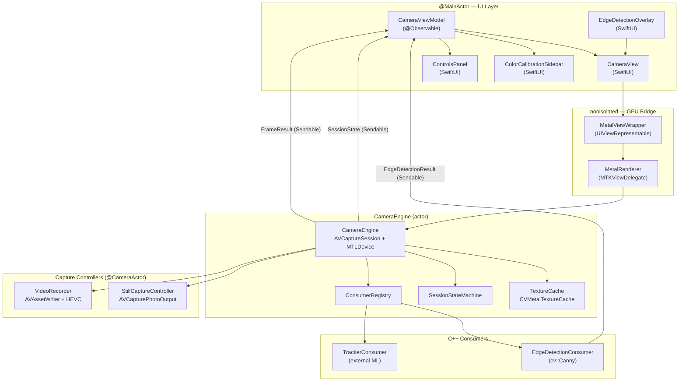
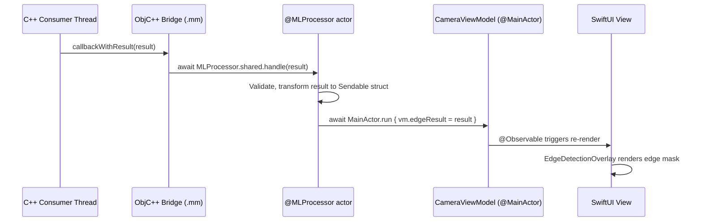

# 01 — Architecture

## Overview

The iOS design uses the **Sandwich pattern** — a three-layer architecture that cleanly separates
declarative UI (SwiftUI), imperative GPU rendering (MTKView), and camera/pipeline logic (CameraEngine).
Data and configuration flow down; processed frames and results flow up. No layer reaches past its
adjacent neighbor.

---

## Layer Diagram



---

## Layer Responsibilities

### Layer 1 — SwiftUI + ViewModel (`@MainActor`)

**Components:** `CameraView`, `CameraViewModel`, `ColorCalibrationSidebar`, `ControlsPanel`, `EdgeDetectionOverlay`

**Responsibilities:**
- Display session state (opening, streaming, recovering, paused, error, closed)
- Render split-screen preview (left: natural stream, right: GPU-processed) via `MTKView` wrappers
- Expose camera controls (ISO, exposure, focus, zoom, white balance, GPU color params)
- Display `FrameResult` readbacks at 3 Hz (ISO, exposure, focus distance, WB gains)
- Render edge detection results as a SwiftUI overlay
- Show recording elapsed timer and capture banner
- NEVER touches `CVPixelBuffer`, `MTLTexture`, or any pixel data

**Isolation:** All types and methods are `@MainActor`. `CameraViewModel` is marked `@Observable`.

**Communication contract:**
- Receives only `Sendable` value types from lower layers: `SessionState`, `FrameResult`, `EdgeDetectionResult`, `CameraError`, `RecordingState`
- Sends `CameraSettings` and `ProcessingParameters` (value types, `Sendable`) down to `CameraEngine`

---

### Layer 2 — Metal Bridge (`nonisolated`)

**Components:** `MetalViewWrapper` (`UIViewRepresentable`), `MetalRenderer` (`MTKViewDelegate`), `NaturalMetalViewWrapper`

**Responsibilities:**
- Bridge SwiftUI's declarative world to Metal's imperative rendering
- Wrap `MTKView` in `UIViewRepresentable` for embedding in SwiftUI
- Implement `MTKViewDelegate.draw(_:)` — called by the system on its own schedule
- Relay configuration changes (viewport size) from SwiftUI to Metal

**Isolation:** `nonisolated` — `MTKViewDelegate.draw(_:)` is called by the system on an arbitrary schedule and cannot be actor-isolated without deadlocking. All pixel data stays in `MetalRenderer` and never escapes to SwiftUI.

**Communication contract:**
- Receives `MTLTexture` references from `CameraEngine` via an atomic texture slot protected by `OSAllocatedUnfairLock<MTLTexture?>` (iOS 16+). The lock is held for microseconds per swap — it is not a lock-free structure, but it is contention-free in practice because producer and consumer touch it ~30–60 times per second on different threads.
- `CameraEngine.processFrame` stores the newly-rendered texture via `textureSlot.withLock { $0 = newTexture }` after the Metal command buffer is committed (but the texture is safe to publish immediately — Metal guarantees GPU writes become visible to subsequent GPU reads through command queue ordering).
- `MetalRenderer.draw(_:)` reads via `textureSlot.withLock { $0 }` and blits the result to the current drawable. A `nil` slot or a same-texture slot results in no-op.
- Triggers `MTKView.setNeedsDisplay()` from `CameraEngine` (via `Task { @MainActor in ... }`) when a new texture is published, so that `MTKView` does not render stale frames on its own timer.
- **`MTKView` configuration (required):** `isPaused = true`, `enableSetNeedsDisplay = true`, `preferredFramesPerSecond = 30`, `framebufferOnly = false`. This puts the view in on-demand redraw mode — `draw(_:)` fires only when `setNeedsDisplay()` is called, not on a 60Hz internal timer.
- Never calls back into SwiftUI directly; relies on `AsyncStream` + `CameraViewModel` for state

---

### Layer 3 — Camera Engine (actor)

**Components:** `CameraEngine` (Swift actor), `SessionStateMachine`, `ConsumerRegistry`, `CVMetalTextureCacheManager`, `StallWatchdog`, `SettingsPersistence`

**Responsibilities:**
- Own and manage the `AVCaptureSession` lifecycle
- Discover and open the back-facing main lens (`AVCaptureDevice`)
- Initialize and tear down the Metal GPU pipeline (render pipeline, compute pipeline)
- Implement the zero-copy camera-to-GPU path: `CVPixelBuffer` → `MTLTexture` via `CVMetalTextureCache`
- Run the 8-step per-frame GPU processing sequence (see `design/03-metal-pipeline.md`)
- Manage the `ConsumerRegistry` and dispatch frames to registered C++ consumers
- Own the `SessionStateMachine` and all state transitions
- Run stall watchdogs (GPU-level 3s, capture-result-level 5s)
- Apply camera hardware settings (`AVCaptureDevice` configuration)
- Orchestrate still capture and recording controllers

**Isolation:** Swift `actor` — all state mutations are automatically serialized. Satisfies domain Invariant 1 (camera state exclusively serialized).

**Communication contract:**
- Receives commands from `@MainActor` via `async` actor method calls
- Sends `Sendable` results back to `@MainActor` via `AsyncStream` or `async` return values
- Dispatches frames to C++ consumers via `ConsumerRegistry` (non-blocking, drop-on-busy)

---

### Layer 4 — C++ Consumers (independent execution contexts)

**Components:** `CppConsumerProtocol` (C++ interface), `EdgeDetectionConsumer`, external tracker consumers

**Responsibilities:**
- Receive frames via zero-copy `cv::Mat` or RGBA pointer wrapping `CVPixelBuffer` base address
- Process frames on their own independent threads (not on the camera actor)
- Return `Sendable` result structs to Swift via the `@MLProcessor` global actor
- Never block the camera engine or Metal render path

**Isolation:** Each consumer owns its own `DispatchQueue` or `pthread`. Results are marshalled to `@MLProcessor` then to `@MainActor`.

**Communication contract:**
- Receives: `CVPixelBuffer` (locked), frame metadata, frame index
- Returns: typed result structs implementing `ConsumerResult` (marked `Sendable`)
- Consumer interface defined in C++ (`IFrameConsumer`); implementation in ObjC++ (`.mm`)

---

## Frame Delivery Data Flow

```mermaid
sequenceDiagram
    participant Sensor as AVCaptureSession
    participant Queue as Capture Serial Queue
    participant Engine as CameraEngine (actor)
    participant Cache as CVMetalTextureCache
    participant Metal as Metal Compute Shader
    participant MTK as MTKView (processed)
    participant NATMTK as MTKView (natural)
    participant Consumer as C++ Consumer
    participant ML as @MLProcessor
    participant UI as @MainActor ViewModel

    Sensor->>Queue: captureOutput(_:didOutput:from:)
    Queue->>Engine: await engine.processFrame(buffer)
    Engine->>Cache: CVMetalTextureCacheCreateTextureFromImage
    Cache-->>Engine: MTLTexture (zero-copy)
    Engine->>Metal: Encode compute pass (color transforms)
    Metal-->>Engine: Processed texture in output MTLTexture
    Engine->>MTK: Set currentDrawable texture → display
    Engine->>NATMTK: Set passthrough texture → display
    Engine->>Engine: MTLBlitCommandEncoder → readback buffer
    Engine->>Engine: Insert MTLFence; wait ≤8ms
    Engine->>Engine: Map readback buffer (previous frame N-1)
    Engine->>Consumer: dispatch frame (CVBufferRetain + async handoff)
    Consumer-->>ML: ConsumerResult (Sendable)
    ML-->>UI: await MainActor.run { viewModel.update(result) }
```

---

## Results Return Path



---

## Module Layout

```
CamPlugin/
├── App/
│   ├── CamPluginApp.swift               # @main entry point
│   └── AppDelegate.swift                # UIApplicationDelegate lifecycle
├── UI/
│   ├── CameraView.swift                 # Root SwiftUI view (split-screen)
│   ├── CameraViewModel.swift            # @Observable; @MainActor
│   ├── ColorCalibrationSidebar.swift    # GPU params sliders
│   ├── ControlsPanel.swift              # ISO/exposure/focus/zoom bar
│   ├── EdgeDetectionOverlay.swift       # SwiftUI canvas overlay for edges
│   ├── RecordingIndicator.swift         # Timer + stop button
│   └── CaptureBanner.swift              # Transient capture confirmation
├── Metal/
│   ├── MetalViewWrapper.swift           # UIViewRepresentable → MTKView
│   ├── NaturalMetalViewWrapper.swift    # UIViewRepresentable → MTKView (natural)
│   ├── MetalRenderer.swift              # MTKViewDelegate; nonisolated
│   ├── CVMetalTextureCacheManager.swift # Cache lifecycle; created once
│   ├── Shaders.metal                    # Compute kernel: YUV→RGBA + color transforms
│   └── ColorTransformUniforms.swift     # Uniform buffer layout (Swift mirror)
├── Engine/
│   ├── CameraEngine.swift               # Swift actor; session owner
│   ├── SessionStateMachine.swift        # State enum + transition logic
│   ├── StallWatchdog.swift              # GPU (3s) + capture-result (5s) watchdogs
│   ├── CameraDeviceDiscovery.swift      # AVCaptureDevice selection (back-main only)
│   ├── CameraSettings+Apply.swift       # AVCaptureDevice configuration extension
│   └── SettingsPersistence.swift        # UserDefaults wrapper; Codable settings
├── Capture/
│   ├── StillCaptureController.swift     # AVCapturePhotoOutput + EXIF
│   ├── VideoRecorder.swift              # AVAssetWriter + HEVC/H.264
│   └── EXIFWriter.swift                 # Image Properties EXIF dict builder
├── Consumers/
│   ├── ConsumerRegistry.swift           # Swift actor; manages C++ consumers
│   ├── IFrameConsumer.hpp               # C++ pure-virtual interface
│   ├── EdgeDetectionConsumer.hpp        # EdgeDetection consumer header
│   ├── EdgeDetectionConsumer.cpp        # cv::Canny implementation
│   ├── EdgeDetectionBridge.h            # ObjC++ bridge header
│   ├── EdgeDetectionBridge.mm           # ObjC++ bridge implementation
│   └── EdgeDetectionResult.swift        # Sendable result struct
└── MLProcessorActor/
    └── MLProcessor.swift                # @globalActor for ML/CV result routing
```

---

## Session Model

A single `CameraEngine` actor instance is created when `open()` is called and destroyed on `close()`. Only one session is active at a time. The back-facing main lens is the only supported camera; calling `open()` while a session is active is rejected with `INVALID_STATE`. The opaque integer handle is a session identifier vended at open time and validated on every subsequent call.

---

## Key Architectural Invariants (iOS mapping)

| Domain invariant | iOS mechanism |
|---|---|
| Preview shows GPU-processed output, never sensor output | `MTKView` displays Metal-processed texture; `AVCaptureVideoPreviewLayer` is NOT used in production |
| Single memcpy per frame | CPU readback → shared `MTLBuffer`; consumers get pointer to same buffer via `CVBufferRetain` handoff |
| Null field means "do not change" | `CameraSettings` uses `Optional` fields; `nil` is preserved through merge logic in `CameraEngine` |
| ISO + exposure are coupled | Coupling enforced inside `CameraEngine.applySettings(_:)` before touching `AVCaptureDevice` |
| Recording encodes GPU output directly | `AVAssetWriter` receives pixel buffers from Metal readback path; no CPU YUV conversion |
| No CPU-side image processing | OpenCV edge detection is NEW (iOS-only capability), not ported from Android; GPU path is unchanged |
