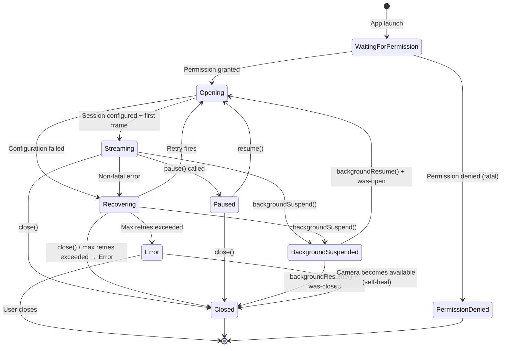

# 02 — Concurrency

Using `swift-engineering:modern-swift` to inform actor isolation and Sendable strategy.

---

## Actor Topology

| Component | Isolation | Mechanism | Why |
|---|---|---|---|
| `CameraViewModel` | `@MainActor` | Swift global actor annotation | Drives SwiftUI; all UI mutations must be on main thread |
| SwiftUI Views | `@MainActor` (implicit via `View`) | Inherited from protocol | SwiftUI renders on main thread |
| `CameraEngine` | `actor` (custom) | Swift actor keyword | Serializes all camera state mutations; satisfies Invariant 1 |
| `SessionStateMachine` | Owned by `CameraEngine` actor | Actor-isolated property | State accessed only through engine; no separate lock needed |
| `ConsumerRegistry` | `actor` | Swift actor keyword | Registration/deregistration must be thread-safe |
| Metal capture callback | Serial `DispatchQueue` | `AVCaptureVideoDataOutput.setSampleBufferDelegate(_:queue:)` | AVFoundation requires a serial queue for sample delivery |
| `MetalRenderer.draw(_:)` | `nonisolated` (reads texture slot via `OSAllocatedUnfairLock`) | No actor annotation; explicit lock on the texture slot | `MTKViewDelegate.draw(_:)` is a synchronous callback from Metal's render thread and cannot be actor-isolated. The texture slot must be protected by an explicit lock because actor isolation does not extend to nonisolated methods. `MTKView` is configured with `isPaused = true` + `enableSetNeedsDisplay = true` so that `draw(_:)` fires only on-demand when `CameraEngine` publishes a new texture — not on a 60Hz internal timer. |
| C++ consumers | Each owns a `DispatchQueue` | Managed by consumer | Independent processing; never block the capture queue |
| `MLProcessor` | `@globalActor` (`@MLProcessor`) | Custom global actor | Compiler prevents cross-boundary calls from camera or render paths into ML result handling |
| `StillCaptureController` | `actor` | Swift actor keyword | In-flight guard for atomic capture; actor provides the serialization |
| `VideoRecorder` | `actor` | Swift actor keyword | Recording state machine isolated from camera state |

---

## Domain Invariant Mapping (all 11 invariants)

### Invariant 1 — Camera State Exclusively Serialized

**Domain requirement:** All camera state mutations (session state, retry counter, error counter, background-suspended flag, watchdog timestamps) must be serialized. The serialization context must not block the UI.

**iOS enforcement:** `CameraEngine` is a Swift `actor`. All methods are `async`; the actor serializes execution automatically. Callers from `@MainActor` call engine methods with `await`; the main thread is never blocked. No locks required.

```swift
actor CameraEngine {
    private var sessionState: SessionState = .closed
    private var retryCount: Int = 0
    private var consecutiveErrorCount: Int = 0
    private var isBackgroundSuspended: Bool = false
    // All mutations happen inside actor methods — compiler enforced
}
```

---

### Invariant 2 — GPU Operations on Dedicated Serialized Context

**Domain requirement:** All GPU rendering operations for a session execute on a single dedicated serialized context. Concurrent GPU operations are forbidden.

**iOS enforcement:** Metal command buffers are submitted to a single `MTLCommandQueue` (one per session). `MTLCommandQueue` is inherently serialized — commands execute in submission order. The Metal capture callback runs on the AVFoundation serial queue and submits to this queue. No concurrent GPU commands are possible because only one thread submits commands.

Additionally: all GPU resource initialization/teardown runs inside `CameraEngine` actor methods, which are already serialized by the actor.

```swift
actor CameraEngine {
    private var commandQueue: MTLCommandQueue?  // Single queue; serial by design
    
    func processFrame(_ buffer: CMSampleBuffer) async {
        guard let queue = commandQueue else { return }
        let commandBuffer = queue.makeCommandBuffer()!
        // Encode all GPU work for this frame into commandBuffer
        commandBuffer.commit()
    }
}
```

---

### Invariant 3 — UI Callbacks on Main Execution Context

**Domain requirement:** All callbacks (`onStateChanged`, `onError`, `onFrameResult`, `onRecordingStateChanged`) must arrive on the main execution context.

**iOS enforcement:** `CameraViewModel` is `@MainActor`. Results flow via `AsyncStream<T>` where the consumer runs a `.task { for await value in stream { ... } }` modifier on the SwiftUI view — `.task` runs on `@MainActor` automatically. For imperative callbacks, `CameraEngine` uses `await MainActor.run { }` before delivering state changes.

```swift
@MainActor @Observable
final class CameraViewModel {
    var sessionState: SessionState = .closed
    var frameResult: FrameResult?
    
    func observeEngine(_ engine: CameraEngine) {
        Task { @MainActor in
            for await state in await engine.stateStream {
                self.sessionState = state  // Guaranteed @MainActor
            }
        }
    }
}
```

---

### Invariant 4 — Native Pipeline Pointer Protected Against Use-After-Free

**Domain requirement:** The C++ pipeline pointer must be guarded; teardown must zero the pointer under the guard before calling the destructor.

**iOS enforcement:** The C++ pipeline object is wrapped in an `actor`-isolated optional. Because actor methods are serialized, there is no concurrent access to the pointer — read and zeroing are both actor-isolated operations. No explicit mutex is needed.

```swift
actor CameraEngine {
    private var pipeline: OpaquePointer?  // C++ IFramePipeline*

    func teardown() async {
        let p = pipeline   // Read under actor isolation
        pipeline = nil     // Zero under actor isolation (same await-free section)
        if let p { destroyPipeline(p) }  // Destructor called after pointer zeroed
    }

    func captureNaturalPicture() async throws -> String {
        guard let p = pipeline else { throw CameraError(.invalidState) }
        // Use p — safe because actor serializes this with teardown
        return try await performNaturalCapture(p)
    }
}
```

---

### Invariant 5 — C++ Consumer Lock Ordering

**Domain requirement:** `pipeline consumer registry lock > processing stage lock > individual consumer lock`.

**iOS enforcement:** On the Swift side, `ConsumerRegistry` is a separate `actor` from `CameraEngine`. The design never acquires both actor locks simultaneously — `CameraEngine` calls `consumerRegistry.dispatch(frame:)` as a fire-and-forget (non-blocking, drop-on-busy). On the C++ side, `IFrameConsumer` implementations use a consistent `std::mutex` acquisition order documented in `design/04-opencv-integration.md`. The registry lock is never held when calling into a consumer — the consumer is dispatched asynchronously to its own queue.

---

### Invariant 6 — GPU Shader Uniforms Protected Against Concurrent Access

**Domain requirement:** GPU uniform values (brightness, contrast, saturation, black balance, gamma) are written from one context and read from the GPU render path — mutual exclusion required.

**iOS enforcement:** `ProcessingParameters` is a `Sendable` value type (struct) stored in the `CameraEngine` actor. When `setProcessingParameters` is called (actor-isolated), the actor updates a stored copy. On every frame, the Metal render path reads this copy inside the actor — since all GPU operations run inside actor methods, the uniform copy is always read under actor isolation. No separate mutex is needed because the actor itself provides the mutual exclusion.

```swift
actor CameraEngine {
    private var processingParams: ProcessingParameters = .default
    
    // Called from @MainActor via await
    func setProcessingParameters(_ params: ProcessingParameters) async {
        processingParams = params  // Actor-isolated write
    }
    
    func processFrame(_ buffer: CMSampleBuffer) async {
        let params = processingParams  // Actor-isolated read (same isolation domain)
        // Encode params into Metal uniform buffer...
    }
}
```

---

### Invariant 7 — Capture In-Flight Guard Must Be Atomic

**Domain requirement:** The "capture in flight" flag must be a compare-and-set — two concurrent `captureNaturalPicture()` calls must result in exactly one proceeding.

**iOS enforcement:** `StillCaptureController` is a Swift `actor`. Its `captureInFlight` flag is an actor-isolated boolean. Because actor methods are serialized, the check-and-set is atomic by construction — only one `captureNaturalPicture()` body can run at a time.

```swift
actor StillCaptureController {
    private var captureInFlight: Bool = false
    
    func captureNaturalPicture(session: AVCaptureSession) async throws -> String {
        guard !captureInFlight else { throw CameraError(.invalidState) }
        captureInFlight = true
        defer { captureInFlight = false }
        return try await performCapture(session: session)
    }
}
```

---

### Invariant 8 — Fast-Path Capture Check Must Be Lock-Free

**Domain requirement:** The "capture requested" flag in the C++ frame delivery path must be readable without locking — it executes on every frame's critical path.

**iOS enforcement:** In the C++ `IFrameConsumer` implementations, `captureRequested_` is `std::atomic<bool>`. The check on every frame is a relaxed atomic load — lock-free by definition. Setting the flag from the Swift side uses `std::atomic::store` with `memory_order_release` to ensure visibility.

---

### Invariant 9 — Recovery Retry Must Not Run Concurrently with Close

**Domain requirement:** If `close()` or `backgroundSuspend()` is called while a recovery retry is pending, the retry must be cancelled and must exit without action if it fires after cancellation.

**iOS enforcement:** Recovery retries are `Task` objects stored in `CameraEngine`. On `close()` or `backgroundSuspend()`, the stored task is cancelled via `retryTask?.cancel()`. The retry body checks `Task.isCancelled` and `sessionState` at the start — both checks are actor-isolated and thus cannot race with the cancellation.

```swift
actor CameraEngine {
    private var retryTask: Task<Void, Never>?
    
    func handleNonFatalError(_ error: CameraError) async {
        retryTask?.cancel()
        retryTask = Task {
            let delay = backoffDelay(for: retryCount)
            try? await Task.sleep(nanoseconds: delay)
            guard !Task.isCancelled else { return }
            guard sessionState == .recovering else { return }  // Actor-isolated check
            await reopen()
        }
    }
    
    func close() async {
        retryTask?.cancel()
        retryTask = nil
        await teardown()
    }
}
```

---

### Invariant 10 — Consumer Dispatch Is Non-Blocking

**Domain requirement:** Frame delivery to C++ consumers must not block the GPU rendering context. Drop-on-busy semantics: overwrite the 1-slot mailbox and return immediately.

**iOS enforcement:** `AsyncStream<Frame>` with `.bufferingNewest(1)` — when a new frame arrives and the consumer hasn't processed the previous one, the old frame is silently dropped. The `yield` call is non-blocking. The C++ consumer drains from the stream on its own `DispatchQueue`.

```swift
actor ConsumerRegistry {
    private var streams: [ConsumerRole: AsyncStream<Frame>.Continuation] = [:]
    
    func dispatch(frame: Frame, role: ConsumerRole) {
        streams[role]?.yield(frame)  // Non-blocking; drops if buffer is full
    }
}
```

---

### Invariant 11 — Stall Watchdog Timestamp Visible Across Contexts

**Domain requirement:** The stall timestamp written by the GPU context must be visible to the watchdog context without requiring a lock.

**iOS enforcement:** `lastFrameTimestamp` is stored as a `Date` value inside `CameraEngine`. Because both the timestamp writer (inside `processFrame`) and the watchdog reader (inside `StallWatchdog.check()`) are actor-isolated methods, the actor's internal serialization guarantees visibility. No separate atomic is needed — actor access is already ordered.

For the GPU-level stall (3s), the watchdog fires via a `Task` that calls `await engine.checkGPUStall()` — crossing the actor boundary provides the necessary memory ordering.

---

## Sendable Strategy

### Rule 1: Buffers Never Cross Actor Boundaries

`CVPixelBuffer` and `CMSampleBuffer` are NOT `Sendable`. They live exclusively inside `CameraEngine` and are released before the actor method returns. C++ consumers receive the buffer through a `sending` parameter annotation (SE-0430) to transfer ownership without copying.

```swift
func dispatchToConsumer(buffer: sending CVPixelBuffer, metadata: FrameMetadata) {
    // buffer ownership transferred; caller must not access it again
}
```

### Rule 2: Only Sendable Results Cross Actor Boundaries

All types that flow from `CameraEngine` or `@MLProcessor` to `@MainActor` are value types conforming to `Sendable`:

```swift
struct FrameResult: Sendable {
    let iso: Int?
    let exposureTimeNs: Int?
    let focusDistanceDiopters: Double?
    let wbGainR: Double?
    let wbGainG: Double?
    let wbGainB: Double?
}

struct EdgeDetectionResult: Sendable {
    let frameIndex: UInt64
    let edges: [EdgeContour]  // Array of Sendable value structs
    let processingTimeMs: Double
}

enum SessionState: String, Sendable {
    case opening, streaming, recovering, paused, error, closed
}
```

### Rule 3: No `@unchecked Sendable`

The compiler warning about buffer types is correct — the buffers are NOT safely shareable. The design never silences this with `@unchecked Sendable`. Instead, it transfers ownership via `sending` or keeps buffers single-context.

---

## Back-Pressure: AsyncStream with `.bufferingNewest(1)`

```
AVFoundation capture callback
    → CameraEngine.processFrame (actor, async)
        → MetalRenderer (synchronous, nonisolated)
        → ConsumerRegistry.dispatch (actor)
            → AsyncStream with .bufferingNewest(1)
                → C++ Consumer (own DispatchQueue)
```

The `AsyncStream` buffer policy `.bufferingNewest(1)` means:
- If the consumer is busy, the previous unprocessed frame is silently dropped
- The consumer always processes the most recent frame
- Memory stays flat — never grows unbounded
- Preview and GPU path are never blocked by slow consumers

---

## State Machine

### States



### State Enum

```swift
enum SessionState: String, Sendable, CaseIterable {
    case waitingForPermission = "waitingForPermission"
    case opening              = "opening"
    case streaming            = "streaming"
    case recovering           = "recovering"
    case paused               = "paused"
    case backgroundSuspended  = "backgroundSuspended"  // Internal; not emitted as user-visible state
    case error                = "error"
    case closed               = "closed"
    case permissionDenied     = "permissionDenied"     // iOS-specific fatal state
}
```

**Note:** `backgroundSuspended` is an internal state — the domain spec says background suspension does not emit a user-visible state change. `permissionDenied` is iOS-specific (maps to the domain's `PERMISSION_DENIED` fatal error).

### Transition Guard Table

| From | Event | Allowed transitions |
|---|---|---|
| `.waitingForPermission` | Permission granted | → `.opening` |
| `.waitingForPermission` | Permission denied | → `.permissionDenied` |
| `.opening` | Session configured | → `.streaming` |
| `.opening` | Error | → `.recovering` |
| `.streaming` | Non-fatal error | → `.recovering` |
| `.streaming` | `pause()` | → `.paused` |
| `.streaming` | `backgroundSuspend()` | → `.backgroundSuspended` |
| `.streaming` | `close()` | → `.closed` |
| `.recovering` | Retry success | → `.opening` |
| `.recovering` | Max retries | → `.error` |
| `.recovering` | `close()` | → `.closed` |
| `.recovering` | `backgroundSuspend()` | → `.backgroundSuspended` |
| `.paused` | `resume()` | → `.opening` |
| `.paused` | `close()` | → `.closed` |
| `.backgroundSuspended` | `backgroundResume()` | → `.opening` or `.closed` |
| `.error` | Camera available (self-heal) | → `.opening` |

Any transition not listed above is a protocol violation and is logged as a fault.

---

## AVCaptureSession Capture Queue Handoff

`AVCaptureVideoDataOutput` requires a serial `DispatchQueue`. The capture callback fires on this queue and immediately hands off to the `CameraEngine` actor:

```swift
// CameraEngine (actor)
func configureCaptureOutput(_ output: AVCaptureVideoDataOutput) {
    let captureQueue = DispatchQueue(label: "com.camplugin.capture", qos: .userInteractive)
    output.setSampleBufferDelegate(captureDelegate, queue: captureQueue)
}

// CaptureDelegate (separate class; nonisolated)
final class CaptureDelegate: NSObject, AVCaptureVideoDataOutputSampleBufferDelegate {
    weak var engine: CameraEngine?

    func captureOutput(_ output: AVCaptureOutput,
                       didOutput sampleBuffer: CMSampleBuffer,
                       from connection: AVCaptureConnection) {
        guard let engine else { return }

        // CMSampleBuffer is non-Sendable and cannot cross actor boundaries under
        // Swift 6 strict concurrency. Extract the CVPixelBuffer (which IS transferable
        // once retained) and the presentation timestamp here, on the capture queue.
        guard let pixelBuffer = CMSampleBufferGetImageBuffer(sampleBuffer) else { return }
        let presentationTime = CMSampleBufferGetPresentationTimeStamp(sampleBuffer)

        // CVPixelBuffer wraps an IOSurface — it is safe to retain here and hand off.
        // We wrap it in a Sendable value type for crossing the actor boundary.
        let packet = IncomingFrame(pixelBuffer: pixelBuffer, presentationTime: presentationTime)
        Task { [engine] in
            await engine.processFrame(packet)
        }
    }
}

// Sendable wrapper — CVPixelBuffer reference + metadata.
// CVPixelBuffer is a CoreFoundation type; its retain/release is thread-safe.
// We use @unchecked Sendable here because CoreFoundation types are unsafe-by-default
// under Swift 6 but the underlying IOSurface-backed buffer IS safe to transfer.
struct IncomingFrame: @unchecked Sendable {
    let pixelBuffer: CVPixelBuffer
    let presentationTime: CMTime
}
```

**Why `@unchecked Sendable` here (despite the general ban elsewhere in the design):** `CVPixelBuffer` is a `CFType` with thread-safe retain/release semantics, but Swift's type system has no way to prove this without a manual `@unchecked Sendable` conformance on a wrapper. The rule for this project is: `@unchecked Sendable` is permitted only on narrow wrapper types around transferable CoreFoundation resources, and the wrapper must not expose any mutating API. `IncomingFrame` is the only exception; all other types use plain `Sendable` conformance.

An alternative (preferred once iOS 26 is the minimum deployment target) is to use the `sending` parameter annotation from SE-0430:
```swift
func processFrame(sampleBuffer: sending CMSampleBuffer) async { ... }
```
But `CMSampleBuffer` still needs a `Sendable` conformance in Foundation — check current Apple SDK status before relying on this path.

The delegate is `nonisolated` because `AVCaptureVideoDataOutputSampleBufferDelegate` requires `@objc` conformance which cannot be actor-isolated. The delegate extracts the transferable data on the serial capture queue (microseconds) and hands it off to the actor via a `Sendable` wrapper.

---

## iOS-Specific Concurrency States

### Permission State (U-01 resolution)

iOS camera permission is checked via `AVCaptureDevice.authorizationStatus(for: .video)`. On first launch, the system prompts the user. The state machine adds `waitingForPermission` as a pre-`opening` state. If permission is `.denied` or `.restricted`, the engine transitions to `.permissionDenied` (fatal) without attempting camera open.

Permission revocation mid-session: `AVCaptureSession` posts `AVCaptureSessionRuntimeErrorNotification` when the system revokes camera access. This is caught and handled as a `PERMISSION_DENIED` fatal error.

### Thermal State Integration (U-05 resolution)

```swift
func startThermalMonitoring() {
    NotificationCenter.default.addObserver(
        forName: ProcessInfo.thermalStateDidChangeNotification,
        object: nil, queue: .main
    ) { [weak self] _ in
        Task { await self?.handleThermalStateChange() }
    }
}

func handleThermalStateChange() async {
    switch ProcessInfo.processInfo.thermalState {
    case .nominal, .fair:
        await restoreFullFrameRate()
    case .serious:
        await degradeFrameRate(to: 15)  // Reduce capture fps
    case .critical:
        await backgroundSuspend()       // Full teardown
    @unknown default:
        break
    }
}
```

### App Lifecycle (U-07 resolution)

iOS "fully invisible" maps to `scenePhase == .background` in SwiftUI (not `.inactive`). The `.inactive` phase occurs during partial occlusion (Control Center overlay, incoming call banner) and must NOT trigger camera release. Only `.background` maps to `backgroundSuspend()`.

```swift
@main
struct CamPluginApp: App {
    @Environment(\.scenePhase) private var scenePhase
    @State private var engine = CameraEngine()

    var body: some Scene {
        WindowGroup {
            CameraView()
        }
        .onChange(of: scenePhase) { _, newPhase in
            Task {
                switch newPhase {
                case .background:
                    await engine.backgroundSuspend()
                case .active:
                    await engine.backgroundResume()
                default:
                    break  // .inactive = partial occlusion; do NOT release camera
                }
            }
        }
    }
}
```

#### `backgroundSuspend()` must guard the recording drain with `beginBackgroundTask`

When the app transitions to `.background`, iOS gives the process a short window to finish
cleanup before suspending it. For a camera app that may be actively recording, the drain
sequence (stop the writer, finalize the MP4 atom/moov, flush the pixel buffer pool) can take
several seconds. If iOS suspends the process mid-drain, the MP4 file is permanently corrupted —
the moov atom is never written, and the file becomes unplayable.

`backgroundSuspend()` must request a background task from `UIApplication` **before** starting
the recording drain, and must end the background task only after the drain completes. If the
drain exceeds the OS-granted window (typically 30 seconds), the expiration handler ends the
task gracefully by cancelling the writer.

```swift
func backgroundSuspend() async {
    // 1. If recording, request background time for the drain.
    //    beginBackgroundTask MUST be called on the main actor (it touches UIApplication).
    var bgTaskID: UIBackgroundTaskIdentifier = .invalid
    let wasRecording = (recordingState == .recording)

    if wasRecording {
        bgTaskID = await MainActor.run {
            UIApplication.shared.beginBackgroundTask(withName: "CameraRecordingDrain") {
                // Expiration handler — iOS is about to suspend us.
                // Hop back onto the engine to cancel the writer cleanly.
                Task { [weak self] in await self?.cancelRecordingOnExpiration() }
            }
        }
    }

    // 2. Stop the watchdog tasks first — they cannot observe teardown safely.
    gpuStallWatchdogTask?.cancel()
    captureResultWatchdogTask?.cancel()

    // 3. Drain the recorder synchronously (if it was active).
    //    This is the step that can take seconds and must not be interrupted.
    if wasRecording {
        await videoRecorder.stopAndFinalize()  // internally calls assetWriter.finishWriting
    }

    // 4. Tear down the capture session and release resources.
    session.stopRunning()
    releaseMetalResources()

    // 5. Set state and release the background task.
    isBackgroundSuspended = true
    sessionState = .backgroundSuspended

    if bgTaskID != .invalid {
        await MainActor.run { UIApplication.shared.endBackgroundTask(bgTaskID) }
    }
}

private func cancelRecordingOnExpiration() async {
    // Called from the background task expiration handler.
    // We have seconds, not minutes — cancel the writer rather than finalize.
    // The partially-written file will be marked incomplete but the pool is released.
    videoRecorder.cancelWriting()
}
```

**Rule:** any teardown step that interacts with the filesystem or encoder during a background
transition must be wrapped in `beginBackgroundTask` / `endBackgroundTask`. The expiration
handler must be idempotent and must terminate the operation cleanly within its own short
window (the expiration handler itself has only a few seconds before forced termination).
