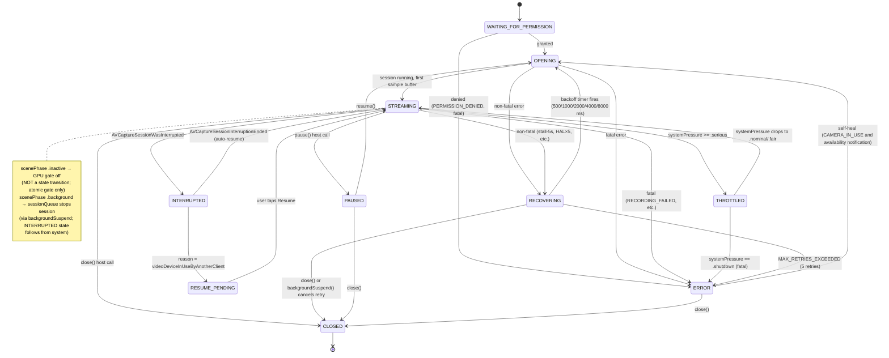

# 02 — Concurrency

This document describes how the 12 concurrency invariants in
`domain-revised/04-concurrency-invariants.md` are enforced on iOS using Swift 6.2
strict concurrency, an `actor`-based engine, dedicated serial `DispatchQueue`s, and
atomics for lock-free hot paths. The foundation is `ios-platform-guide/02` (ADR-07,
ADR-08, ADR-09, ADR-10) plus `04 §Device configuration windows`.

## 1. Actor Topology

Per **ADR-02** there are exactly two Swift isolation domains:

| Domain | What runs here | Rationale |
|---|---|---|
| `@MainActor` | SwiftUI views, `CameraControlViewModel`, KVO→AsyncStream consumers, pan/zoom gesture state | Mandatory for all UI callbacks (invariant 3); no per-frame work here |
| `actor CameraEngine` | Session state machine, consumer registry, persisted settings, thermal/pressure state, recording controller state | Swift actor structurally enforces invariant 1 (exclusive serialization) on camera state |

**Everything else is a class or serial queue.** The engine actor *coordinates* with
queues; it does not *replace* them (ADR-02, ADR-07):

| Component | Kind | Purpose |
|---|---|---|
| `sessionQueue` | serial `DispatchQueue(qos: .userInitiated)` | `AVCaptureSession.startRunning/stopRunning`; **every** `AVCaptureDevice` mutation inside `lockForConfiguration/unlockForConfiguration` (ADR-07, device-config-window rule below) |
| `deliveryQueue` | serial `DispatchQueue` set as `AVCaptureVideoDataOutput` sample-buffer delegate queue | Per-frame path: Metal encode/commit, `FrameSet` publication, still-readback gating |
| `MetalEngine` | `final class` (not an actor) | `MTLDevice`, `MTLCommandQueue`, `MTLLibrary`, pipeline states, `CVMetalTextureCache`, pools. Serialized *by construction*: touched only from `deliveryQueue` (invariant 2) |
| C++ thread pool | C++ `std::thread` pool (`std::min(4, hardware_concurrency())`) behind `PixelSink` | Drop-on-busy per-consumer mailboxes; honors invariant 5 (lock order) in C++ |
| Asset-writer queue | `AVAssetWriter`'s own queue | Encoder drain per ADR-16 |

## 2. Capture Queue Handoff — No Per-Frame Actor Hop

**ADR-02 §"Forbidden: the Task { await engine.process(...) } frame hop"** is the
single most important rule of the concurrency design. The capture delegate is a
`nonisolated` method on an `NSObject` subclass; it runs on `deliveryQueue` and does
**all** per-frame work inline — Metal encode, C++ consumer yield, Metal commit — in
one synchronous pass. The engine actor is consulted **only** for operations that are
not per-frame (open/close/pause/resume/setResolution/updateSettings/captureImage/
startRecording/stopRecording).

```
capture delegate (deliveryQueue, nonisolated)
  ├─ re-entrancy guard: read sessionState atomic; skip if not .streaming
  ├─ build Metal command buffer (all passes from design/01 §4)
  ├─ check gpuSubmissionEnabled atomic (ADR-09); if false, release buffers + return
  ├─ commit(); waitUntilScheduled recorded via os_signpost
  ├─ publish FrameSet atomically into each subscribed lane's mailbox (ADR-19)
  ├─ on 10th frame: Task { @MainActor in viewModel.frameResult = … } (3 Hz heartbeat)
  └─ return (CMSampleBuffer released → AVFoundation pool stays healthy)
```

Engine-actor async calls from UI (`await engine.updateSettings(...)`) hop onto
`sessionQueue` via `sessionQueue.async { ... }` to run the lock-for-configuration
bracket (§4 below). Results flow back via `AsyncStream<Sendable>` on `@MainActor`
(invariant 3).

## 3. Sendable Strategy (ADR-10)

**Non-Sendable types never cross an actor boundary.** Enforced by Swift 6 strict
concurrency at compile time.

| Type | Sendable? | Confined to |
|---|---|---|
| `CVPixelBuffer`, `CVMetalTexture` | No (G-13) | `deliveryQueue` only; held inside `FrameSet` published through CF reference counting — consumers retain the whole `FrameSet` as an ARC box |
| `MTLTexture`, `MTLCommandBuffer`, `MTLCommandQueue` | No | `MetalEngine` class, touched only from `deliveryQueue` |
| `cv::Mat`, `cv::Ptr<T>` | No | C++ thread pool only; never imported into Swift |
| `FrameSet` | **Sendable** (IOSurface-backed `CVPixelBuffer` refs are movable; wrapped by plain metadata structs) | Crosses into consumer mailboxes via `sending` annotation (SE-0430) |
| `FrameResult`, `SessionState`, `CameraError`, `TrackerResult`, `FrameDeliveryStats`, `RgbSample` | Sendable structs/enums | `AsyncStream<T>` to `@MainActor` |

**The frame clock never hops an actor.** Per ADR-10 §Corollary. The completion
handler on `MTLCommandBuffer` runs on a Metal-driver thread; the first thing it does
is a `Task { await self?.onFrameComplete(..., expectedState:) }` — but that `Task`
is **not** on the per-frame hot path (it runs at most once per frame and only touches
re-entrancy-guarded state per G-20). The mailbox swap and consumer publication happen
inline on `deliveryQueue` before the completion handler's Task is scheduled.

## 4. Device Configuration Window (REQUIRED SECTION)

**Invariant: every `AVCaptureDevice` property mutation MUST be wrapped in
`lockForConfiguration()` / `unlockForConfiguration()` with `defer` for unlock.**
(`ios-platform-guide/04 §Device configuration windows`.)

```swift
// Runs on sessionQueue — NEVER on @MainActor (ADR-07; G-03; lockForConfiguration blocks)
func applySettings(_ merged: MergedSettings, device: AVCaptureDevice) throws {
    try device.lockForConfiguration()
    defer { device.unlockForConfiguration() }            // deferred unlock survives throws

    // ISO and exposure are a COUPLED COMMIT — always together via
    // setExposureModeCustom(duration:iso:completionHandler:). Direct assignment to
    // device.iso / device.exposureDuration is unsupported; those are READ-ONLY
    // observation properties (KVO sources per ADR-14).
    if merged.exposureMode == .manual {
        device.setExposureModeCustom(
            duration: merged.exposureDuration,
            iso: merged.iso,
            completionHandler: nil
        )
    } else {
        if device.isExposureModeSupported(.continuousAutoExposure) {
            device.exposureMode = .continuousAutoExposure
        }
    }

    // Focus: independent commit inside the same lock window
    if merged.focusMode == .manual {
        device.setFocusModeLocked(lensPosition: merged.lensPosition, completionHandler: nil)
    } else {
        device.focusMode = .continuousAutoFocus
    }

    // White balance: gains clamped to [1.0, device.maxWhiteBalanceGain] per G-10
    if merged.whiteBalanceMode == .manual {
        let gains = merged.whiteBalanceGains.clamped(to: 1.0 ... device.maxWhiteBalanceGain)
        device.setWhiteBalanceModeLockedWithDeviceWhiteBalanceGains(gains, completionHandler: nil)
    }

    // Zoom: direct; always inside the lock
    device.videoZoomFactor = merged.zoomFactor

    // EV compensation only meaningful in auto-exposure mode
    if merged.exposureMode == .auto {
        device.setExposureTargetBias(merged.evCompensation, completionHandler: nil)
    }
}
```

**Failure mode if the lock is omitted: `NSGenericException` is raised on device at the
first ISO / exposure change after launch. The Simulator treats the lock as a no-op —
this is the #1 first-launch crash for camera apps** (`ios-platform-guide/04`).

**Read-only observation.** `device.iso`, `device.exposureDuration`, `device.lensPosition`,
`device.deviceWhiteBalanceGains`, and `device.systemPressureState` are KVO sources;
writes use the setters above. Observations feed `DeviceStateStream` (ADR-14) which
publishes a `DeviceStateSnapshot` into the ViewModel on `@MainActor` at the 3 Hz
`FrameResult` cadence (domain §02 Frame Result Heartbeat).

**Coalescing.** Slider input in the UI is debounced at ~60 Hz on `@MainActor` before
`await engine.updateSettings(...)` posts work to `sessionQueue`. Holding
`lockForConfiguration` per drag-update wastes hardware cycles.

**Mode-toggle discipline.** Mode flips (`auto ↔ manual`) must not race a manual value
commit inside the same lock window. The engine serializes: toggle first, `defer`
unlock, wait for the next sample buffer's sensor metadata readback (domain §03 Rule 3
"manual latches from last sensor readback"), then commit manual values in a second
lock window. Until the first readback arrives the call fails with
`SETTINGS_CONFLICT` per the domain rule.

## 5. State Machine

The domain's six states (`opening`, `streaming`, `recovering`, `paused`, `error`,
`closed`) extend with iOS-specific states for permission, interruption, and
thermal/pressure gating:



**Mapping domain states to iOS states:**
- `opening`, `streaming`, `recovering`, `paused`, `error`, `closed` are direct.
- `INTERRUPTED`, `RESUME_PENDING`, `THROTTLED`, `WAITING_FOR_PERMISSION` are iOS-only
  wrappers over existing domain states. From the app's `onStateChanged` callback they
  collapse: `INTERRUPTED`/`THROTTLED`/`RESUME_PENDING` surface as `recovering`
  domain state with a descriptive `CameraError` notification;
  `WAITING_FOR_PERMISSION` surfaces as `opening` with a callback requesting
  authorization UI.

## 6. Domain Invariant → iOS Mechanism Mapping

| Domain invariant (domain-revised/04) | iOS enforcement |
|---|---|
| **1. Camera state serialized** | `actor CameraEngine` structurally serializes all mutations (invariant 1). State machine transitions, retry counter, suspended flag, stall timestamps all live inside the actor. Engine does not block UI: all host methods are `async` and internally hop to `sessionQueue` for AVFoundation work. |
| **2. GPU ops on dedicated serialized context** | `MetalEngine` class, touched only from `deliveryQueue` (the `AVCaptureVideoDataOutput` delegate queue). Serialization by construction — `deliveryQueue` is a serial `DispatchQueue`. All `MTLCommandBuffer` creation/commit, `CVMetalTextureCache` use, texture pool dequeue happen on this one queue. |
| **3. UI callbacks on main context** | All callbacks delivered via `AsyncStream<Sendable>` consumed in `.task { for await … }` on SwiftUI views (implicit `@MainActor`). Engine itself never calls UI APIs directly. 3 Hz `FrameResult` heartbeat: single `Task { @MainActor in viewModel.frameResult = … }` hop per cadence event. |
| **4. Native pipeline use-after-free guard** | Swift ARC on `Unmanaged<CameraEngine>` held by the C-ABI context box. Teardown: engine actor invalidates the C++ consumer registry via `ConsumerRegistry.shutdown()` (acquires C++ mutex), then releases the `Unmanaged` box exactly once. C++ side: `PixelSink::teardown()` is `noexcept`, drops all mailbox refs, joins pool threads; new frames arriving after teardown hit a `std::atomic<bool> isShutdown_` fast check and return (ADR-12). |
| **5. C++ consumer lock ordering** | Enforced in C++ facade: `ConsumerRegistry::mutex_` > `ProcessingStage::mutex_` > per-`PixelSink::mailboxMutex_`. Lock-order is documented in `Cpp/ConsumerRegistry.cpp` and pattern-checked via a ThreadSanitizer run in Phase 3. |
| **6. GPU shader uniforms protected** | Metal uniforms live in a `MTLBuffer` owned by `MetalEngine`. Write path: engine actor → `sessionQueue.async` → `deliveryQueue.sync { writeUniforms }`. Read path: Metal shader reads from the same `MTLBuffer`. Serialization is by `deliveryQueue` (single writer, Metal-GPU reader; GPU memory coherence via Apple Silicon unified memory — no explicit mutex needed because writes land before `commit()` that scheduled the shader). |
| **7. Capture in-flight atomic** | `ManagedAtomic<Bool> captureInFlight` in engine. `compareExchange(expected: false, desired: true)` is the single atomic test-and-set; losers receive `ErrorCode.INVALID_STATE` immediately. Cleared in `defer` after capture finalizes or errors. |
| **8. Lock-free capture-requested fast path** | `ManagedAtomic<Bool> stillRequested` checked on `deliveryQueue` before Pass 6. Set by engine on `captureImage`; cleared by completion handler on Pass 6. No lock, no actor hop on the frame path. |
| **9. Retry not concurrent with close** | Recovery timer is a `Task` stored on the engine actor; `close()` calls `recoveryTask?.cancel()` (idempotent). When the task fires, its first check is `guard sessionState == .recovering else { return }`. |
| **10. Consumer dispatch non-blocking** | Per-lane 1-slot mailbox atomic swap (ADR-19); publisher never waits. Slow consumers drop via overwrite; counters exposed via `FrameDeliveryStats`. C++ side: `std::atomic` mailbox + drop-on-busy thread pool pattern (ADR-13). |
| **11. Stall timestamp visible across contexts** | `ManagedAtomic<UInt64> lastFrameTimestampNs` updated from `deliveryQueue` (release ordering), read from `StallWatchdog`'s own `DispatchSourceTimer` (acquiring ordering). No lock; Apple Silicon memory model + `Atomics` acquire/release ordering guarantees visibility. |
| **12. Watchdog observes only originating session** | `StallWatchdog` captures a `sessionToken: UInt64` at arm time. Fire path reads engine's current token via atomic; mismatch → no-op. Tokens are monotonic, incremented on every session open. |

## 7. Back-Pressure

**Per-lane `AsyncStream.bufferingNewest(1)` is used only for the Swift-side ViewModel
consumption path** (`SessionState`, `FrameResult`, `FrameDeliveryStats`,
`CameraError`). These streams carry Sendable result structs, not frames. The frame
path uses C-level latest-wins atomic mailboxes (ADR-19), **not** `AsyncStream`, to
avoid `await`-point suspension cost on the 30 Hz path.

`bufferingNewest(1)` placement:
- `stateStream: AsyncStream<SessionState>` — emitted from engine actor on every
  transition.
- `errorStream: AsyncStream<CameraError>` — emitted from engine actor on
  `handleNonFatalError` / `handleFatalError`.
- `frameResultStream: AsyncStream<FrameResult>` — emitted from `deliveryQueue` at
  3 Hz cadence (every 10th frame).
- `statsStream: AsyncStream<FrameDeliveryStats>` — emitted from engine at 1 Hz
  (ADR-19 counters + C++ `PixelSink` overwrite counts polled via C-ABI).

All four have `.bufferingNewest(1)` because the ViewModel only cares about the latest
value; if `@MainActor` is blocked, the stream drops stale values rather than
accumulating latency.

## 8. Key Platform Rules That Apply Here

- **ADR-07** — dedicated serial `sessionQueue`; `AVCaptureSession` created once per
  `open()`, reused across pause/resume (G-07).
- **ADR-08** — scenePhase: `.inactive` gates GPU, `.background` stops session (G-19
  App-Store policy: status-bar camera indicator must disappear within ~1s).
- **ADR-09** — Metal background rule: atomic `gpuSubmissionEnabled` gate + post-gate
  `waitUntilScheduled()` (G-05).
- **ADR-10** — Sendable strategy (above).
- **G-14** — `sessionQueue.async { session.startRunning() }` then reading
  `session.isRunning` from main is a race; state transitions emitted via
  `stateStream` only.
- **G-20** — completion-handler re-entrancy guard: capture `sessionState` at commit,
  verify in handler, drop silently if state changed (close/pause/setResolution ran
  between).

## Cited ADRs

ADR-07, ADR-08, ADR-09, ADR-10 (core); ADR-14 (KVO→AsyncStream for device
observations); ADR-02 (single heavy isolation domain); ADR-18 / ADR-19 referenced for
the frame path but detailed in design/03.
