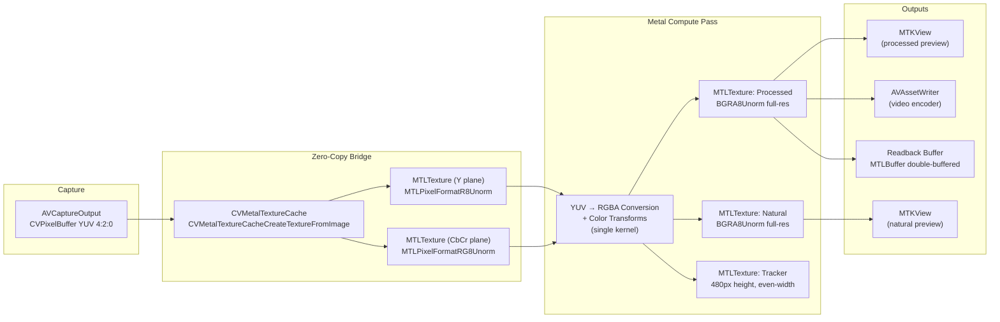

# 03 — Metal Pipeline

Using `swift-engineering:ios-26-platform` and `swift-engineering:swift-diagnostics` to inform this design.

---

## VTFrameProcessor Evaluation

**Evaluation date:** 2026-04-13  
**Verdict: Proceed with custom Metal compute shaders.**

`VTFrameProcessor` (VideoToolbox, WWDC 2025) is a new iOS 26+ API designed to apply configurable effects to video frames with an `AsyncSequence`-based output model and Metal command buffer integration. It is a preferred option per the design brief.

**Evaluation findings:**
- `VTFrameProcessor` is documented for effects such as motion deblur, super-resolution, and noise reduction — system-defined effect types. It does not expose an arbitrary "custom color transform" mode.
- The per-channel color-correction pipeline required by `domain/03-camera-control.md` (black balance → brightness → contrast → saturation → gamma, with specific Rec.709 luma coefficients for saturation) is not achievable through `VTFrameProcessor`'s effect enumeration.
- `VTFrameProcessor` lacks native `CVPixelBuffer`-to-`MTLTexture` zero-copy semantics equivalent to `CVMetalTextureCache` for our specific pipeline.
- The `AsyncSequence` output model introduces a layer of indirection between camera capture and GPU readback that would complicate the frame-synchronized double-buffer design.

**Decision:** Custom Metal compute shaders with `CVMetalTextureCache` zero-copy are the correct approach. This decision is logged in `design/06-decisions-log.md` entry D-02.

---

## Pipeline Architecture



---

## Per-Frame Render Sequence (8-step domain spec mapping)

| Domain step | iOS Metal implementation |
|---|---|
| 1. Texture update | `CVMetalTextureCacheCreateTextureFromImage` wraps `CVPixelBuffer` into Y + CbCr `MTLTexture` objects — zero-copy |
| 2. Processed render | Metal compute kernel encodes YUV→RGBA + 5-stage color transform in a single dispatch; output to `processedTexture` |
| 3. Preview surface swap | `MetalRenderer.draw(_:)` blits `processedTexture` to `MTKView.currentDrawable`; swap failure counter incremented on `presentDrawable` error |
| 4. Encoder blit (recording only) | `MTLBlitCommandEncoder` copies `processedTexture` to `AVAssetWriterInputPixelBufferAdaptor` buffer when recording is active |
| 5. Async readback | `MTLBlitCommandEncoder` copies `processedTexture` to `readbackBuffer[writeIndex]` (double-buffered) |
| 6. Fence insertion | `MTLFence` inserted after readback blit; `commandBuffer.addCompletedHandler` used as the fence signal |
| 7. Previous buffer map | `readbackBuffer[readIndex].contents()` — maps the buffer from the prior frame after `completedHandler` fires |
| 8. Frame copy + consumer dispatch | Pixel pointer is wrapped in `CVPixelBuffer` (via `CVPixelBufferCreateWithBytes`) and dispatched to `ConsumerRegistry` via `AsyncStream.yield` |

**Double-buffer semantics:** `writeIndex` and `readIndex` alternate each frame (`writeIndex = 1 - readIndex`). Frame N-1's readback buffer is consumed during frame N's GPU work — one frame delivery lag, matching domain spec.

---

## Texture Specification

| Stage | MTLPixelFormat | Dimensions | Usage flags | Storage mode |
|---|---|---|---|---|
| Camera Y plane input | `R8Unorm` | stream W × stream H | `.shaderRead` | `.shared` (CPU+GPU) |
| Camera CbCr plane input | `RG8Unorm` | stream W/2 × stream H/2 | `.shaderRead` | `.shared` |
| Processed output | `BGRA8Unorm` | stream W × stream H | `.shaderWrite`, `.renderTarget` | `.private` (GPU-only) |
| Natural output | `BGRA8Unorm` | stream W × stream H | `.shaderWrite`, `.renderTarget` | `.private` |
| Tracker output | `BGRA8Unorm` | `trackerWidth` × 480 | `.shaderWrite` | `.shared` |
| Readback buffer A | n/a (raw `MTLBuffer`) | W × H × 4 bytes | `.storageModeShared` | `.shared` |
| Readback buffer B | n/a (raw `MTLBuffer`) | W × H × 4 bytes | `.storageModeShared` | `.shared` |
| MTKView drawable | `BGRA8Unorm` | view bounds | system-managed | system-managed |

**BGRA8Unorm justification:** iOS camera hardware natively produces YUV; conversion to BGRA8Unorm (8-bit per channel) is the standard SDR path for display and ML consumption. The processed preview is SDR — no HDR path is needed for this use case. `MTKView` with `colorPixelFormat = .bgra8Unorm` matches the output texture format directly.

---

## Tracker Dimension Formula

Per domain/12-unresolved.md §U-15 (RESOLVED), the tracker height is fixed at 480px and the width formula is:

```swift
// trackerHeight is a compile-time constant: 480
static let trackerHeight: Int = 480

static func trackerWidth(streamWidth: Int, streamHeight: Int) -> Int {
    ((streamWidth * trackerHeight / streamHeight) + 1) & ~1  // even-rounded
}
```

This formula is preserved exactly from the domain spec.

---

## Color Space and HDR

**Recommendation: SDR — `BGRA8Unorm` throughout.**

**Justification:**
- The domain spec describes a GPU color pipeline with `[-1.0, 1.0]` brightness range, `[0.0, 2.0]` contrast, and gamma correction. These are SDR-range operations — no HDR headroom is utilized.
- The split-screen preview comparison (natural vs. processed) is display-only; HDR for preview purposes adds complexity without perceptible benefit on SDR panels.
- C++ consumer callbacks receive 8-bit RGBA per the domain spec (`domain/02-frame-delivery.md §Pixel Format`): "All delivered frames use RGBA8888."
- JPEG still capture (quality 90) is inherently SDR.

**HDR path (future):** If HDR capture is added later, the processed output texture can be upgraded to `rgba16Float` and the Metal shader can be extended. The `AVCaptureSession` would need to be configured for HDR. This is a forward-compatible architecture decision — changing the pixel format is a one-line change in the compute kernel output descriptor.

---

## Metal Compute Shader Design

The core GPU work is a single Metal compute kernel that handles:

1. YUV (Y + CbCr biplanar) → linear RGB conversion (BT.601 / BT.709 matrix, configurable)
2. Black balance (per-channel offset, then rescale to [0,1])
3. Brightness (piecewise: `x > 0` → `pow(x, 1 - brightness)` ; `x < 0` → `x * (1 + brightness)`)
4. Contrast (piecewise sigmoid around 0.5 midpoint)
5. Saturation (Rec.709 luma weights: 0.2126R, 0.7152G, 0.0722B)
6. Gamma (`output = pow(input, 1.0 / gamma)`, gamma clamped to `max(0.001, gamma)`)
7. Write to processed output texture
8. If natural stream enabled: write YUV→RGB (no color transforms) to natural output texture
9. If tracker enabled: downscale to tracker texture using `MPSImageBilinearScale` (Metal Performance Shaders) — `MTLBlitCommandEncoder` performs only 1:1 region copies and cannot apply filtering; MPS bilinear scale is correct for aspect-preserving downscaling to 480px height

**Kernel signature:**

```metal
kernel void processFrame(
    texture2d<float, access::read>   yTexture      [[texture(0)]],
    texture2d<float, access::read>   cbcrTexture   [[texture(1)]],
    texture2d<float, access::write>  outProcessed  [[texture(2)]],
    texture2d<float, access::write>  outNatural    [[texture(3)]],
    constant ColorUniforms &uniforms               [[buffer(0)]],
    uint2 gid                                      [[thread_position_in_grid]]
);
```

**Uniform buffer layout:**

```swift
struct ColorUniforms {
    var brightness: Float
    var contrast: Float
    var saturation: Float
    var blackR: Float
    var blackG: Float
    var blackB: Float
    var gamma: Float
    var enableNaturalStream: UInt32  // 0 or 1; avoid branch misprediction
}
```

The uniform buffer is updated from `CameraEngine.setProcessingParameters(_:)` (actor-isolated). The Metal command buffer reads the uniform buffer at encode time — the actor-isolated update happens before the next frame's command buffer is encoded, satisfying Invariant 6.

---

## Zero-Copy Path Detail

```swift
// Inside CameraEngine.processFrame(_:) — actor-isolated

func processFrame(_ sampleBuffer: CMSampleBuffer) async {
    guard let pixelBuffer = CMSampleBufferGetImageBuffer(sampleBuffer) else { return }
    
    // Step 1: Zero-copy wrap CVPixelBuffer → MTLTexture
    var cvTexture: CVMetalTexture?
    let width = CVPixelBufferGetWidth(pixelBuffer)
    let height = CVPixelBufferGetHeight(pixelBuffer)
    
    // Y plane
    CVMetalTextureCacheCreateTextureFromImage(
        kCFAllocatorDefault, textureCache, pixelBuffer, nil,
        .r8Unorm, width, height, 0, &cvTexture)
    let yTexture = CVMetalTextureGetTexture(cvTexture!)!
    
    // CbCr plane
    CVMetalTextureCacheCreateTextureFromImage(
        kCFAllocatorDefault, textureCache, pixelBuffer, nil,
        .rg8Unorm, width / 2, height / 2, 1, &cvTexture)
    let cbcrTexture = CVMetalTextureGetTexture(cvTexture!)!
    
    // Step 2: Encode compute pass
    let commandBuffer = commandQueue.makeCommandBuffer()!
    let computeEncoder = commandBuffer.makeComputeCommandEncoder()!
    computeEncoder.setComputePipelineState(colorTransformPipeline)
    computeEncoder.setTexture(yTexture, index: 0)
    computeEncoder.setTexture(cbcrTexture, index: 1)
    computeEncoder.setTexture(processedTexture, index: 2)
    computeEncoder.setTexture(naturalTexture, index: 3)
    computeEncoder.setBytes(&currentUniforms, length: MemoryLayout<ColorUniforms>.size, index: 0)
    
    let threadgroupSize = MTLSize(width: 16, height: 16, depth: 1)
    let threadgroupCount = MTLSize(
        width: (width + 15) / 16,
        height: (height + 15) / 16,
        depth: 1)
    computeEncoder.dispatchThreadgroups(threadgroupCount, threadsPerThreadgroup: threadgroupSize)
    computeEncoder.endEncoding()
    
    // Steps 5-6: Async readback + fence
    let blitEncoder = commandBuffer.makeBlitCommandEncoder()!
    blitEncoder.copy(from: processedTexture, to: readbackBuffers[writeIndex])
    blitEncoder.endEncoding()
    
    let readIndex = 1 - writeIndex
    let frameSessionState = sessionState   // capture pre-commit for teardown race guard
    commandBuffer.addCompletedHandler { [weak self] cb in
        // Explicit status check (R-23): GPU faults are silent without this.
        if cb.status == .error, let err = cb.error {
            Task { await self?.handleMetalCommandBufferError(err) }
            return
        }
        Task { await self?.onFrameReadbackComplete(readIndex: readIndex,
                                                   expectedState: frameSessionState) }
    }
    commandBuffer.commit()

    writeIndex = 1 - writeIndex
}

/// Readback completion — must guard against actor re-entrancy during teardown.
///
/// Between commit (above) and this handler firing, the actor may have serviced other
/// messages: `close()`, `backgroundSuspend()`, `setResolution()` — any of which may have
/// released `readbackBuffers`, nulled `commandQueue`, or transitioned `sessionState`.
/// If `sessionState` no longer matches what we captured at commit time, the buffer we
/// were about to read is stale or has been released. Drop the frame silently.
func onFrameReadbackComplete(readIndex: Int, expectedState: SessionState) {
    guard sessionState == expectedState, sessionState == .streaming else {
        // State changed during GPU execution — session teardown, resize, or background
        // suspension raced the completion handler. The readback buffer for this frame
        // is no longer safe to touch. Drop the frame and return.
        return
    }
    // Safe to read readbackBuffers[readIndex].contents() here.
    // ...
}
```

---

## Display Path: MTKView vs AVCaptureVideoPreviewLayer

**Production:** `MTKView` displays Metal-processed output. `AVCaptureVideoPreviewLayer` is NOT used (it shows the sensor's native unprocessed output, bypassing the GPU color pipeline).

**Phase 1a temporary:** `AVCaptureVideoPreviewLayer` is used as a placeholder preview only during Phase 1a, before the Metal pipeline is built. It is removed in Phase 2.

**Natural stream display:** A separate `MTKView` instance (wrapped in `NaturalMetalViewWrapper`) displays the natural output texture. The two `MTKView` instances are placed side-by-side in the SwiftUI `HStack` for the split-screen layout.

---

## GPU-to-Encoder Path (U-03 resolution) — True Zero-Copy

**Domain requirement:** `domain/08-capture-and-recording.md` §Video Encoding requires that the encoder receive GPU-processed frames directly from the GPU render pipeline **without CPU-side frame conversion**. This is a hard invariant, not an optimization target.

**iOS mechanism:** The zero-copy path relies on `IOSurface`-backed `CVPixelBuffer`s shared between Metal and VideoToolbox via `AVAssetWriterInputPixelBufferAdaptor`. The key insight is that every `CVPixelBuffer` allocated from a pool created with `kCVPixelBufferIOSurfacePropertiesKey` is backed by an `IOSurface`, which both Metal and VideoToolbox can map into their respective address spaces without copying. When Metal writes to a texture wrapping that `IOSurface` and VideoToolbox reads the same `IOSurface` for encoding, the pixel data never leaves GPU/shared memory.

### `VideoRecorder` Pool Setup (one-time, on recording start)

```swift
let pixelBufferAttrs: [String: Any] = [
    kCVPixelBufferPixelFormatTypeKey as String: kCVPixelFormatType_32BGRA,
    kCVPixelBufferWidthKey as String: width,
    kCVPixelBufferHeightKey as String: height,
    kCVPixelBufferMetalCompatibilityKey as String: true,
    kCVPixelBufferIOSurfacePropertiesKey as String: [:]     // REQUIRED — opts in to IOSurface backing
]

let adaptor = AVAssetWriterInputPixelBufferAdaptor(
    assetWriterInput: videoInput,
    sourcePixelBufferAttributes: pixelBufferAttrs
)
// adaptor.pixelBufferPool is lazily created after assetWriter.startWriting()
```

The `kCVPixelBufferMetalCompatibilityKey: true` and `kCVPixelBufferIOSurfacePropertiesKey: [:]` entries are **load-bearing** — without them, the pool allocates plain CPU-backed `CVPixelBuffer`s and `CVMetalTextureCache` wrapping fails or returns an incompatible texture.

### Per-Frame Zero-Copy Write (inside Metal command buffer)

```swift
// Step 1: Dequeue a CVPixelBuffer from the adaptor pool
var cvPixelBuffer: CVPixelBuffer?
CVPixelBufferPoolCreatePixelBuffer(nil, adaptor.pixelBufferPool!, &cvPixelBuffer)
guard let pb = cvPixelBuffer else {
    // Pool exhausted — drop this frame for recording; preview still runs
    return
}

// Step 2: Wrap it as a Metal texture via CVMetalTextureCache
var cvMetalTex: CVMetalTexture?
let status = CVMetalTextureCacheCreateTextureFromImage(
    nil, recorderTextureCache, pb, nil,
    .bgra8Unorm, width, height, 0, &cvMetalTex
)
guard status == kCVReturnSuccess,
      let cvTex = cvMetalTex,
      let encoderTexture = CVMetalTextureGetTexture(cvTex) else {
    return
}

// Step 3: GPU-side blit: processed full-res texture → encoder texture
// This is a GPU-local copy (stays in IOSurface memory), not a CPU copy.
// Uses MTLBlitCommandEncoder if dimensions match; otherwise MPSImageBilinearScale.
let blitEncoder = commandBuffer.makeBlitCommandEncoder()!
blitEncoder.copy(
    from: processedFullResTexture,
    sourceSlice: 0, sourceLevel: 0,
    sourceOrigin: MTLOrigin(x: 0, y: 0, z: 0),
    sourceSize: MTLSize(width: width, height: height, depth: 1),
    to: encoderTexture,
    destinationSlice: 0, destinationLevel: 0,
    destinationOrigin: MTLOrigin(x: 0, y: 0, z: 0)
)
blitEncoder.endEncoding()

// Step 4: Append pixel buffer to adaptor in the command buffer's completion handler
// (to ensure GPU writes are visible before VideoToolbox reads)
commandBuffer.addCompletedHandler { [weak self, pb] _ in
    guard let self else { return }
    Task { await self.appendRecordedFrame(pb, at: presentationTime) }
}
```

The `appendRecordedFrame` actor method calls `adaptor.append(pb, withPresentationTime: presentationTime)` — this does **not** copy the buffer; `AVAssetWriter` reads the same `IOSurface` that Metal wrote.

### Per-Frame Flow Summary

```
[Camera sensor]
      ↓  (CVMetalTextureCache wrapping of input CVPixelBuffer — zero-copy)
[Input YCbCr textures]
      ↓  (Metal compute: YCbCr → BGRA + color processing)
[Processed full-res BGRA MTLTexture]
      ↓  (MTLBlitCommandEncoder — GPU-local copy, stays in IOSurface memory)
[Encoder CVPixelBuffer (IOSurface-backed)]
      ↓  (adaptor.append — VideoToolbox maps the same IOSurface)
[HEVC/H.264 encoded frame]
```

**The CPU never touches pixel data on the recording path.** `MTLTexture.getBytes` is **forbidden** on this path.

### Recorder Texture Cache (separate from capture texture cache)

`VideoRecorder` owns its own `CVMetalTextureCache` distinct from `CameraEngine`'s input texture cache. This separation is intentional: the input cache is invalidated on session teardown; the recorder cache is invalidated on recording stop. Mixing them would couple their lifecycles incorrectly.

### Why Not `AVCaptureMovieFileOutput`?

`AVCaptureMovieFileOutput` writes the camera's native capture directly, bypassing the Metal compute pipeline. It cannot encode GPU-processed frames. It is therefore excluded from the design — the whole point of the Metal pipeline is that the recording must contain the processed output, not the sensor output.

### Pool Exhaustion

`AVAssetWriterInputPixelBufferAdaptor.pixelBufferPool` has an implicit maximum buffer count (typically ~3, controlled by the underlying pool). If the encoder backs up (thermal throttling, disk I/O stall), `CVPixelBufferPoolCreatePixelBuffer` returns `kCVReturnWouldBlock`. On this path the design drops the recording frame (not the preview frame) and logs a `RECORDER_POOL_EXHAUSTED` counter — the preview pipeline continues at full rate. This preserves the "recording dropout rate < 1%" budget in `domain/07-performance-budgets.md` while avoiding a stall.

---

## Profiling Strategy

### `os_signpost` Intervals

```swift
// Recommended signpost instrumentation
let cameraLog = OSLog(subsystem: "com.camplugin.camera", category: .pointsOfInterest)

// Interval 1: Capture callback received
os_signpost(.begin, log: cameraLog, name: "CaptureCallback")
// ... processFrame start
os_signpost(.end, log: cameraLog, name: "CaptureCallback")

// Interval 2: Metal encoding
os_signpost(.begin, log: cameraLog, name: "MetalEncoding")
// ... commandBuffer.commit()
os_signpost(.end, log: cameraLog, name: "MetalEncoding")

// Interval 3: Display commit (MTKView presentDrawable)
os_signpost(.event, log: cameraLog, name: "DisplayCommit")

// Interval 4: Readback complete (commandBuffer completedHandler fires)
os_signpost(.event, log: cameraLog, name: "ReadbackComplete")

// Interval 5: Consumer handoff begin/end
os_signpost(.begin, log: cameraLog, name: "ConsumerHandoff")
// ... AsyncStream.yield
os_signpost(.end, log: cameraLog, name: "ConsumerHandoff")
```

### Frame Budget (at 30fps = 33.33ms total)

| Stage | Budget | Acceptable | Degraded | Failing |
|---|---|---|---|---|
| AVFoundation callback delivery | 1ms | < 2ms | 2–5ms | > 5ms |
| `CVMetalTextureCache` wrap | 0.1ms | < 0.5ms | 0.5–1ms | > 1ms |
| Metal compute dispatch + encode | 3ms | < 6ms | 6–10ms | > 10ms |
| GPU execution (measured via `addCompletedHandler` delta) | 5ms | < 8ms | 8–12ms | > 12ms |
| Readback blit (async, overlapping with next frame) | 2ms | < 4ms | 4–8ms | > 8ms |
| `MTKView.presentDrawable` | 0.5ms | < 1ms | 1–3ms | > 3ms |
| Consumer dispatch (`AsyncStream.yield`) | 0.1ms | < 0.5ms | — | — |
| **Total pipeline (capture → display)** | **12ms** | **< 16ms** | **16–25ms** | **> 25ms** |

The GPU fence budget of 8ms (from domain spec) is enforced by the `completedHandler` pattern — if the handler hasn't fired within 8ms of command buffer commit, the session logs a stall warning.

### Instruments Templates

- **Metal System Trace** — Verify command buffer submission cadence and GPU utilization
- **Time Profiler** — CPU hotspot analysis in capture callback and Metal encoding
- **Allocations** — Verify no per-frame heap allocations in the hot path (everything pre-allocated)
- **Leaks** — Check for CVMetalTexture or MTLTexture leaks (use CVMetalTextureCacheFlush on memory warnings)

### CVMetalTextureCache Lifecycle

```swift
// Create once at pipeline initialization:
CVMetalTextureCacheCreate(kCFAllocatorDefault, nil, device, nil, &textureCache)

// Flush on memory warning (not recreation):
NotificationCenter.default.addObserver(forName: UIApplication.didReceiveMemoryWarningNotification, ...) {
    CVMetalTextureCacheFlush(textureCache, 0)
}

// DO NOT recreate per-frame — the cache holds internal allocations and recreating is expensive
```

---

## Sensor Orientation (U-10 resolution)

On iOS, `AVCaptureConnection.videoRotationAngle` handles sensor orientation automatically. The app sets the connection's rotation angle to match the UI orientation at session configuration time. Since the app is landscape-only, the rotation is set once at configuration and not changed dynamically.

Unlike the Android source (which applied a manual 90° UV rotation matrix in the vertex shader), this is handled by AVFoundation before the pixel buffer reaches the Metal pipeline — the `CVPixelBuffer` arriving in `captureOutput(_:didOutput:from:)` is already correctly oriented.

```swift
if let connection = captureOutput.connection(with: .video) {
    connection.videoRotationAngle = 0  // Landscape right; verify for target hardware
}
```

**Note:** The exact rotation angle must be verified on target hardware during Phase 1a. Use `AVCaptureDevice.position` and the device's natural orientation to compute the correct value.
