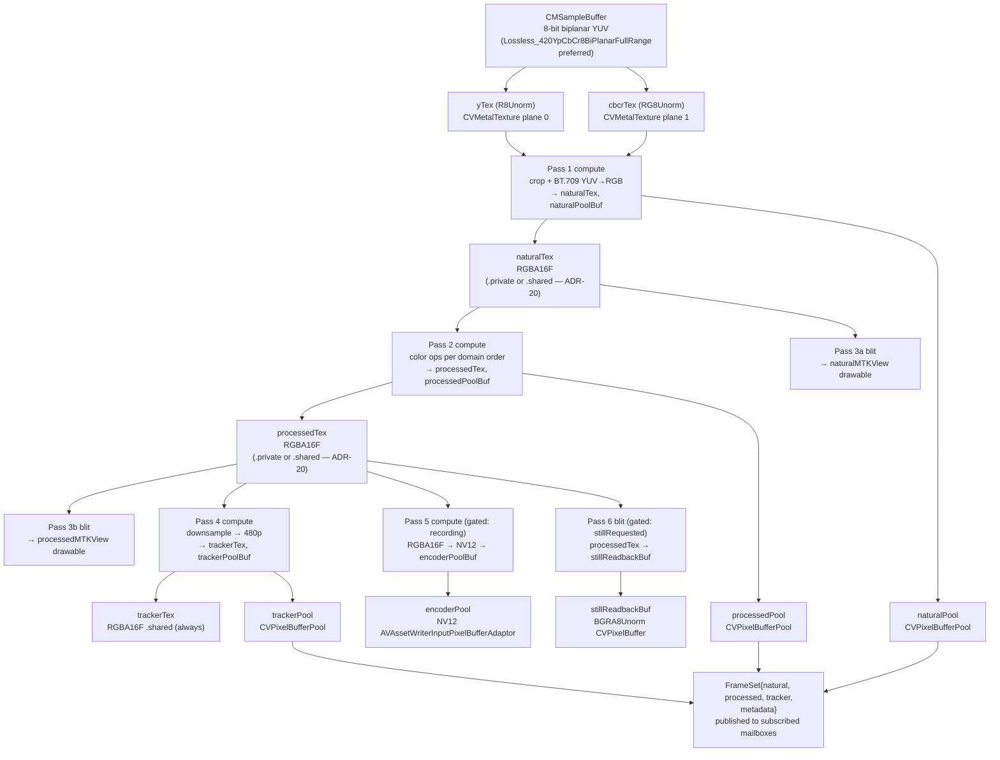

# 03 — Metal Pipeline

This document specifies the GPU pipeline, texture format table, zero-copy paths, and
profiling strategy. Built on ADR-04, ADR-05, ADR-06, ADR-15, ADR-18, ADR-19, ADR-20.

## 1. VTFrameProcessor Evaluation

`VTFrameProcessor` (iOS 26+) is evaluated first for each transform the domain requires
(YUV→RGB, crop, color ops, RGBA16F→NV12, downsample). **Result: rejected for every
custom transform.** Per `ios-platform-guide/03 §VTFrameProcessor` (and G-21),
`VTFrameProcessor` exposes **system-defined effects only** — motion deblur,
super-resolution, noise reduction, frame interpolation. The effect enumeration is
fixed, not programmable. It cannot run:

- The per-channel color pipeline (black balance → brightness → contrast → saturation
  → gamma) specified in `domain-revised/03 §GPU Color Processing Parameters`.
- Crop + YUV→RGB with operator-chosen crop origin/size.
- RGBA16F → NV12 compute conversion for the encoder (ADR-06).
- Arbitrary downsample to 480px height with aspect preservation.

Decision logged as **D-02** in `design/06-decisions-log.md`. Custom Metal compute
shaders are used for every transform. Re-evaluate only if Apple adds programmable
pipelines in a future SDK.

## 2. Pipeline Topology



Passes 3a/3b (blits) keep display bit-identical to the consumer-lane IOSurfaces
(ADR-18). Passes 4/5/6 are gated on runtime predicates (tracker subscriber count > 0,
`isRecording`, `stillRequested`) and simply aren't appended to the command buffer
when the gate is closed (no stub shader).

## 3. Custom Shaders

Every pass is custom-authored Metal. Choice of **compute vs fragment vs MPS**:

| Pass | Kernel type | Justification |
|---|---|---|
| Pass 1: crop + YUV→RGB | **Compute** | Two input textures (Y, CbCr) at different resolutions, two output writes (`naturalTex` + `naturalPoolBuf` for consumer lane); threadgroups on output tile; BT.709 matrix (full-range or video-range per capture format). Fragment would require a render pass per output. |
| Pass 2: color ops | **Compute** | Chain runs fully inside one kernel (black balance → brightness → contrast → saturation → gamma, domain §03 order); uniforms read from `MTLBuffer`; two writes (`processedTex` + `processedPoolBuf`). |
| Pass 3a / 3b: display blit | **Blit** (`MTLBlitCommandEncoder.copy`) | Same format, same precision copies into `MTKView.currentDrawable`. Blit is the correct tool — any precision or format change would force compute. |
| Pass 4: downsample to 480p | **Compute** | Arbitrary non-power-of-2 scale factor (varies with operator crop); box filter or Lanczos3 authored in Metal. `MPSImageLanczosScale` was evaluated and rejected: MPS cannot write into a `CVPixelBuffer` IOSurface-backed texture without an intermediate allocation, defeating the pool invariant. |
| Pass 5: RGBA16F → NV12 | **Compute** | Per ADR-06: BT.709 RGB→YCbCr matrix + half→byte quantization + 2×2 chroma subsample — three operations that a blit cannot perform. Writes Y plane and CbCr plane of encoder-pool buffer directly. |
| Pass 6: still readback | **Blit** | `processedTex` is RGBA16F. The still path needs 8-bit for the TIFF writer (domain §08 "8-bit TIFF"). Pass 6 is a two-step: (a) compute RGBA16F→BGRA8 into an IOSurface-backed CPU-readable `CVPixelBuffer`, (b) `CVPixelBufferLockBaseAddress` on completion. The "blit" label in the architecture doc covers (a) for brevity; the detailed kernel is compute. |

All pipeline states cached at engine setup (`MTLComputePipelineState` per kernel,
`MTLRenderPipelineState` for any fragment pass). No per-frame pipeline-state creation.

## 4. Texture Specification Table

Per-frame textures and the buffers they fill. **Storage mode is dynamic per ADR-20
and G-25 for the consumer-facing outputs:**

| Stage | `MTLPixelFormat` | Dimensions | Usage flags | Storage mode |
|---|---|---|---|---|
| `yTex` (capture plane 0) | `.r8Unorm` | capture W × capture H | `.shaderRead` | IOSurface-backed via `CVMetalTextureCache` (ADR-04); storage mode controlled by Apple |
| `cbcrTex` (capture plane 1) | `.rg8Unorm` | capture W/2 × capture H/2 | `.shaderRead` | same as above |
| `naturalTex` | `.rgba16Float` | crop W × crop H | `.shaderRead` + `.shaderWrite` + `.renderTarget` | **`.private` when no `.natural` subscriber; `.shared` (IOSurface-backed) when any `PixelSink` subscriber attached** (ADR-20, G-25) |
| `processedTex` | `.rgba16Float` | crop W × crop H | `.shaderRead` + `.shaderWrite` + `.renderTarget` | **`.private` when no `.processed` subscriber; `.shared` when any attached** (ADR-20, G-25) |
| `trackerTex` | `.rgba16Float` | `processedTex.W × 480/processedTex.H` (even-rounded) × 480 | `.shaderRead` + `.shaderWrite` | **Always `.shared` (IOSurface-backed)** — edge-detection consumer is designed-in (ADR-20) |
| Shared canny texture | `.rgba16Float` (mipmapped) | crop W × crop H, full mip chain | `.shaderRead` + `.renderTarget` | `.shared`, IOSurface-backed; allocated **once** at engine setup; reused every frame (design/04 §Edge detection) |
| Encoder pool buffer | `kCVPixelFormatType_420YpCbCr8BiPlanarVideoRange` (NV12) | crop W × crop H | via pool | IOSurface-backed (ADR-06) |
| Still readback buffer | `kCVPixelFormatType_32BGRA` | crop W × crop H | via dedicated pool | IOSurface-backed, CPU-readable (for TIFF writer) |

**Crucial:** `.private` has **nil** `.iosurface` (G-25). Publishing a `.private`
texture to a C++ consumer via `CVPixelBufferGetIOSurface()` silently drops all frames
with no error. The storage-mode flip (ADR-20) rotates textures over one frame
boundary when the first subscriber attaches; it is not a free operation (IOSurface
coherence has bandwidth cost), so default `.private` is preserved for the
subscriber-less case.

## 5. Three CVPixelBufferPools (ADR-19)

Three separate `CVPixelBufferPool`s, **one per sink** (`natural`, `processed`,
`tracker`) — required by ADR-19 and reinforced by the domain's "every consumer gets a
reference to the same shared frame buffer" invariant (domain §02):

```swift
func makePool(w: Int, h: Int, pixelFormat: OSType) throws -> CVPixelBufferPool {
    let poolAttrs: [String: Any] = [
        kCVPixelBufferPoolMinimumBufferCountKey as String: 3,
        kCVPixelBufferPoolMaximumBufferAgeKey   as String: 1.0,
    ]
    let pbAttrs: [String: Any] = [
        kCVPixelBufferPixelFormatTypeKey as String: pixelFormat,
        kCVPixelBufferWidthKey as String: w,
        kCVPixelBufferHeightKey as String: h,
        kCVPixelBufferIOSurfacePropertiesKey as String: [:],
        kCVPixelBufferMetalCompatibilityKey as String: true,
    ]
    var pool: CVPixelBufferPool?
    let st = CVPixelBufferPoolCreate(nil, poolAttrs as CFDictionary,
                                     pbAttrs as CFDictionary, &pool)
    guard st == kCVReturnSuccess, let pool else { throw EngineError.poolCreate(st) }
    return pool
}
```

Pool cap per ADR-19: `N_active_lanes + 1`. Minimum 3 covers the "0–1 active consumer +
1 GPU write slot + 1 slack" case. CF grows each pool on demand past the minimum and
ages buffers out after 1.0 s of disuse. **No explicit grow/shrink code** — trust CF
(ADR-19). Pool exhaustion (`kCVReturnWouldExceedAllocationThreshold`) increments the
global `pool_exhaustion` counter (ADR-19) surfaced via `FrameDeliveryStats`.

## 6. Color Space and HDR

**SDR path, always.** The domain requires RGBA16F working format (domain §02) because
the multi-stage color chain (5 stages) quantizes visibly at 8 bits. Per ADR-05:

- **Working format: `.rgba16Float`** inside all Metal passes (naturalTex / processedTex
  / trackerTex). Half-float math is full-rate on Apple Silicon; storage cost is 2× of
  8-bit but mitigated by IOSurface-backed pools.
- **Display format: BGRA8Unorm** on `MTKView.currentDrawable` (MTKView default). The
  Pass 3a/3b blits carry RGBA16F into the drawable; Metal performs the format
  conversion in the blit.
- **Encoder format: NV12 (`kCVPixelFormatType_420YpCbCr8BiPlanarVideoRange`)** per
  ADR-06 — VideoToolbox HEVC hardware encoder's native format. Matches domain §08
  "HEVC 8-bit only" requirement.
- **HDR disabled.** `device.activeFormat.isVideoHDRSupported` is checked per G-22 at
  startup; if `true`, `automaticallyAdjustsVideoHDREnabled = false` and
  `isVideoHDREnabled = false`. The domain specifies 8-bit output end-to-end; HDR
  would complicate the color chain without domain benefit.

**Capture format choice.** Enumerate `device.formats` at startup (G-17, G-22). Filter
for biplanar 8-bit YUV at ≥30 fps at the largest 4:3 resolution. Prefer
`kCVPixelFormatType_Lossless_420YpCbCr8BiPlanarFullRange` when available (hardware-
compressed, lossless, reduces memory bandwidth), fall back to
`kCVPixelFormatType_420YpCbCr8BiPlanarFullRange` (ADR-05). **Do not** attempt
10-bit / half-float capture — not supported on A16-class hardware
(`ios-platform-guide/06 §Capture format facts`).

## 7. Zero-Copy Paths

**Capture → Metal (ADR-04):**

```swift
var yCV: CVMetalTexture?
CVMetalTextureCacheCreateTextureFromImage(
    nil, cache, pixelBuffer, nil,
    .r8Unorm, width, height, 0, &yCV)
var cbcrCV: CVMetalTexture?
CVMetalTextureCacheCreateTextureFromImage(
    nil, cache, pixelBuffer, nil,
    .rg8Unorm, width/2, height/2, 1, &cbcrCV)

guard let yCV, let cbcrCV,
      let yTex = CVMetalTextureGetTexture(yCV),
      let cbcrTex = CVMetalTextureGetTexture(cbcrCV)
else {
    metalWrapFailureCount += 1
    return  // ADR-15: kCVReturnSuccess + nil is possible under pressure
}
```

The `CVMetalTexture` objects are released at the end of the capture delegate
invocation (G-15: hold only for the current frame; flush the cache on memory warning
per ADR-04).

**Processed → C++ consumers (zero-copy).** Consumers receive `FrameSet` with three
IOSurface-backed `CVPixelBuffer` refs. C++ side:

```cpp
CVPixelBufferLockBaseAddress(buf, kCVPixelBufferLock_ReadOnly);
void* ptr = CVPixelBufferGetBaseAddress(buf);
size_t stride = CVPixelBufferGetBytesPerRow(buf);
cv::Mat mat(height, width, CV_16FC4, ptr, stride);   // wraps, no copy
// … processing …
CVPixelBufferUnlockBaseAddress(buf, kCVPixelBufferLock_ReadOnly);
```

IOSurface is coherent across GPU/CPU on Apple Silicon; the lock is a
fence/invalidate, not a copy. Details in `design/04-opencv-integration.md`.

**Processed → encoder (ADR-06, zero-copy).** Pass 5 writes plane textures of the
encoder-pool `CVPixelBuffer` directly. `adaptor.append(pixelBuffer, withPresentationTime:)`
hands VideoToolbox the same IOSurface. `MTLTexture.getBytes(_:)` is **forbidden** on
this path (defeats zero-copy; ADR-06).

**Processed → still (CPU readback, domain-required).** The domain requires 8-bit
TIFF output (§08). Pass 6 is a GPU compute (RGBA16F → BGRA8) into an IOSurface-backed
`CVPixelBuffer`, followed by CPU read via `CVPixelBufferLockBaseAddress` and
`CGImageDestination` (TIFF writer). The final stage is an unavoidable CPU read —
but the **GPU-to-CPU transfer** is the only copy, and it's the minimum the format
transition and file-system hand-off require.

**Decision for C++ consumers: CPU pointer, not texture readback.** Per **D-07**
(decisions log), C++ consumers receive `CVPixelBuffer` refs and lock for CPU access
(OpenCV operates on CPU memory; pulling pixels via `MTLTexture.getBytes` would add
an unnecessary Metal→CPU copy on top of the implicit IOSurface coherence). The
shared IOSurface model gives us "zero extra copy" — the GPU write and the CPU read
see the same physical memory.

## 8. Profiling Strategy

`os_signpost` intervals (no entitlement, no gated availability; always-on via
`OSSignposter`):

| Signpost interval | Begin event | End event |
|---|---|---|
| `CaptureCallback` | capture delegate entry | delegate return |
| `MetalEncode` | command buffer creation | `commit()` |
| `MetalScheduled` | `addScheduledHandler` fires | (paired with `MetalCompleted`) |
| `MetalCompleted` | `addCompletedHandler` fires | (closes GPU-execution interval) |
| `ConsumerPublish` | `FrameSet` build begin | mailbox swap done |
| `EdgeCannyCpp` | C++ `processFrame` entry | `processFrame` return (C-ABI signpost) |
| `MipmapBlit` | `generateMipmaps` commit | completion |
| `DisplayCommit` | `present(drawable:)` | drawable `addPresentedHandler` |

Instruments templates: **Metal System Trace**, **Time Profiler**, **Hangs**, **Points
of Interest**. Run with the `os_signpost` categories `"com.cambrian.camera.capture"`,
`"com.cambrian.camera.metal"`, `"com.cambrian.camera.consumer"`.

**Frame budget at 30 fps = 33 ms.** Sub-budgets (per `ios-platform-guide/03
§Profiling strategy` adjusted for the full domain pipeline):

| Phase | Target | Degraded | Failing |
|---|---|---|---|
| Capture callback entry → commit (CPU-side Metal encode) | ≤ 15 ms | 15–25 ms | > 25 ms |
| Metal encode → scheduled | ≤ 2 ms | 2–5 ms | > 5 ms |
| Metal scheduled → completed (GPU) | ≤ 10 ms | 10–20 ms | > 20 ms |
| Consumer publish (C++ processFrame at 480p) | ≤ 4 ms | 4–8 ms | > 8 ms (per G-23) |
| Mipmap blit + canny MTKView present | ≤ 3 ms | 3–6 ms | > 6 ms |

**Thresholds correlate to domain signals:**
- > 25 ms total encode → consumer back-pressure starts (ADR-13; matches the
  GPU-level 3 s stall threshold from domain §06 if sustained).
- Metal command-buffer `.error` status (via `addCompletedHandler`, ADR-15 / G-02) →
  emit `UNKNOWN_ERROR` non-fatal; triggers full recovery (domain §06 recovery
  sequence).

**Capture-side 5 s stall watchdog** is armed on the engine actor with a
`DispatchSourceTimer` fed by the atomic `lastFrameTimestampNs` (invariant 11). Domain
§06 thresholds: 3000 ms GPU-level → notify; 5000 ms capture-result-level → full
recovery.

## Cited ADRs

ADR-04 (CVMetalTextureCache), ADR-05 (rgba16Float working format, lossless YUV
capture), ADR-06 (GPU→encoder compute conversion, NV12), ADR-15 (CVMetalTextureGetTexture
nil-check, MTLCommandBuffer error handling), ADR-18 (FrameSet atomic unit), ADR-19
(three pools, cap N+1, observability), ADR-20 (dynamic `.private`/`.shared` storage
mode). G-17, G-22 (capture format verification); G-21 (VTFrameProcessor rejection);
G-23 (tracker stream downsample rationale).
