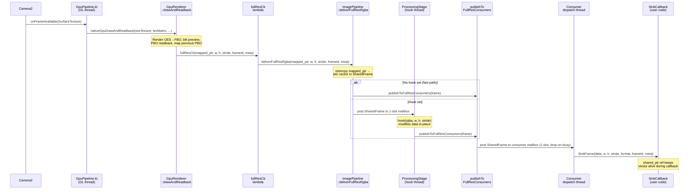
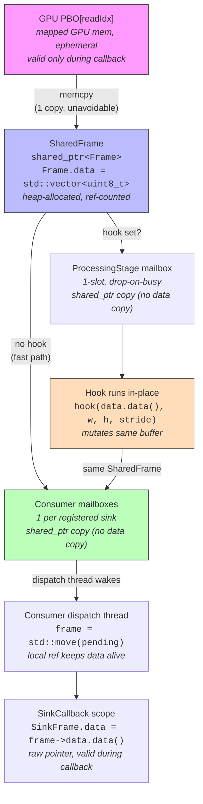

# Camera2 Flutter Plugin Architecture v2

## Quick Reference

A Flutter plugin (`cambrian_camera`) that captures camera frames on Android via Camera2, applies real-time GPU post-processing (brightness, contrast, gamma, saturation, white balance), and delivers processed frames to both a Flutter preview and any number of native C++ consumer sinks.

### Layer map

| Layer | Language | Key file(s) | Role |
|-------|----------|-------------|------|
| L1 Dart Public API | Dart | `lib/src/cambrian_camera_controller.dart` | `CambrianCamera` class, streams, settings |
| L2 Platform Interface | Dart/Kotlin (generated) | `pigeons/camera_api.dart` → `messages.g.dart`, `Messages.g.kt` | Pigeon type-safe bridge |
| L3 Flutter Plugin | Kotlin | `CambrianCameraPlugin.kt` | Plugin entry, TextureRegistry, Pigeon host |
| L4 Camera Controller | Kotlin | `CameraController.kt`, `VideoRecorder.kt`, `GpuPipeline.kt` | Camera2 lifecycle, auto-recovery, recording, GL thread |
| L5 JNI Bridge | C++ | `CameraBridge.cpp` | Deserialize metadata, call pipeline |
| L6 C++ Pipeline | C++ | `ImagePipeline.cpp`, `GpuRenderer.cpp` | GPU rendering, post-processing, consumer fan-out |

All paths are relative to `packages/cambrian_camera/android/src/main/`.

### Key invariants (preserve when modifying code)

- **Preview = consumer output.** The tone-mapped preview is pixel-identical to what `FULL_RES` sinks receive.
- **1 memcpy per frame.** PBO → `std::vector` in `SharedFrame`. All downstream dispatch is `shared_ptr` copy only.
- **No per-consumer copies.** Each `SharedFrame` buffer is allocated once on delivery and ref-counted through the pipeline; downstream dispatch is `shared_ptr` copy only.
- **`null` = don't change.** `CameraSettings` fields that are `null` retain their previous Kotlin-side values.
- **ISO ↔ exposure are coupled.** Setting either to `auto` propagates to the other via Camera2's single AE flag.
- **LUT rebuilt atomically.** When `ProcessingParams` change, the 256-entry LUT is rebuilt and swapped; no partial updates visible to the frame loop.
- **Latest-value-wins for CameraSettings.** No debounce — in-flight values are replaced, not queued.
- **Fire-and-forget for ProcessingParams.** All color transforms are applied by the GPU shader via `GpuPipeline.setAdjustments()`. No CPU processing in `ImagePipeline`.
- **Recording encodes GPU output directly.** MediaCodec surface receives tone-mapped FBO via EGL blit — no CPU YUV copy.
- **No OpenCV in pipeline.** `ImagePipeline` uses `std::vector<uint8_t>` for pixel storage; OpenCV is not linked.

### Section index

| Section | What it covers |
|---------|---------------|
| Architecture Overview | 6-layer ASCII diagram |
| Key Design Decisions | Pigeon, YUV format, ISP settings, SurfaceProducer, consumer model, auto-recovery |
| Plugin File Structure | Complete directory tree with annotations |
| Dart Public API | `CambrianCamera` class, all types, settings update strategies |
| Platform Bridge | Pigeon interface + JNI metadata layout |
| Kotlin Layer | Auto-recovery state machine + video recording subsystem |
| C++ Pipeline Internals | GPU rendering, frame delivery, buffer ownership, processing stages, consumer fan-out, memory budget |
| C++ Native Consumer API | Public header, sink registration example |
| Testing Strategy | Dart unit, C++ unit, Kotlin integration, on-device tests |

---

## Architecture Overview (6 Layers)

```
┌─────────────────────────────────────────────────────────────┐
│  L1: Dart Public API          (packages/cambrian_camera/lib)│
│  CambrianCamera, CameraSettings, ProcessingParams, streams  │
└──────────────────────────┬──────────────────────────────────┘
                           │ Pigeon-generated type-safe interface
┌──────────────────────────┴──────────────────────────────────┐
│  L2: Platform Interface   (Pigeon @HostApi / @FlutterApi)    │
│  CameraHostApi → Kotlin, CameraFlutterApi → Dart callbacks   │
└──────────────────────────┬──────────────────────────────────┘
                           │ Generated Kotlin bindings
┌──────────────────────────┴──────────────────────────────────┐
│  L3: Kotlin FlutterPlugin (CambrianCameraPlugin.kt)          │
│  FlutterPlugin + ActivityAware, TextureRegistry, Pigeon host │
└──────────────────────────┬──────────────────────────────────┘
                           │ direct Kotlin calls
┌──────────────────────────┴──────────────────────────────────┐
│  L4: Kotlin CameraController                                 │
│  Camera2 lifecycle, ImageReader, per-request ISP settings,   │
│  auto-recovery state machine                                 │
└──────────────────────────┬──────────────────────────────────┘
                           │ JNI (DirectByteBuffer + flat arrays)
┌──────────────────────────┴──────────────────────────────────┐
│  L5: C++ JNI Bridge  (CameraBridge.cpp)                      │
│  Deserialize metadata, wrap buffers, call pipeline           │
└──────────────────────────┬──────────────────────────────────┘
                           │ C++ calls
┌──────────────────────────┴──────────────────────────────────┐
│  L6: C++ ImagePipeline                                       │
│  Post-processing, preview output, generic consumer fan-out   │
└─────────────────────────────────────────────────────────────┘
```

---

## Key Design Decisions

| Decision | Rationale |
|----------|-----------|
| **Pigeon over raw MethodChannel** | Type-safe generated Dart/Kotlin bridge; eliminates string-based method name bugs. `@FlutterApi` replaces EventChannel for callbacks. |
| **YUV_420_888 for streaming** | `resolveStreamFormat()` queries `StreamConfigurationMap`. By default selects largest 4:3 size (sensor native AR), falls back to 1280×960. An explicit override via `setResolution()` takes priority. Resolution reported in `CameraCapabilities.streamWidth/streamHeight`. |
| **Runtime resolution switching** | `setResolution()` performs a full teardown (device close + EGL destroy) followed by a fresh `openCamera()` + `startCaptureSession()` at the new size. A lighter `teardownSession()` approach fails on some devices because `eglInitialize()` cannot reinit a terminated display. State transitions: STREAMING → RECOVERING → STREAMING. Blocked while recording. |
| **Per-request ISP settings** | All `CameraSettings` map to `CaptureRequest` keys — rebuilds repeating request only (no session reconfiguration). Session-level changes (format/size) trigger full stop/start. |
| **SurfaceProducer for preview** | Flutter's `TextureRegistry.SurfaceProducer` provides the preview Surface. Camera2 writes directly into it as a `CaptureRequest` target — no C++ memcpy on preview path. On surface invalidation (hot restart), controller rebinds to new Surface; `SurfaceProducer.id` is stable. |
| **Generic consumer model** | No hardcoded outputs. Applications register C++ sinks via `addSink(config, callback)`. Unlimited consumers per role; each gets a dedicated dispatch thread and 1-slot drop-on-busy mailbox. Resolution differences are handled at GPU PBO readback, not per-consumer. |
| **Auto-recovery** | Camera errors handled internally with exponential backoff. Dart receives state transitions (including `recovering`) but doesn't implement recovery logic. |

---

## Plugin File Structure

```
packages/cambrian_camera/
├── pubspec.yaml
├── pigeons/
│   └── camera_api.dart                  # Pigeon interface definition
├── lib/
│   ├── cambrian_camera.dart             # barrel export
│   └── src/
│       ├── cambrian_camera_controller.dart   # CambrianCamera class
│       ├── camera_settings.dart              # CameraSettings, ProcessingParams
│       ├── camera_state.dart                 # CameraState, CameraCapabilities, CameraError, RecordingState
│       ├── camera_settings_serializer.dart   # Latest-value-wins for CameraSettings
│       ├── frame_result.dart                 # FrameResult (actual sensor values from hardware)
│       └── messages.g.dart                   # Generated by Pigeon
├── android/
│   ├── build.gradle.kts
│   └── src/main/
│       ├── AndroidManifest.xml
│       ├── kotlin/com/cambrian/camera/
│       │   ├── CambrianCameraPlugin.kt       # FlutterPlugin + ActivityAware + Pigeon host
│       │   ├── CambrianCameraConfig.kt       # Configuration constants
│       │   ├── CameraController.kt           # Camera2 lifecycle + auto-recovery
│       │   ├── GpuPipeline.kt                # EGL context, GL thread, encoder surface
│       │   ├── VideoRecorder.kt              # MediaCodec/MediaMuxer, drain thread
│       │   ├── VideoRecordingReceiver.kt     # Broadcast receiver for recording state
│       │   ├── LogLevelReceiver.kt           # Broadcast receiver for runtime log-level toggling
│       │   ├── MetadataLayout.kt             # Shared metadata array constants
│       │   └── Messages.g.kt                 # Generated by Pigeon
│       └── cpp/
│           ├── CMakeLists.txt
│           ├── include/
│           │   ├── cambrian_camera_native.h   # Public consumer API (NO OpenCV)
│           │   └── MetadataLayout.h           # Shared metadata constants
│           ├── src/
│           │   ├── CameraBridge.cpp           # JNI glue
│           │   ├── GpuRenderer.cpp            # Dual-path GPU rendering (color + raw shaders)
│           │   ├── GpuRenderer.h              # GPU renderer internal header
│           │   ├── ImagePipeline.cpp          # GPU dispatch, ProcessingStage hook, consumer fan-out
│           │   └── ImagePipeline.h            # Internal header
│           └── test/
│               ├── SinkRoutingTest.cpp        # Consumer sink routing tests
│               └── TrackerDimTest.cpp         # Tracker dimension calculation tests
├── ios/                                       # Stub for future
│   ├── Classes/
│   │   ├── CambrianCameraPlugin.swift         # PlatformException("PLATFORM_NOT_SUPPORTED")
│   │   └── Messages.g.swift                   # Generated by Pigeon (iOS)
│   └── cambrian_camera.podspec
└── test/
    └── camera_settings_serializer_test.dart
```

---

## Dart Public API

### CambrianCamera

```dart
class CambrianCamera {
  /// Opens camera and starts the pipeline.
  static Future<CambrianCamera> open({
    String? cameraId,
    CameraSettings? settings,
  });

  Future<void> close();

  /// Flutter texture ID for the color-processed preview.
  Stream<CameraTextureInfo> get toneMappedTexture;

  /// Flutter texture ID for the raw (passthrough) preview.
  /// Only emits if enableRawStream: true was set in CameraSettings.
  Stream<CameraTextureInfo> get rawTexture;

  Stream<CameraState> get stateStream;
  Stream<CameraError> get errorStream;

  /// Actual sensor values reported by hardware. Emits ~3 Hz.
  Stream<FrameResult> get frameResultStream;

  CameraCapabilities get capabilities;

  /// Uses latest-value-wins serialization (see Key Invariants).
  Future<void> updateSettings(CameraSettings settings);

  /// Fire-and-forget: mutex-protected struct copy in C++, next frame picks up new values.
  Future<void> setProcessingParams(ProcessingParams params);

  /// Hardware ISP JPEG capture. Does NOT include GPU post-processing
  /// (LUT, saturation, contrast, brightness, gamma). Highest quality JPEG.
  Future<String> captureNaturalPicture();

  /// GPU post-processed frame capture. Reads the next RGBA frame from the
  /// C++ pipeline (what the user sees on screen), encodes as JPEG or PNG
  /// (inferred from fileName extension; default PNG), writes EXIF metadata.
  Future<String> captureImage({String? outputDirectory, String? fileName});

  /// Returns display rotation in degrees CW from portrait (0/90/180/270).
  static Future<int> getDisplayRotation();

  /// Native pipeline pointer for C++ consumer registration, or null if not initialized.
  Future<int?> getNativePipelineHandle();

  Future<(String, String)> startRecording({
    String? outputDirectory,  // MediaStore RELATIVE_PATH; default "Movies/CambrianCamera/"
    String? fileName,         // without extension; default timestamp
    int? bitrate,             // bits/sec; default 50 Mbps
    int? fps,                 // default 30
  });

  Future<String> stopRecording();
  Stream<RecordingState> get recordingStateStream;
}
```

### CameraSettings

Maps to per-request `CaptureRequest` keys. Auto-capable settings use sealed types (`AutoValue.auto()` | `AutoValue.manual(value)`):

```dart
class CameraSettings {
  final AutoValue<int>? iso;              // auto is contagious with exposureTimeNs
  final AutoValue<int>? exposureTimeNs;   // nanoseconds
  final AutoValue<double>? focus;         // diopters; auto = continuous AF
  final WhiteBalance? whiteBalance;       // auto() | locked() | manual(gainR, gainG, gainB)
  final double? zoomRatio;
  final NoiseReductionMode? noiseReductionMode;  // off/fast/highQuality/minimal/zeroShutterLag
  final EdgeMode? edgeMode;               // off/fast/highQuality/zeroShutterLag
  final int? evCompensation;              // steps; no effect when AE disabled
  final bool? enableRawStream;
  final int? rawStreamHeight;             // width auto-computed from aspect ratio
}
```

**Update strategy — latest-value-wins serializer:** Each change requires a Dart → Kotlin → `setRepeatingRequest` round trip. If a new value arrives while the previous is in-flight, the old pending value is replaced (not queued). No artificial latency. Implementation: `CameraSettingsSerializer` in `camera_settings_serializer.dart`.

### ProcessingParams

Controls the GPU color shader applied to every frame on the processed path:

```dart
class ProcessingParams {
  final double blackR, blackG, blackB;   // [0.0, 0.5] per-channel black level
  final double gamma;                     // [0.1, 4.0], 1.0 = identity
  final double brightness;               // [-1.0, +1.0], 0.0 = identity
  final double contrast;                  // [-1.0, +1.0], 0.0 = identity
  final double saturation;               // [-1.0, +1.0], 0.0 = identity
}
```

### Supporting types

```dart
enum CameraState { closed, opening, streaming, recovering, error }

enum RecordingState { recording, idle, error }

class CameraCapabilities {
  final List<CameraSize> supportedSizes;     // all YUV_420_888 sizes, sorted descending by area
  final int isoMin, isoMax;
  final int exposureTimeMinNs, exposureTimeMaxNs;
  final double focusMin, focusMax;
  final double zoomMin, zoomMax;
  final int evCompMin, evCompMax;
  final double evCompensationStep;
  final int streamWidth, streamHeight;       // chosen by resolveStreamFormat() or setResolution()
  final int rawStreamTextureId;              // 0 when disabled
  final int rawStreamWidth, rawStreamHeight; // 0 when disabled
}

class CameraError {
  final CameraErrorCode code;  // typedef to Pigeon-generated CamErrorCode
  final String message;
  final bool isFatal;          // false = informational (auto-recovering)
}

/// Serialized as integer indices — do NOT reorder; only append before [unknown].
enum CamErrorCode {
  cameraDevice,          // ERROR_CAMERA_DEVICE — fatal hardware failure
  cameraService,         // ERROR_CAMERA_SERVICE — camera service error
  cameraDisconnected,    // camera lost unexpectedly (system reclaim, USB)
  configurationFailed,   // session configuration or rebind failed
  permissionDenied,      // CAMERA permission denied or revoked — fatal
  cameraDisabled,        // ERROR_CAMERA_DISABLED — disabled by policy — fatal
  maxCamerasInUse,       // ERROR_MAX_CAMERAS_IN_USE — too many open — fatal
  cameraInUse,           // ERROR_CAMERA_IN_USE — another app holds the camera
  cameraAccessError,     // CameraAccessException (transient access failure)
  maxRetriesExceeded,    // auto-recovery gave up after max retries — fatal
  previewSurfaceLost,    // Flutter SurfaceProducer was invalidated
  pipelineError,         // C++ processing pipeline error
  settingsConflict,      // invalid settings combination
  frameStall,            // GPU pipeline stopped receiving frames
  captureFailure,        // HAL reported repeated capture failures (self-healed)
  fpsDegraded,           // sustained FPS below 15 for 3+ heartbeats
  aeConvergenceTimeout,  // auto-exposure stuck in SEARCHING >5 s
  recordingTruncated,    // EOS drain timed out; recording file may be incomplete
  unknown,               // catch-all; keep last
}

class FrameResult {
  final int? iso;
  final int? exposureTimeNs;
  final double? focusDistanceDiopters;  // 0.0 = infinity
  final double? wbGainR, wbGainG, wbGainB;
}
```

---

## Platform Bridge

### Pigeon Interface

Defined in `packages/cambrian_camera/pigeons/camera_api.dart`. Generated outputs: `messages.g.dart` (Dart), `Messages.g.kt` (Kotlin), `Messages.g.swift` (iOS stub).

**HostApi** (Dart → Kotlin): `open`, `getCapabilities`, `updateSettings`, `setResolution`, `setProcessingParams`, `captureNaturalPicture`, `captureImage`, `getNativePipelineHandle`, `startRecording`, `stopRecording`, `close`, `pause`, `resume`, `getPersistedProcessingParams`, `getDisplayRotation`, `sampleCenterPatch`

**FlutterApi** (Kotlin → Dart): `onStateChanged`, `onError`, `onFrameResult`, `onRecordingStateChanged`

### JNI Metadata Layout

Flat arrays for zero-allocation metadata transfer between Kotlin (L4) and C++ (L5/L6). Layout defined in `MetadataLayout.kt` and `MetadataLayout.h` — these files **must** be kept in sync (matching array indices and counts).

C++ uses `static_assert` to verify counts match. Example: `static_assert(cam::meta::FLOAT_COUNT == 26, "Layout mismatch");`

---

## Kotlin Layer

### Diagnostic Logging

All log tags share a `CC/` prefix so they can be filtered with one command:

```bash
adb logcat | grep "CC/"
```

| Tag | Source | Content |
|-----|--------|---------|
| `CC/Cam` | CameraController | Lifecycle transitions, device/surface events, errors, capture failures |
| `CC/3A` | CameraController | AE/AF/AWB state changes (Tier 1) and heartbeat (Tier 2, includes per-interval capFail/bufLost counts) |
| `CC/Settings` | CameraController | Settings applied per `updateSettings()` call |
| `CC/Gpu` | GpuPipeline | Frame counter, stall detection, pipeline start/stop (always logged) |
| `CC/Renderer` | GpuRenderer.cpp | EGL/GL operations, per-300-frame heartbeat |
| `CC/Plugin` | CambrianCameraPlugin | open/close/detach events |
| `CC/Dart` | cambrian_camera_controller.dart | Dart-side open/close/state/error/settings (debug builds only) |
| `CC/LogLevel` | LogLevelReceiver | Confirmation when log level is changed via ADB broadcast |

Log tiers are controlled by `CambrianCameraConfig`:

| Flag | Default | Effect |
|------|---------|--------|
| *(always on)* | — | Tier 0: lifecycle events, 3A state transitions, settings summary, capture failures |
| `verboseDiagnostics` | `true` | Tier 2: `CC/3A` heartbeat every 30 frames (fps, drops, full 3A state, capFail/bufLost) |
| `verboseSettings` | `true` | Verbose settings dump via `buildSettingsLog()` |
| `verboseFullResult` | `false` | Tier 3: full `TotalCaptureResult` dump every 30 frames |
| `debugDataFlow` | `false` | GPU pipeline C++ frame-flow traces (perf log every 60 frames in ImagePipeline, frame counter every 300 in GpuRenderer) |

The `CambrianCameraConfig` flags are also mapped to a numeric `debugLevel` (0–2) that is threaded through JNI at pipeline construction time, so C++ components (`ImagePipeline`, `GpuRenderer`) gate their log calls natively without JNI overhead per frame.

**Runtime log-level toggling via ADB:** `LogLevelReceiver` listens for `com.cambrian.camera.SET_LOG_LEVEL` broadcasts and updates the `CambrianCameraConfig` flags atomically at runtime. Changes take effect immediately for Kotlin-side logging (CameraController, GpuPipeline). **C++ logging is not affected at runtime** — `ImagePipeline` and `GpuRenderer` receive their `debugLevel` once at construction via `computeDebugLevel()`; a pipeline restart (`close()` + `open()`) is required for C++ log verbosity changes to take effect.

```bash
adb shell am broadcast -a com.cambrian.camera.SET_LOG_LEVEL --ei level 2
# level 0 = quiet, 1 = default, 2 = verbose (debugDataFlow), 3 = full (verboseFullResult)
# Note: level 2 and 3 affect C++ logging only after a pipeline restart.
```

### Auto-Recovery State Machine

Implemented in `CameraController.kt`.

```
                    ┌──────────┐
                    │  CLOSED  │◄─────────────────────────────────────────┐
                    └────┬─────┘                                          │
                         │ open() / backgroundResume()                    │
                    ┌────▼─────┐                                          │
              ┌────►│ OPENING  │◄────────────────────────┐                │
              │     └────┬─────┘                         │ resume()       │
              │          │ camera opened + session       │                │
              │          │ configured             ┌──────┴───┐           │
              │     ┌────▼──────┐   pause()        │  PAUSED  │           │
              │┌───►│ STREAMING │────────────────►│          │           │ close()
              ││    └────┬──────┘                  └──────────┘           │
              ││         │ error detected                                  │
              ││    ┌────▼───────┐                                        │
              │└────┤ RECOVERING │────────────────────────────────────────┤
              │     └────┬───────┘ retry succeeded                        │
              │          │ max retries exceeded                           │
              │     ┌────▼─────┐                                          │
              │     │  ERROR   │──────────────────────────────────────────┘
              │     └────┬─────┘
              │          │ onCameraAvailable (AvailabilityCallback)
              └──────────┘
```

**Recovery behavior:** Exponential backoff (500ms → 1s → 2s → 4s → max 8s). After 5 failures: fatal error, state = ERROR. `CameraManager.AvailabilityCallback` provides recovery from ERROR: when the camera becomes available again (e.g. after a phone call ends), `retryCount` is reset and `doReopenCamera()` is triggered automatically.

**Dart-initiated pause vs background suspend:**

| | `pause()` (Dart) | `backgroundSuspend()` (lifecycle) |
|---|---|---|
| Trigger | Dart calls `pause()` (e.g. user navigated away from camera screen) | `ProcessLifecycleOwner.onStop` (app fully invisible) |
| Teardown | Session only (`teardownSession()`) — `CameraDevice` stays open | Full (`teardown()`) — `CameraDevice` closed |
| Resume | `resume()` → `startCaptureSession()` on existing device (fast) | `backgroundResume()` → `doReopenCamera()` (full reopen) |
| State emitted | `"paused"` | `"suspended"` |
| Sets flag | `dartPaused = true` | `backgroundSuspended = true` |
| Camera available to other apps? | No (device held) | Yes (device fully released) |

**Automatic lifecycle suspend/resume:** `CambrianCameraPlugin` registers a `DefaultLifecycleObserver` on `ProcessLifecycleOwner` (process-scoped, so config changes like rotation don't trigger spurious events). On `onStop`, all active sessions call `backgroundSuspend()` (full device close); on `onStart`, all call `backgroundResume()` (full device reopen). We use `onStop`/`onStart` rather than `onPause`/`onResume` because in multi-window mode an activity can be PAUSED but still fully visible — releasing the camera on `onPause` would kill the preview while the user is looking at it.

**`dartPaused` flag:** If Dart explicitly paused the camera before the app went to background, `backgroundResume()` skips the reopen — the camera would be streaming wastefully to a hidden screen. Dart will call `resume()` when the user navigates back to the camera screen; `resume()` detects `backgroundSuspended = true` and performs a full reopen via `doReopenCamera()`.

**`CameraManager.AvailabilityCallback`:** Registered once during `open()`, unregistered on `close()`/`release()`. When the camera becomes available and the controller is in ERROR state (retries exhausted), it resets `retryCount` and triggers `doReopenCamera()`. This handles preemption recovery (incoming calls, multi-window camera sharing) where the retry loop alone cannot recover because ERROR is a terminal state.

**Auto-recoverable:** `ERROR_CAMERA_DEVICE`, `ERROR_CAMERA_SERVICE`, `ERROR_CAMERA_IN_USE`, `ERROR_MAX_CAMERAS_IN_USE`, `onDisconnected()`, `onConfigureFailed()`, `onSurfaceAvailable()` (preview rebinding), `SecurityException` on `openCamera` (transient OEM keyguard bug).

**Fatal (no recovery):** `ERROR_CAMERA_DISABLED` (device policy / MDM), permission revoked (`checkSelfPermission` failure).

**Thread safety:** `close()` posts `teardown()` to `backgroundHandler` so it serialises with any in-flight `backgroundSuspend` or recovery work, preventing concurrent teardown on two threads.

#### Self-healing behaviors

In addition to the session-level recovery state machine, the pipeline detects and responds to subtler degraded states without tearing down the session. All emit non-fatal errors to Dart via `errorStream` so the app can surface feedback when appropriate.

| Fault | Detector | Threshold | Response |
|-------|----------|-----------|----------|
| Repeated HAL capture failures | `onCaptureFailed(REASON_ERROR)` counter in `repeatingCaptureCallback` | 5 consecutive | Calls `handleNonFatalError(captureFailure)` → enters existing recovery state machine; emits `captureFailure` error |
| Foreground frame stall | `stallWatchdog` runnable checks `lastCaptureResultMs` every 3 s; only active while `STREAMING` | >5 000 ms since last `onCaptureCompleted` | Calls `handleNonFatalError(pipelineError)` → recovery. Watchdog is stopped on `pause()` so background pauses are not misidentified as stalls |
| Stale EGL preview surface | `GpuRenderer.consecutiveSwapFailures_` polled by `GpuPipeline` after each frame | 3 consecutive swap failures | `onPreviewRebindNeeded` callback → `CameraController` rebinds surface via `GpuPipeline.rebindPreviewSurface()`; emits nothing (transparent) |
| FPS degradation | `SENSOR_FRAME_DURATION` checked in heartbeat (every 30 results, `verboseDiagnostics` gate) | FPS < 15 for 3 heartbeats | Emits non-fatal `fpsDegraded` error to Dart |
| AE convergence timeout | `aeSearchingStartMs` timestamp checked per result when AE is in `SEARCHING` | >5 000 ms in SEARCHING | Emits non-fatal `aeConvergenceTimeout` error; timer resets to prevent repeated firing |
| EOS drain timeout | `VideoRecorder.eosDrainTimedOut` flag set when 5-second drain latch expires | Single occurrence | `stopRecording()` emits non-fatal `recordingTruncated` error after returning the URI |
| InputRing dimension mismatches | `nativeGetDimensionMismatchCount()` always returns 0 (InputRing removed) | — | Legacy diagnostic; retained for API compatibility |

#### App Lifecycle Scenarios

The camera pipeline must handle every way the Android OS can interrupt, suspend, or preempt the camera — and recover cleanly in each case without restarting the rest of the app.

##### ① Home button / task switch / screen lock / screen off

```
User presses Home (or locks screen, or switches to another app)
     │
     ├── ProcessLifecycleOwner.onStop fires
     │   └── backgroundSuspend() on each session
     │       ├── backgroundSuspended = true
     │       ├── cancel pending recovery retries
     │       ├── teardown() — full CameraDevice close
     │       └── emit "suspended" to Dart
     │
User returns to the app
     │
     ├── ProcessLifecycleOwner.onStart fires
     │   └── backgroundResume() on each session
     │       ├── if dartPaused → skip (Dart will call resume() when ready)
     │       ├── backgroundSuspended = false, retryCount = 0
     │       └── doReopenCamera() → OPENING → STREAMING
```

The camera device is fully closed while the app is invisible so that other apps (phone dialler, system camera, etc.) can acquire it. Extra startup time on reopen is acceptable; the rest of the app is unaffected.

##### ② Camera preempted while app is in foreground (incoming call, multi-window)

```
Higher-priority client takes the camera (e.g. phone call overlay)
     │
     ├── CameraDevice.StateCallback.onDisconnected fires
     │   └── handleNonFatalError → RECOVERING → retries with backoff
     │
     ├── Retries exhaust (all fail with ERROR_CAMERA_IN_USE) → ERROR (terminal)
     │
Phone call ends → camera hardware released
     │
     ├── CameraManager.AvailabilityCallback.onCameraAvailable fires
     │   ├── state == ERROR? yes
     │   ├── retryCount = 0
     │   └── doReopenCamera() → OPENING → STREAMING
```

Without the `AvailabilityCallback`, the controller would be stuck in ERROR permanently. The callback provides the escape hatch from the terminal state.

##### ③ backgroundResume fails because camera is still held

```
App returns to foreground while another app still holds the camera
     │
     ├── backgroundResume() → doReopenCamera()
     │   └── openCamera() → ERROR_CAMERA_IN_USE → retries exhaust → ERROR
     │
Other app releases camera
     │
     ├── AvailabilityCallback.onCameraAvailable fires
     │   └── retryCount = 0, doReopenCamera() → STREAMING
```

Same recovery path as scenario ②.

##### ④ Dart-paused camera survives background round-trip

```
Dart calls pause() (user navigated away from camera screen within the app)
     │
     ├── dartPaused = true, session torn down, CameraDevice held
     │
App goes to background (user presses Home)
     │
     ├── backgroundSuspend() → full teardown (device closed)
     │
App returns to foreground
     │
     ├── backgroundResume() → dartPaused == true → skip reopen
     │   (camera stays closed — no wasted streaming to a hidden screen)
     │
Dart calls resume() (user navigates back to camera screen)
     │
     ├── dartPaused = false
     ├── backgroundSuspended still true → full reopen via doReopenCamera()
     └── STREAMING
```

The `dartPaused` flag preserves Dart's intent across background/foreground cycles.

##### ⑤ Thread-safe close() during background transitions

```
close() from Dart (main thread)               backgroundSuspend (backgroundHandler)
     │                                              │
     ├── released = true (volatile)                 │
     ├── unregister AvailabilityCallback            │
     ├── post teardown to backgroundHandler ────────┤
     │                                              │
     └── (backgroundHandler serialises both)        ▼
         teardown runs exactly once, sequentially
```

`close()` posts its `teardown()` to `backgroundHandler` rather than running it inline on the main thread, so it cannot race with a concurrent `backgroundSuspend` or recovery retry.

##### ⑥ SecurityException after screen unlock (OEM bug)

Some OEMs throw `SecurityException` from `openCamera()` immediately after keyguard dismissal even though `checkSelfPermission()` returns `GRANTED`. All three `openCamera` call sites (initial `open()`, recovery retry, `doReopenCamera`) treat this as a non-fatal error. The recovery loop retries after backoff, and the second attempt typically succeeds.

##### ⑦ Permission revoked while backgrounded

```
App is backgrounded → camera closed (backgroundSuspend)
User revokes camera permission via Settings
App returns to foreground
     │
     ├── backgroundResume() → doReopenCamera()
     │   └── checkSelfPermission fails → handleFatalError(PERMISSION_DENIED)
     │       └── state = ERROR, emit "error" to Dart
```

The app must re-request permission before the camera can be reopened.

##### ⑧ OS kills app for memory

No lifecycle callbacks are fired. The kernel reclaims all camera resources when the process dies — there is no resource leak. On relaunch, the app starts fresh (full `open()` flow).

##### ⑨ Rotation

- **Default (no `configChanges`):** Activity is destroyed and recreated. `ProcessLifecycleOwner` does NOT fire `onStop` for configuration changes, so the camera stays alive through the rotation.
- **With `configChanges=orientation|screenSize`:** `onConfigurationChanged()` fires. The camera device does not need to be reopened — only the preview surface transform needs updating.
- **180° rotation:** Neither `onConfigurationChanged` nor lifecycle callbacks fire. Use `DisplayManager.DisplayListener` to detect and update JPEG orientation.

##### ⑩ Rapid background/foreground cycling

All lifecycle callbacks (`backgroundSuspend`, `backgroundResume`) post work to the same `backgroundHandler`, so they execute serially regardless of how fast the user switches. If `doReopenCamera` is mid-flight when a suspend arrives, `startCaptureSession` checks `backgroundSuspended` and suppresses the session start, closing the just-opened device cleanly.

##### ⑪ ERROR_MAX_CAMERAS_IN_USE

Treated as non-fatal (retryable). This error simply means another app currently holds the camera. The recovery loop retries with backoff. If retries exhaust, `AvailabilityCallback` provides recovery when the camera is released (same as scenario ②).

#### Preview rebinding

When `SurfaceProducer` is invalidated (hot restart, activity recreation):
1. `onSurfaceAvailable()` fires with new Surface
2. `CameraController.rebindYuvPreviewSurface(newSurface)` — closes old session, creates new with `newSurface`
3. `SurfaceProducer.id` is stable — Dart does not rebuild the `Texture` widget

### Video Recording

Encodes tone-mapped GPU output directly to H.264/HEVC MP4. The encoder receives frames via a MediaCodec input surface on the GPU render thread.

**Key features:**
- Surface-mode `MediaCodec` — GPU blits to encoder surface, no CPU YUV copy
- HEVC preferred, automatic AVC fallback
- Configurable bitrate (default 50 Mbps) and fps (default 30)
- MediaStore integration with `IS_PENDING=1` during recording
- Auto-stop on app background (`AppLifecycleState.paused`)
- Startup cleanup of orphaned `IS_PENDING=1` entries

#### Recording data flow

```
Dart startRecording()
     │
     ├─► CameraController.startRecording()
     │   ├─► VideoRecorder.prepare() → MediaCodec.configure + MediaMuxer + drain thread
     │   ├─► gpuPipeline.setEncoderSurface() → EGL window surface created on GL thread
     │   └─► emit RecordingState.recording
     │
Each frame (GL thread):
     GpuRenderer::drawAndReadback()
     ├─► Render OES → FBO (tone-mapping shader)
     ├─► Blit FBO → preview surface (eglSwapBuffers → Flutter)
     ├─► Blit FBO → encoder surface (eglSwapBuffers → MediaCodec)  [when recording]
     └─► PBO readback → C++ sinks
     │
Dart stopRecording()
     └─► VideoRecorder.stop()
         ├─► signalEndOfInputStream → wait EOS latch (5s timeout)
         ├─► muxer.stop() [writes moov atom]
         └─► IS_PENDING=0 (visible in gallery)
```

#### Recording error handling

| Scenario | Action | Dart Result |
|----------|--------|-------------|
| Start fails (state invalid, codec init) | Emit error immediately | `RecordingState.error` |
| Disk full during drain | Store exception, rethrow on `stop()` | `RecordingState.error` |
| Muxer failure on `stop()` | Delete pending entry, rethrow | `RecordingState.error` |
| EOS drain timeout (5 sec) | Force stop, continue cleanup; emit non-fatal `recordingTruncated` error | `RecordingState.idle` (best-effort) |
| Force-stop during teardown | Emit error, delete or finalize entry | `RecordingState.error` |

#### Threading model

| Thread | Owner | Purpose |
|--------|-------|---------|
| Main thread | Dart/Flutter | Platform channel calls, Dart callbacks |
| `backgroundHandler` | CameraController | Camera2 operations |
| `glHandler` (GL thread) | GpuPipeline | GPU rendering, PBO readback, encoder blit |
| Drain thread | VideoRecorder | Polls MediaCodec output, writes to MediaMuxer |

Error emission always posts back to `mainHandler` for Dart callback safety.

---

## C++ Pipeline Internals

### Dual-path GPU rendering

`GpuRenderer.cpp` runs two shader passes per frame when `enableRawStream` is active:

```
Camera2 → SurfaceTexture → OES texture
  ├── [color shader]       → processedFBO → preview surface + FULL_RES/TRACKER sinks
  └── [passthrough shader] → rawFBO(rawH) → raw preview surface + RAW sinks
```

**Processed path** (always active): Color shader applies all `ProcessingParams` and renders into `processedFBO`.

**Raw path** (optional, `rawW_ > 0`): Passthrough shader — no adjustments, Camera2 image as-is in RGBA at `rawStreamHeight` resolution.

**Failure handling:** If raw init fails, `rawW_` is set to 0 and processed pipeline continues. Check `capabilities.rawStreamWidth > 0` to confirm raw is active.

**Raw resources** (allocated only when `rawW_ > 0`): `rawFBO`, `rawPBOs[2]` (double-buffered readback), `rawEGLSurface` (optional preview).

### Frame delivery (post-GPU readback)

```
Camera2 → GpuPipeline (GL thread) → GpuRenderer::drawAndReadback
  │
  ├─► fullResCb → ImagePipeline::deliverFullResRgba
  │   └─► memcpy PBO → std::vector in SharedFrame  (the 1 unavoidable copy)
  │       ├─► [no hook]  → publishToFullResConsumers (fast path)
  │       └─► [hook set] → mailbox → hook(in-place) → publishToFullResConsumers
  │           └─► per-consumer mailbox (1-slot, drop-on-busy) → dispatch thread → SinkCallback
  │
  ├─► trackerCb → deliverTrackerRgba  (same pattern, 480p)
  └─► rawCb → deliverRawRgba          (same pattern, passthrough)
```



### Buffer ownership

One memcpy (PBO → vector), then `shared_ptr` copies only through the rest of the pipeline:

```
GPU PBO[readIdx]           (mapped GPU mem, ephemeral — valid only during callback)
     │
     └─► memcpy → SharedFrame (shared_ptr<Frame>, Frame.data = std::vector<uint8_t>)
           │
           ├─► [hook set?] → ProcessingStage mailbox (1-slot, drop-on-busy, shared_ptr copy)
           │                  └─► hook(data.data(), w, h, stride) runs in-place
           │                      └─► same SharedFrame → consumer mailboxes
           │
           └─► [no hook]  → consumer mailboxes (1 per sink, shared_ptr copy)
                             └─► dispatch thread: frame = std::move(pending)
                                 └─► SinkCallback: SinkFrame.data valid during callback
```



**Concurrency guarantee:** When a consumer's dispatch thread does `frame = std::move(pending)`, it takes ownership of the `shared_ptr`. New frames overwrite the mailbox slot but do NOT affect the local ref.

### Processing stages (GPU color shader, processed path only)

Applied per-fragment in `GpuRenderer.cpp` (`kFragSrc`), in this order:

1. **White balance gains** — Camera2 ISP hardware (`COLOR_CORRECTION_GAINS`), applied before the frame reaches the GPU
2. **Black balance** — per-channel level subtraction: `rgb = max(rgb - uBlackBalance, 0.0)`
3. **Brightness** (`uBrightness` in [-1, +1], 0 = identity) — branch on sign:
   - Positive: reverse gamma lift — `output = 1.0 - pow(1.0 - color, vec3(pow(2.7, b)))` (flat toe, highlights lift fast)
   - Negative: multiplicative dim — `output = color * (1.0 + b * 0.75)` (black anchored, highlights scale down)
   - Input clamped to [0, 1] before `pow()` to prevent NaN on super-white pixels.
4. **Contrast** (`uContrast` in [-1, +1], 0 = identity) — forward/inverse sigmoid per channel. UI range [-1, +1] is scaled to [-0.5, +0.5] internally to keep extremes usable. Let `e = color - 0.5`:
   - `c >= 0`: `k = 1 - c`, `output = 0.5 + e / (k + abs(2*e) * (1 - k))`
   - `c < 0`:  `k = 1 + c`, `output = 0.5 + e*k / (1 - abs(2*e) * (1 - k))`
   - Denominator guarded with `max(..., 1e-3)` to prevent division by zero.
5. **Saturation** (`uSaturation` in [-1, +1], 0 = identity) — luminance-weighted blend:
   - `lum = dot(color, vec3(0.299, 0.587, 0.114))`
   - `output = clamp(mix(vec3(lum), color, 1.0 + s), 0.0, 1.0)`
6. **Gamma** (`uGamma`, 1.0 = identity) — standard power curve: `output = pow(color, vec3(1.0 / max(g, 0.001)))`

### White Balance and Black Balance calibration

Both algorithms are iterative and fully encapsulated inside the `cambrian_camera` package. Callers invoke `camera.calibrateWhiteBalance()` or `camera.calibrateBlackBalance()` — the package owns all patch sampling and returns before/after results. The GPU shader applies the corrections; the Dart layer reads back a **96×96-pixel center patch** via `sampleCenterPatch()` (JNI → GL thread → `glReadPixels` on `fbo_`) between iterations. The average discards the top and bottom 15% of pixel values per channel (histogram-based trimmed mean) to eliminate hot pixels and specular outliers.

**White Balance** — uses Camera2 ISP hardware (`COLOR_CORRECTION_GAINS`, `RggbChannelVector`). Green is the fixed reference channel. Each iteration:
```text
gainR *= sample.g / sample.r
gainB *= sample.g / sample.b
```
Convergence: `max(|r−g|, |b−g|) / g < 0.01`. Max 10 iterations.

**Black Balance** — uses `ProcessingParams.blackR/G/B` (GPU shader: `rgb = max(rgb − black, 0)`). Each iteration accumulates the residual:
```text
accR += sample.r,  accG += sample.g,  accB += sample.b
```
Convergence: `max(r, g, b) < 0.01`. Max 10 iterations.

Pure math primitives (`wbError`, `wbStep`, `bbError`, `bbStep`) live in `packages/cambrian_camera/lib/src/calibration.dart`. The high-level loops, patch sampling, and settings updates are in `CambrianCamera.calibrateWhiteBalance()` / `calibrateBlackBalance()` in `cambrian_camera_controller.dart`. Both methods return a result struct with `patchBefore` and `patchAfter` fields (the 96×96 trimmed-mean RGB sampled before and after convergence) so callers can display a before/after comparison without calling `sampleCenterPatch()` themselves.

### Consumer fan-out

After GPU rendering and PBO readback, `ImagePipeline` fans out to all registered sinks for that role. There is no fixed limit on the number of consumers — each `addSink()` call appends to the appropriate `std::vector<unique_ptr<Consumer>>`. Every consumer gets:

- Its own **dedicated dispatch thread** (started at `addSink` time, joined at `removeSink`).
- A **1-slot mailbox** (`SharedFrame pending`). If the consumer is still processing the previous frame when a new one arrives, the new frame replaces it (latest-wins, no queuing, no back-pressure on the GL thread).
- A **shared_ptr copy** of the `SharedFrame` — no additional pixel data copy. All consumers share the same heap buffer; the `shared_ptr` ref-count keeps it alive until the last consumer drops its reference.

Resolution differences between roles (FULL_RES vs TRACKER) are handled at the **GPU PBO readback stage** inside `GpuRenderer`, not per-consumer on the CPU. There is no `cv::resize` or channel extraction in `ImagePipeline`.

Preview rendering is separate — FBO blitted to Flutter `SurfaceProducer` surface via `eglSwapBuffers`, no CPU memcpy.

### Memory budget

Each registered consumer holds at most one `SharedFrame` at a time (its mailbox slot + the local ref held during the callback). The pixel buffer itself is allocated once per frame in `deliverFullResRgba` / `deliverTrackerRgba` / `deliverRawRgba` and freed when all consumers release their `shared_ptr`.

Approximate per-frame buffer sizes:

| Stream | Resolution | Format | Size |
|--------|-----------|--------|------|
| FULL_RES | sensor native (e.g. 3840×2160) | RGBA | ~32 MB |
| TRACKER | ~853×480 | RGBA | ~1.6 MB |
| RAW | configurable `rawStreamHeight` (e.g. 1280×720) | RGBA | ~3.7 MB |

With N consumers on a role, the approximate lower bound is `(N + 1) × frame_size` (one in the mailbox per consumer, plus the one being dispatched). The actual worst case is closer to `(2N + 1) × frame_size` — a slow consumer can simultaneously hold a frame in its 1-slot mailbox **and** a second frame as a local reference inside its callback. Slow consumers hold their refs longer, increasing peak resident memory.

Raw stream adds: `rawFBO` (~8 MB at 1080p), `rawPBOs[2]` (~16 MB), `rawEGLSurface` (~8 MB).

---

## C++ Native Consumer API

Header: `packages/cambrian_camera/android/src/main/cpp/include/cambrian_camera_native.h`

Key types: `IImagePipeline` (`addSink`/`removeSink`/`setFrameHook`), `SinkConfig`, `SinkFrame`, `FrameMetadata`, `SinkRole`, `FrameHookFn`. Intentionally excludes library internals.

### Consumer registration example

```cpp
#include <cambrian_camera_native.h>

void registerConsumers() {
    auto* pipeline = cam::getPipeline();
    if (!pipeline) return;

    pipeline->addSink({"stitcher", cam::SinkRole::FULL_RES},
                      [](const cam::SinkFrame& frame) {
        // frame.data = full-res RGBA, valid for duration of callback
    });

    pipeline->addSink({"tracker", cam::SinkRole::TRACKER},
                      [](const cam::SinkFrame& frame) {
        // frame.data = 480p-height RGBA
    });

    pipeline->addSink({"raw_writer", cam::SinkRole::RAW},
                      [](const cam::SinkFrame& frame) {
        // frame.data = passthrough RGBA, no shader adjustments
    });

    // Optional: register a processing hook for in-place frame mutation before dispatch.
    // The hook runs on a dedicated thread between GPU readback and consumer delivery.
    pipeline->setFrameHook(cam::SinkRole::FULL_RES,
                           [](uint8_t* rgba, int w, int h, int stride) {
        // Modify rgba in-place; buffer remains valid for the duration of the call.
    });

    // Pass nullptr to clear the hook and resume direct consumer dispatch.
    pipeline->setFrameHook(cam::SinkRole::FULL_RES, nullptr);
}
```

Dart can also call `getNativePipelineHandle()` and pass the pointer to app native code via FFI.

---

## Testing Strategy

| Layer | Scope | Key tests |
|-------|-------|-----------|
| **Dart unit** | `CameraSettingsSerializer` | Latest-value-wins, in-flight replacement, Pigeon serialization round-trips, state machine transitions (mock platform) |
| **C++ unit** (Google Test) | `SlotRing`, pipeline, metadata | Ring acquire/release + concurrency, golden-reference output, flat-array deserialization, per-sink transforms, `SinkRoutingTest.cpp`, `TrackerDimTest.cpp` |
| **Kotlin integration** | CameraController | State machine transitions, auto-recovery simulation, per-request settings on CaptureRequest |
| **On-device** | End-to-end | Camera → pipeline → preview + consumer frames, error recovery, preview rebinding, 5-min memory stability, ProcessingParams latency |
